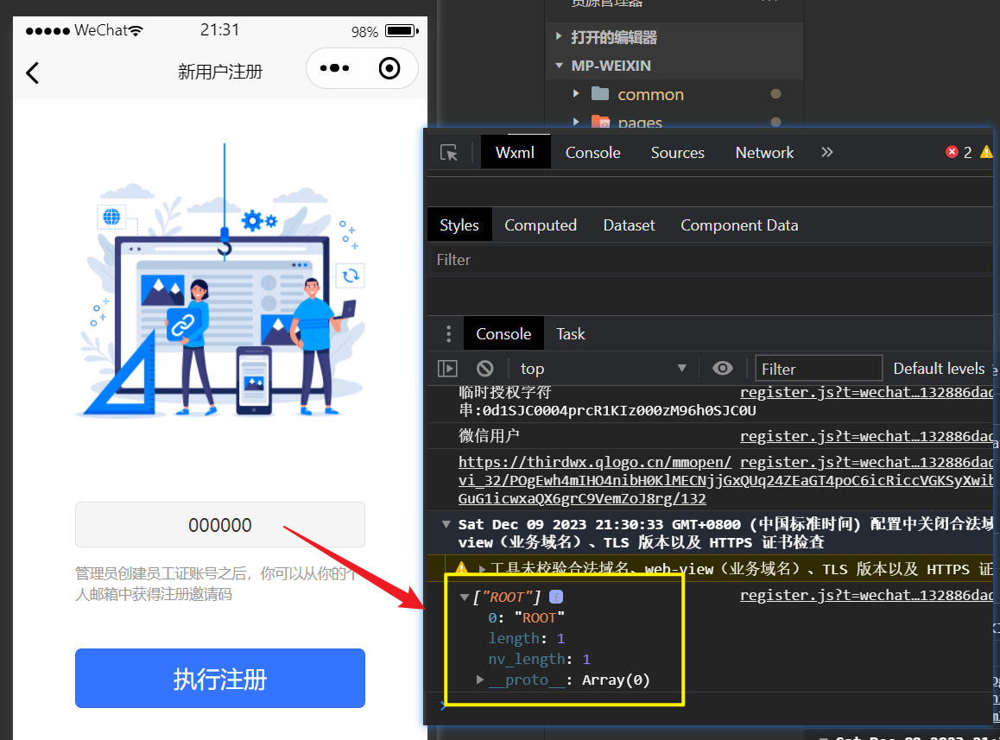
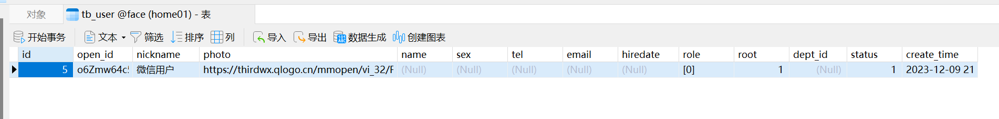

# 完成注册超级管理员功能[5-6]

## 01)前端验证功能

向后端提交数据之前，我们先要做好前端的数据验证，比如说验证激活码必须是6位数字。

- 在register.vue文件写。

::: danger this不要写在回调函数里面

写在外面this表示vue对象。

:::

```js
			let that=this
			if(that.registerCode==null||that.registerCode.length==0){
				uni.showToast({
					icon:"none",
					title:"邀请码不能为空"
				})
				return
			}
			else if(/^[0-9]{6}$/.test(that.registerCode)==false){
				uni.showToast({
					icon:"none",
					title:"邀请码必须是6位数字"
				})
				return
			}
```

## 02)提交Ajax请求

```js
						let data={
								code:code,
								nickname:nickName,
								photo:avatarUrl,
								registerCode:that.registerCode
							}
							that.ajax(that.url.register,"POST",data,function(resp){
								let permission=resp.data.permission
								uni.setStorageSync("permission",permission)
								console.log(permission)
								//跳转到index页面
								uni.switchTab({
									url:"../index/index"
								})
							})
```


## 03)测试注册超级用户



成功，查看数据库看看。


