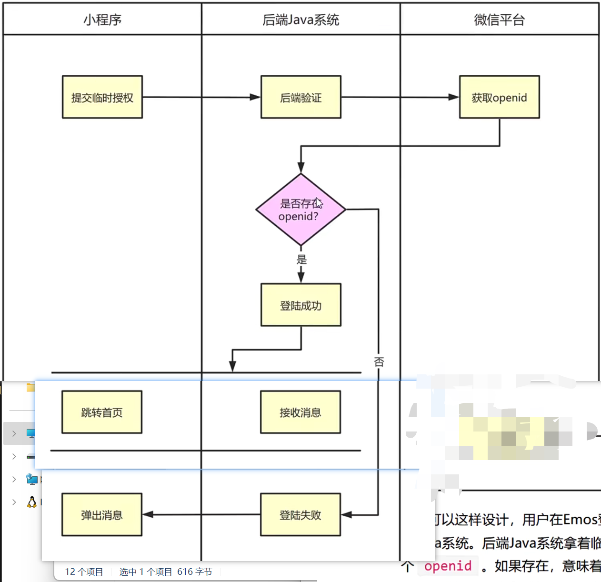

# 实现用户登陆功能[5-7]

我们完成了超级管理员注册流程之后，用户表中就已经有了超级管理员记录，那么接下来我们可以利用这个用户记录来完成Emos小程序的微信登陆功能。

## 01)如何判定登陆

用户表中并没有密码字段，我们无法根据username和password来判定用户是否可以登录。因为用户要拿着微信登陆Emos小程序，在用户表中只有 openid 、 nickname 和 photo 跟微信账号相关，我们应该如何判定用户登陆?

我们可以这样设计，用户在Emos登陆页面点击登陆按钮，然后小程序把 临时授权字符串 提交给后端Java系统。后端Java系统拿着临时授权字符串换取到 openid ，我们查询用户表中是否存在这个 openid 。如果存在，意味着该用户是已注册用户，可以登录。如果不存在，说明该用户尚未注册，目前还不是我们的员工，所以禁止登录。

## 02)编写持久层代码

- 在TbuserDao.xml 文件中，编写查询语句

- 在TbUserDao.java 中，定义DAO方法

## 03)编写业务层代码

- 在Userservice.java 中定义抽象方法

