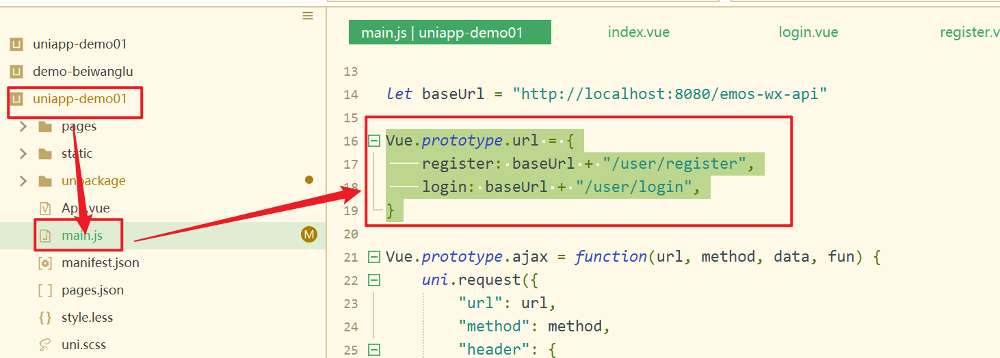
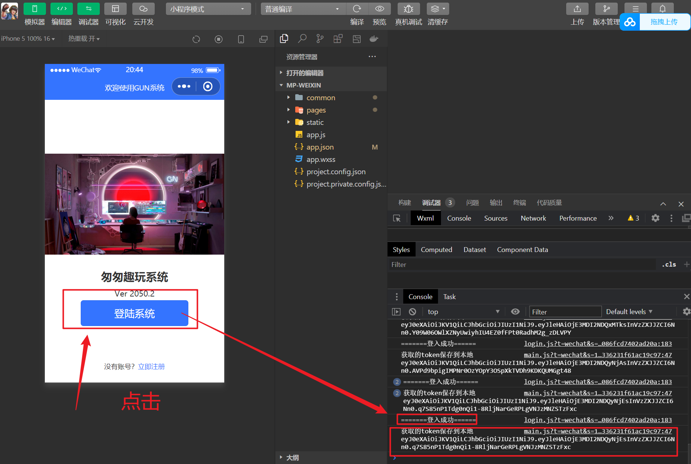

# 实现用户登陆功能[移动端]

## 01)封装登陆地址

```js
Vue.prototype.url = {
	register: baseUrl + "/user/register",
	login: baseUrl + "/user/login",
}
```



## 02)编写登陆方法

```js
export default {
	data() {
		return {

		}
	},
	methods: {
		toRegister:function(){
			uni.navigateTo({
				url:"/pages/register/register"
			})
		},
		// 登入的方法
			login:function(){
						let that=this
						uni.login({
							provider:"weixin",
							// 登入成功
							success:function(resp){
								let code=resp.code
								// 发请求到后端地址，加临时授权码
								that.ajax(that.url.login,"POST",{"code":code},function(resp){
									let permission=resp.data.permission
									uni.setStorageSync("permission",permission)
									//跳转到登陆页面
									uni.switchTab({
										url:"../index/index"
									})

								})


							},
							// 登入失败回调
							fail:function(e){
								uni.showToast({
									icon:"none",
									title:"执行异常"
								})
							}
						})
					}
				}


	}
}
</script>
```

## 03)测试




## 04)设置页面标题

小程序的页面标题分为全局标题和局部标题。如果页面没有设置局部标题，那么页面标题默认就是全局标题。反之，就是局部标题。全局标题和局部标题都是在 pages.json 文件中设置，如下:

```json
{
	"pages": [ //pages数组中第一项表示应用启动页，参考：https://uniapp.dcloud.io/collocation/pages

		{
			"path": "pages/login/login",
			"style": {
				"navigationBarTitleText": "欢迎使用GUN系统",
				"enablePullDownRefresh": false
			}
		},
		{
			"path": "pages/register/register",
			"style": {
				"navigationBarTitleText": "新用户注册",
				"enablePullDownRefresh": false
			}
		},
		{
			"path": "pages/demo/demo",
			"style": {
				"navigationBarTitleText": "",
				"enablePullDownRefresh": false
			}
		},
		{
			"path": "pages/index/index",
			"style": {
				"navigationBarTitleText": "uni-app"
			}
		}
	],
	"globalStyle": {
		"navigationBarTextStyle": "black",
		"navigationBarTitleText": "uni-app",
		"navigationBarBackgroundColor": "#F8F8F8",
		"backgroundColor": "#F8F8F8"
	},
```

- 全局样式

```json
	"globalStyle": {
		"navigationBarTextStyle": "white",
		"navigationBarTitleText": "GUN系统",
		"navigationBarBackgroundColor": "#3474FF",
		"backgroundColor": "#EEEEF4"
	},
```


