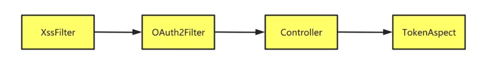

# 观察后端项目运行细节

之前我们在SpringBoot项目中添加了很多第三方的技术广包括我们自己也写了很多有关的配置程序其中包括 Servlet过滤器，shiro过滤器 ，以及 AOP拦截器 。

- Emos后端项目运行的时候这些程序的执行顺序是什么?
-  哪里是入口，我们还不大了解，所以这个小节，我们利用登陆案例来观察Emos后端项目的运行细节。

## 01)为什么XSSFilter最先执行?

Emos系统接收到 HTTP请求 之后，首先由 XSSFilter 来处理请求。因为 XSSFilter 是标准的 Servlet过滤器，所以他执行的优先级要高 ShiroFilter 和 AOP截器 的。这也很好理解，还没轮到Controller中的Web方法执行，AOP连接器自然不能运行。另外， XssFilter 使用 @webFilter 注解定义出来的过滤器，所以他的优先级比 SpringMVC 中注册的 Filter 优先级更高，所以 XSSFilter 早于 SpringMVC 执行。这个也能说得通，我们希望先把请求中的数据先转义，然后再由SpringMVC框架来处理请求。

## 02)OAuth2Filter的执行

因为OAuth2Filter是在SpringMVC中注册的Filter，所以它晚于Servlet过滤器的执行。但是SpringMVC中注册过滤器有个好处，就是可以规定Filter的优先级别，所以定义普通的Filter，注册在SpringMVC上更加的妥当。

我们在定义OAuth2Filter的时候，声明了很多的方法，但是在注册流程中，我们只能看到doFilterlnternal0方法的执行，这又是为什么呢?

我们声明Shiro过滤器拦截路径的时候为登陆和注册路径下的请求，设置了放行，所以验证与授权并没有生效。等我们将来写具体的业务类型的Web方法，添加相关的Shiro注解，这时候OAuth2Filter中的其他方法就得以运行了。

## 03)TokenAspect的作用

TokenAspect是切面类，拦截所有Web方法的返回值。TokenAspect先检测ThreadLocalToken中有

