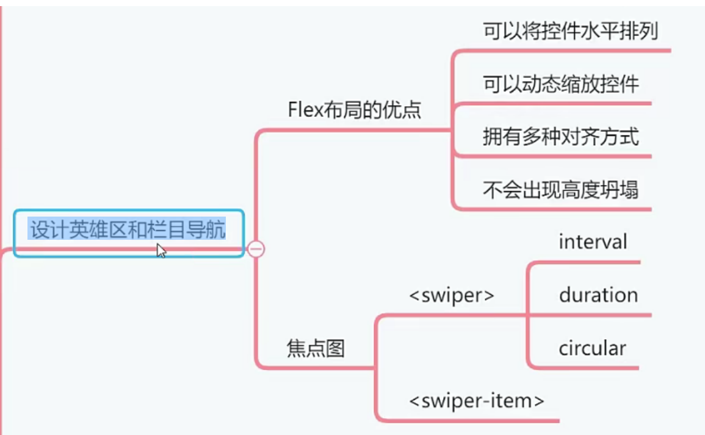
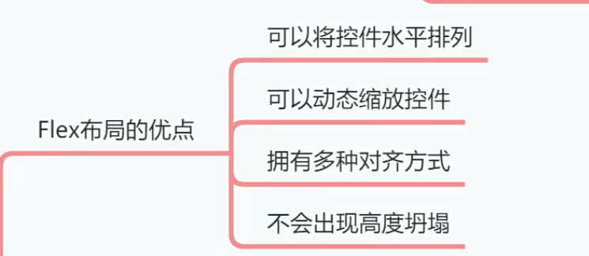
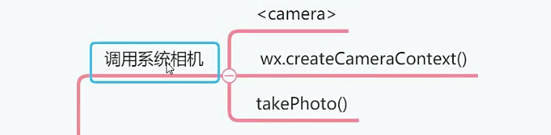
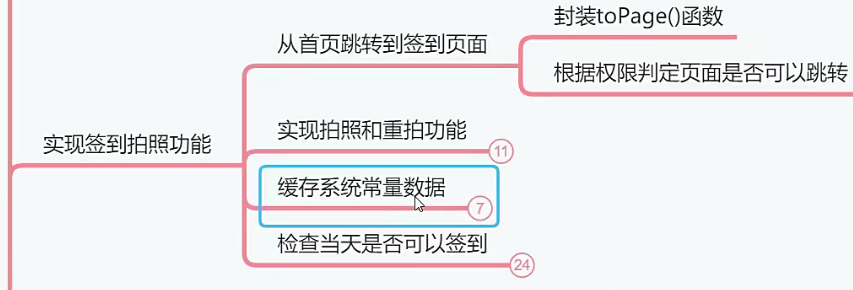

# 01章节介绍

## 01创建小程序Tab导航

- 创建五个页面

- 修改pages.json

- 跳转到首页

## 02开通腾讯云对象存储服务

- 静态资源要在网上
  - 图片和视频
  - 小程序打包体积不能超过2M，分包不能超过8M
  - 小程序页面引用网上静态资源
- 腾讯云COS服务
  - 创建存储桶
  - 上传图片
    - 轮播图
    - 用户头像图片

## 03设计英雄区和栏目导航

## 04设计人脸签到页面

- 调用系统相机

- 业务流程
  - 先拍照
  - 后签到

- 实现签到拍照功能

