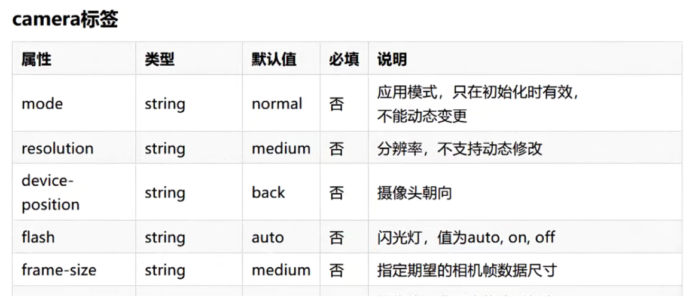
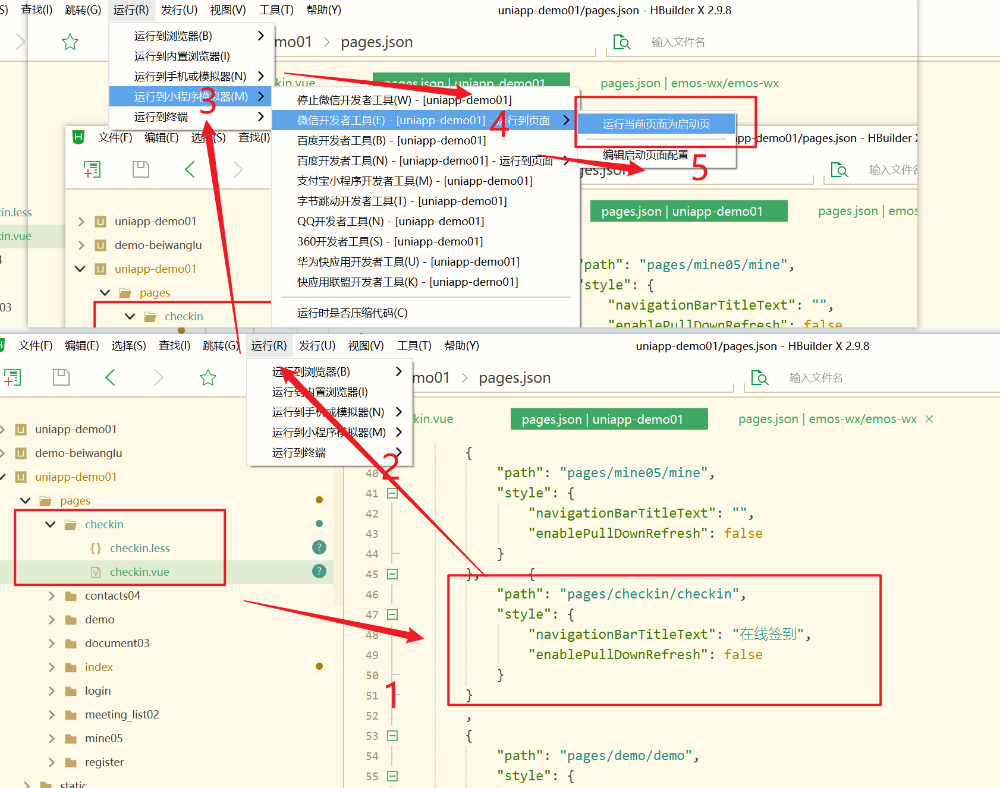
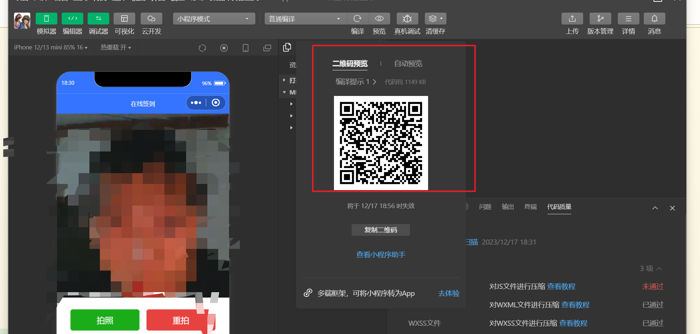

# 设计人脸签到页面

## 01)如何调用系统相机?

微信小程序提供了 camera> 标签，这个标签可以调用系统相机进行拍照，至于说开启前摄像头还是后摄像头，我们可以用参数设置。想要拍照的时候，我们给某个按钮添加点击事件，然后调用相机对象的 takephoto() 方法即可。下面我们来看一下 camera> 标签的使用规范




## 02)设计人脸签到页面

创建 checkin.vue 页面，然后编写页面内容

```js
<template>
	<view>
		<camera device-position="front" flash="off" class="camera" @error="error" v-if="showCamera"></camera>
		<image mode="widthFix" class="image" :src="photoPath" v-if="showImage"></image>
		<view class="operate-container">
			<button type="primary" class="btn" @tap="clickBtn" :disabled="!canCheckin">{{btnText}}</button>
			<button type="warn" class="btn" @tap="afresh" :disabled="!canCheckin">重拍</button>
		</view>
		<view class="notice-container">
			<text class="notice">注意事项</text>
			<text class="desc">拍照签到的时候，必须要拍摄自己的正面照片，侧面照片会导致无法识别。另外，拍照的时候不要戴墨镜或者帽子，避免影响拍照签到的准确度。</text>
		</view>
	</view>
</template>

<script>
	export default {
		data() {
			return {
				canCheckin: true,
				photoPath: '',
				btnText: '拍照',
				showCamera: true,
				showImage: false
			}
		},
		
	}
</script>

<style lang="less">
	@import url("checkin.less");
</style>

```


```
@import url("../../style.less");
.camera,.image{
	width: 100%;
	height: 400px;
}
.operate-container{
	display: flex;
	justify-content: center;
	margin-top: 50rpx;
	.btn{
		width: 40%;
		margin: 0;
		&:first-child{
			margin-right: 30rpx;
		}
	}
}

.notice-container{
	padding: 40rpx 60rpx;
	.notice{
		font-size: 40rpx;
		color: @font-color;
		font-weight: bold;
		display: block;
		margin-bottom: 15rpx;
	}
	.desc{
		display: block;
		font-size: 32rpx;
		color: @desc-color;
		line-height: 1.6;
	}
}
```


## 03)运行




## 04)wx预览





