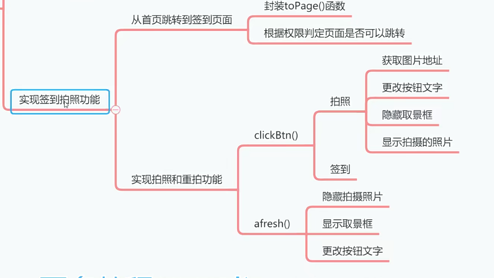
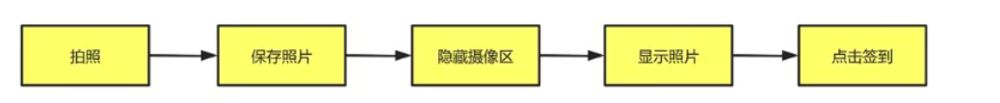

# 06)实现签到自拍功能




## 01)拍照流程

上个小节，我们把签到页面设计出来了，这节课我们要把拍照按钮功能给实现一下。



## 02)跳转到签到页面

既然签到页面已经设计好了，我们就应该允许用户从首页跳转到签到页面在首页声明 topage() 函数，用于跳转到任何页面。

- 在index页面中

```js
	toPage: function(name, url) {
			//TODO 验证权限
			uni.navigateTo({
				url::url
			})
			
		}
```

给在线签到导航链接添加点击事件

```js
// toPage 跳转页面的方法
<view class="nav" @tap="toPage('在线签到','../checkin/checkin')">
    
    
		<image mode="widthFix" src="../../static/nav-1.png" class="icon"></image>
		<text class="name">在线签到</text>
</view>
```

## 03)实现拍照和重拍功能

创建clickBtn() 方法和 afresh() 方法，实现拍照按钮和重拍的点击事件。

```js
	clickBtn:function(){
				let that=this;
				if(that.btnText=="拍照"){
					let ctx=uni.createCameraContext();
					ctx.takePhoto({
						quality:"high",// 拍照质量
						success:function(resp){
							console.log("获取拍照图片路径:"+resp.tempImagePath)
                            
                            // 赋值给模型层变量。
							that.photoPath=resp.tempImagePath
							that.showCamera=false
							that.showImage=true
							that.btnText="签到"
						}
					})
				}
				else{
                    // 点击签到按钮要执行的代码
					uni.showLoading({
						title:"签到中请稍后"
					})
				
                    
                    //  签到要做
				
				}
			},
                
        // 重新拍照
			afresh:function(){
				let that=this;
				that.showCamera=true;
				that.showImage=false;// 图片隐藏起来图片
                // 页面的文字改为，拍照。
				that.btnText="拍照"
			}
		}
```

