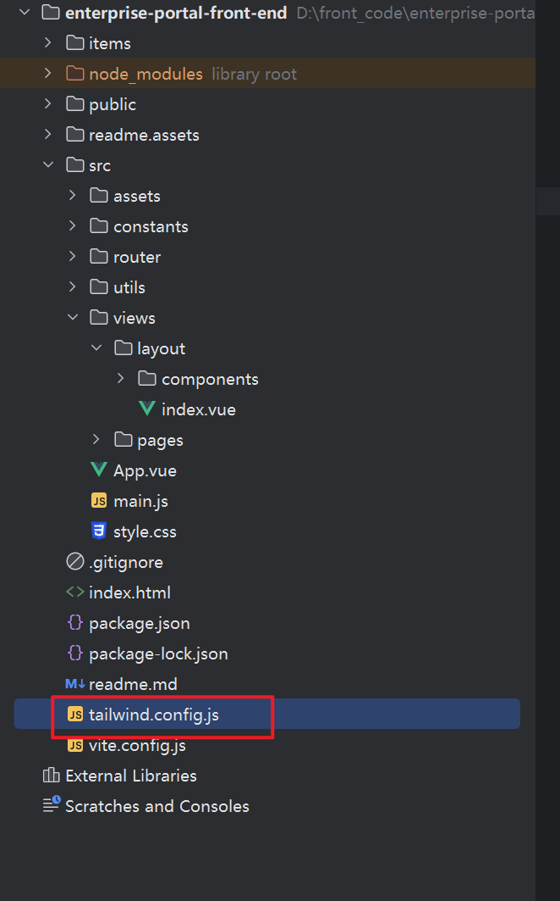

# WebStorm没有tailwindcss类样式提示

github仓库地址：

[tailwindlabs/tailwindcss: A utility-first CSS framework for rapid UI development.](https://github.com/tailwindlabs/tailwindcss)

问题场景描述：

1. 原来是有tailwindcss类样式提示的，但是在Vue的项目的assets目录下添加了其它css文件。然后就没有提示了！


问题排查：

1. WebStorm的tailwindcss的类样式提示插件是没有问题的。因为原先是有提示的。


## 问题的解决

主要的问题是WebStorm这个编译器无法识别Vue项目中使用了tailwindcss。




解决办法就是在项目中添加这个`tailwind.config.js`配置文件。

默认配置内容：

```js
// tailwind.config.js
module.exports = {
    content: ["./index.html", "./src/**/*.{vue,js,ts,jsx,tsx}",],
    theme: {
        extend: {},
    },
    plugins: [],
}
```


