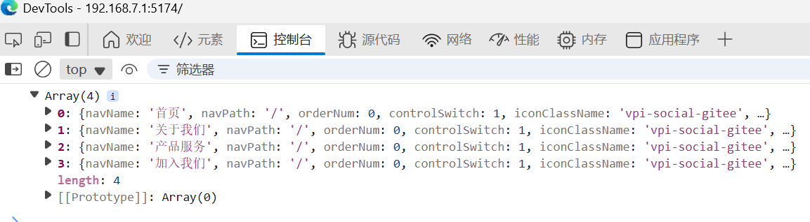

# Vue组件中打印响应式变量调试

```vue
<script setup>
import {computed} from 'vue';
import {useRouter} from 'vue-router'
import {PORTAL_NAVS_DATA} from "@/constants/index.js";

// 直接使用计算属性排序、Vue3组合式API写法。
const sortedNavs = computed(() => {
  return [...PORTAL_NAVS_DATA].sort((a, b) => a.orderNum - b.orderNum);
});
const router = useRouter()
</script>
```

sortedNavs这变量保存这什么？


## 方法1

console.log(sortedNavs.value)打印：

```vue
<script setup>
import {computed} from 'vue';
import {useRouter} from 'vue-router'
import {PORTAL_NAVS_DATA} from "@/constants/index.js";

// 直接使用计算属性排序、Vue3组合式API写法。
const sortedNavs = computed(() => {
  return [...PORTAL_NAVS_DATA].sort((a, b) => a.orderNum - b.orderNum);
});

console.log(sortedNavs.value)
const router = useRouter()
</script>
```




console.log(sortedNavs)打印：

```vue
<script setup>
import {computed} from 'vue';
import {useRouter} from 'vue-router'
import {PORTAL_NAVS_DATA} from "@/constants/index.js";

// 直接使用计算属性排序、Vue3组合式API写法。
const sortedNavs = computed(() => {
  return [...PORTAL_NAVS_DATA].sort((a, b) => a.orderNum - b.orderNum);
});

console.log(sortedNavs)
const router = useRouter()
</script>

```


ComputedRefImpl是什么？


## 方法2

步骤一：

```js
import {computed, onMounted} from 'vue';
```

步骤二：

```js
// 添加生命周期钩子
onMounted(() => {
  console.log('导航数据:', sortedNavs.value)
})
```

完整案例代码

```js
<script setup>
import {computed, onMounted} from 'vue';
import {useRouter} from 'vue-router'
import {PORTAL_NAVS_DATA} from "@/constants/index.js";

// 添加生命周期钩子
onMounted(() => {
  console.log('导航数据:', sortedNavs.value)
})

const sortedNavs = computed(() => {
  return [...PORTAL_NAVS_DATA].sort((a, b) => a.orderNum - b.orderNum);
});

const router = useRouter()
</script>
```

执行结果：


