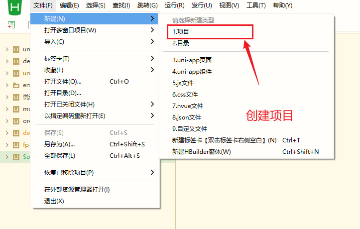
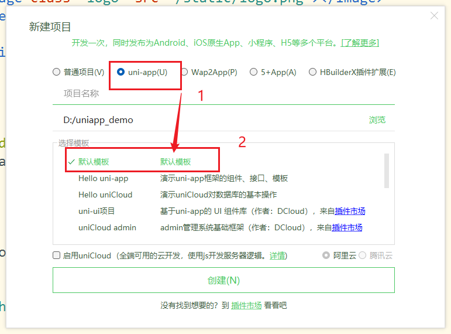
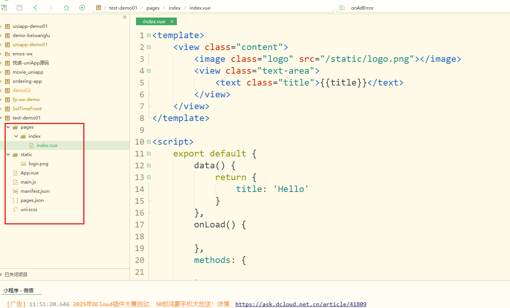
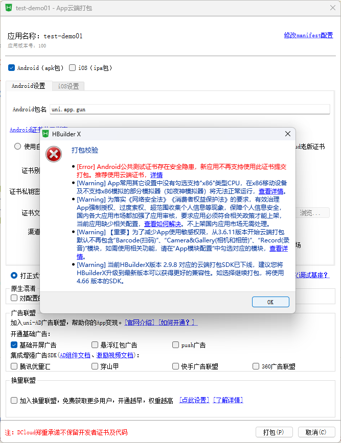
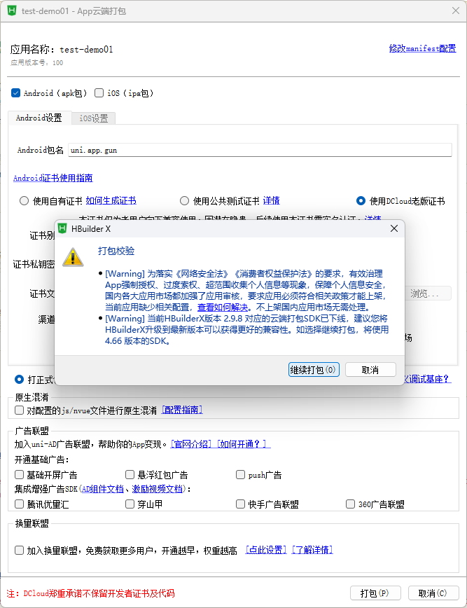
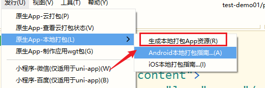
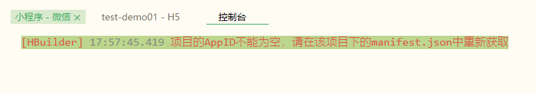
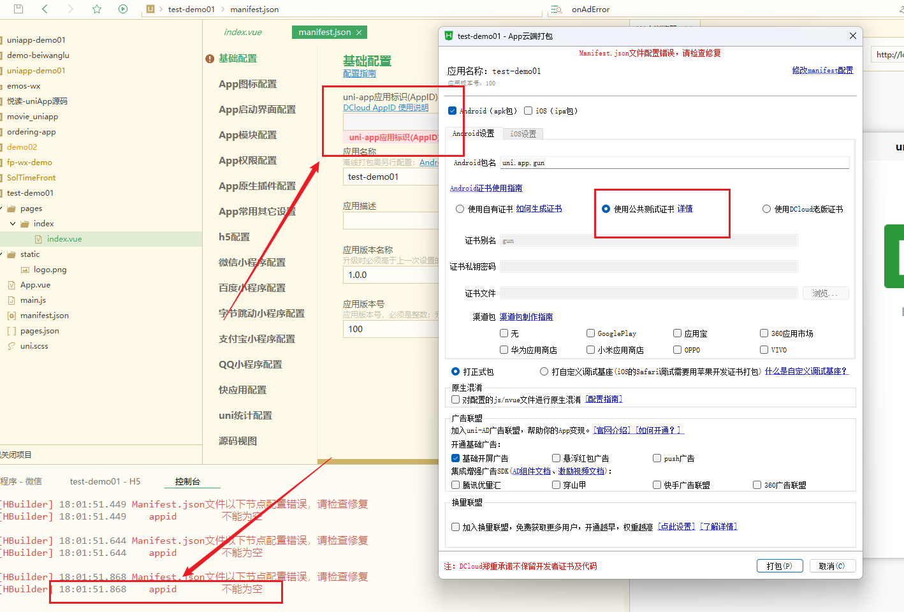

# 创建一个uniapp项目

## 学习目标

- 熟悉怎么创建一个uniapp的项目流程。

## uni-app默认模板创建

创建项目的默认目录结构：

## 打包问题1

触发位置：

产生的问题：

[HBuilder] 17:57:45.419 项目的AppID不能为空，请在该项目下的manifest.json中重新获取

uni-app的项目的AppID是什么？

## 安卓打包问题2

注意点：

- 要填写安卓包名。
- 使用公共的测试证书。

uni-app的项目的AppID是什么？

DCloud appid（以后简称 appid） 是 DCloud 应用的唯一标识，在 DCloud 提供的所有服务中，都会以 appid 来标记一个应用。注意这和各家小程序的appid以及Apple的appid（其实就是iOS的包名）是不同的体系。

## uni-app的项目的AppID

- 怎么获取一个uniapp的appid呢？

答：登录[开发者中心](https://dev.dcloud.net.cn/)，也可以创建 uniapp、5+app 等类型应用的 appid；

