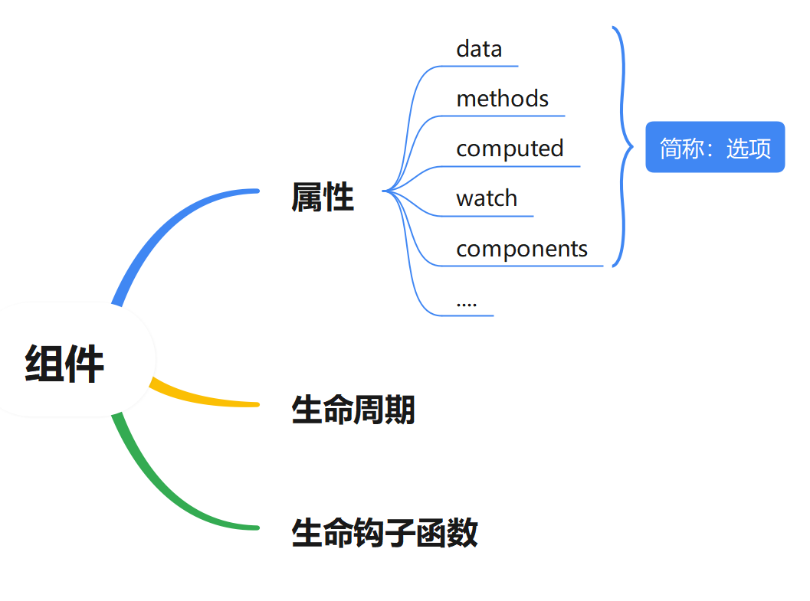

# vue组件开发思维

## 组件的基本概念

- 问题1：什么是组件？
- 问题2：vue中组件分几种类型呢？

问题1的回答是：组件看作是一个实例对象。有属性、等其它行为。

问题2的回答：

## 全局组件的弊端

当浏览器访问一个网页时，会把所有全局组件的代码也下载到客户端。假定某个网页并不包含所有的全局组件，那么下载所有全局组件的代码是多余的。

带来的问题是：

- 网络传输带来额外的负担。
- 降低网站的访问性能，影响用户体验。

