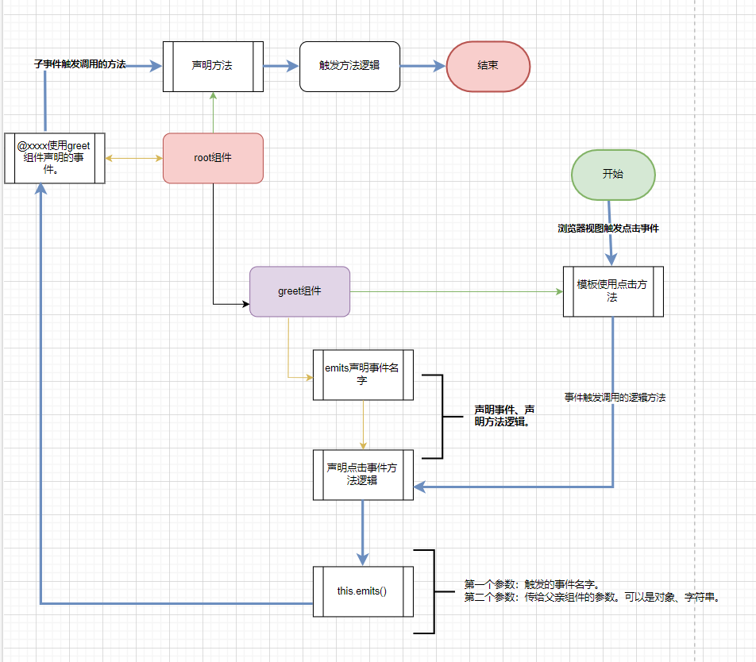
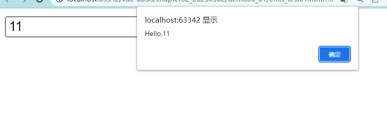

# 监听子组件的事件

父组件可以通过子组件的属性向子组件传递数据。反过来，子组件怎么向父组件传递数据呢？

## 子组件向父组件通信

```js
<html>
  <head>
    <meta charset="UTF-8">
    <title>Vue 范例 </title>
    <script src="vue.js"></script>
  </head>
  <body>
    <div id="app">
       <greet @greet-event="sayHello"></greet> 
    </div>
    <script>
      const app=Vue.createApp({ 
        methods: {
          //  name 属性是儿子给父亲的
          sayHello(name){
             alert("Hello,"+name)
          }
        }
      })
      // 添加全局组件
      app.component('greet', {
        data() {
          // 儿子属性 name
          return {   name: ''  }
        },
        // 儿子 生明事件
        emits: ['greetEvent'],
        methods:{
          //  儿子的 点击事件调用的方法
          doClick(){
            // 触发什么事件，传什么参数给父亲。
            this.$emit('greetEvent',this.name)
          }
        },
        // 儿子的模板
        template: ` <input v-model="name" />
             <button @click="doClick">Greet</button>`
      })
      app.mount('#app')
   </script>

  </body>
</html>
```

下面就是子组件事件怎么传播给父亲组件的逻辑实现流程图。




## 子组件声明事件问题

- 子组件声明事件的名字可以自己定义吗？

答：下面就改造上面的代码。greetEvent事件的名字就是子组件声明的。我们将起改为自己定义的任意名字尝试在运行代码。


```js
<html>
  <head>
    <meta charset="UTF-8">
    <title>Vue 范例 </title>
    <script src="vue.js"></script>
  </head>
  <body>
    <div id="app">
       <greet @test-event="sayHello"></greet>
    </div>
    <script>
      const app=Vue.createApp({ 
        methods: {
          //  name 属性是儿子给父亲的
          sayHello(name){
             alert("Hello,"+name)
          }
        }
      })
      // 添加全局组件
      app.component('greet', {
        data() {
          // 儿子属性 name
          return {   name: ''  }
        },
        // 儿子 生明事件
        emits: ['testEvent'],
        methods:{
          //  儿子的 点击事件调用的方法
          doClick(){
            // 触发什么事件，传什么参数给父亲。
            this.$emit('testEvent',this.name)
          }
        },
        // 儿子的模板
        template: ` <input v-model="name" />
             <button @click="doClick">Greet</button>`
      })
      app.mount('#app')
   </script>
  </body>
</html>
```


测试运行：



结果证明：子组件声明的事件的名字可以自己任意定义为其它名字。


