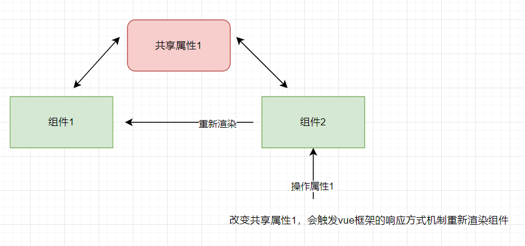
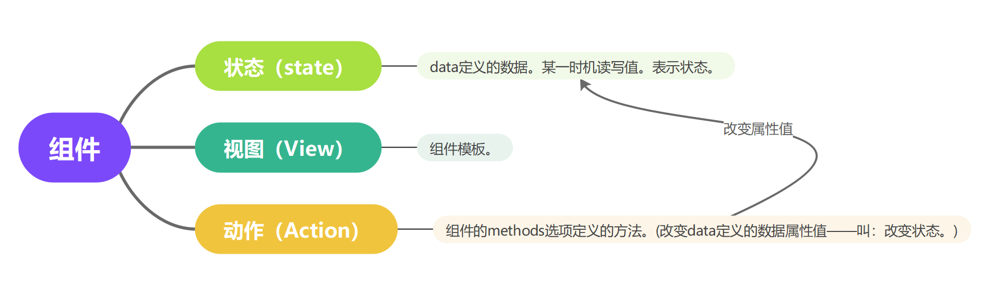

# Vuex进行状态管理

## 组件与组件数据共享的问题

存在数据共享的问题。

组件1与组件2都共享属性1的问题。如果说组件1与组件2、组件3、...都去共享一个属性或者多个属性。那么在组件的属性维护与管理方面就变得不可以控制了。

这种问题在前端工程管理上绝对不能出现这种情况的。

那么有什么解决的方案呢？

答：那就是本章要讲的Vuex进行状态管理的知识点了。

## 状态管理的3要素

