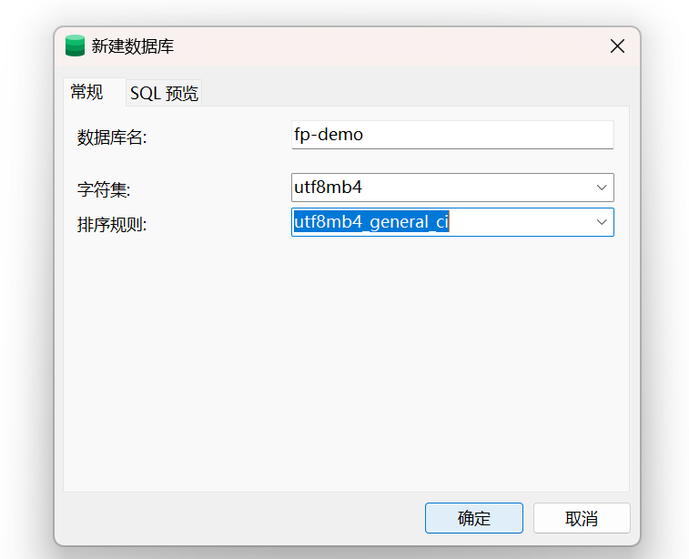
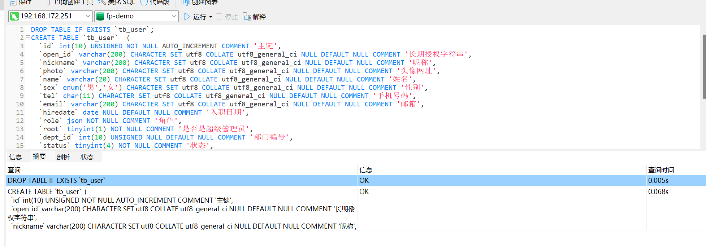
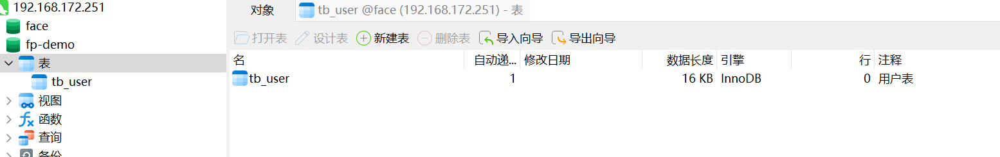

# 01小程序登入

- 用户表怎么设计？


## 用户表结构

第一步：创建数据库




第二步：创建表结构

1. 复制下面代码。

```sql
DROP TABLE IF EXISTS `tb_user`;
CREATE TABLE `tb_user`  (
  `id` int(10) UNSIGNED NOT NULL AUTO_INCREMENT COMMENT '主键',
  `open_id` varchar(200) CHARACTER SET utf8 COLLATE utf8_general_ci NULL DEFAULT NULL COMMENT '长期授权字符串',
  `nickname` varchar(200) CHARACTER SET utf8 COLLATE utf8_general_ci NULL DEFAULT NULL COMMENT '昵称',
  `photo` varchar(200) CHARACTER SET utf8 COLLATE utf8_general_ci NULL DEFAULT NULL COMMENT '头像网址',
  `name` varchar(20) CHARACTER SET utf8 COLLATE utf8_general_ci NULL DEFAULT NULL COMMENT '姓名',
  `sex` enum('男','女') CHARACTER SET utf8 COLLATE utf8_general_ci NULL DEFAULT NULL COMMENT '性别',
  `tel` char(11) CHARACTER SET utf8 COLLATE utf8_general_ci NULL DEFAULT NULL COMMENT '手机号码',
  `email` varchar(200) CHARACTER SET utf8 COLLATE utf8_general_ci NULL DEFAULT NULL COMMENT '邮箱',
  `hiredate` date NULL DEFAULT NULL COMMENT '入职日期',
  `role` json NOT NULL COMMENT '角色',
  `root` tinyint(1) NOT NULL COMMENT '是否是超级管理员',
  `dept_id` int(10) UNSIGNED NULL DEFAULT NULL COMMENT '部门编号',
  `status` tinyint(4) NOT NULL COMMENT '状态',
  `create_time` datetime NOT NULL ON UPDATE CURRENT_TIMESTAMP COMMENT '创建时间',
  PRIMARY KEY (`id`) USING BTREE,
  UNIQUE INDEX `unq_open_id`(`open_id`) USING BTREE,
  INDEX `unq_email`(`email`) USING BTREE,
  INDEX `idx_dept_id`(`dept_id`) USING BTREE,
  INDEX `idx_status`(`status`) USING BTREE
) ENGINE = InnoDB AUTO_INCREMENT = 1 CHARACTER SET = utf8 COLLATE = utf8_general_ci COMMENT = '用户表' ROW_FORMAT = DYNAMIC;

```

2. 运行！效果如下。






## 前端登入方法

- onShow()方法

  作用：每刷新一次页面就执行一次。

```
	onShow() {
		console.log('我是onShow方法');
	},
```


