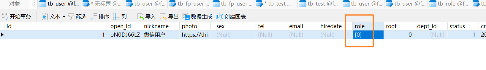
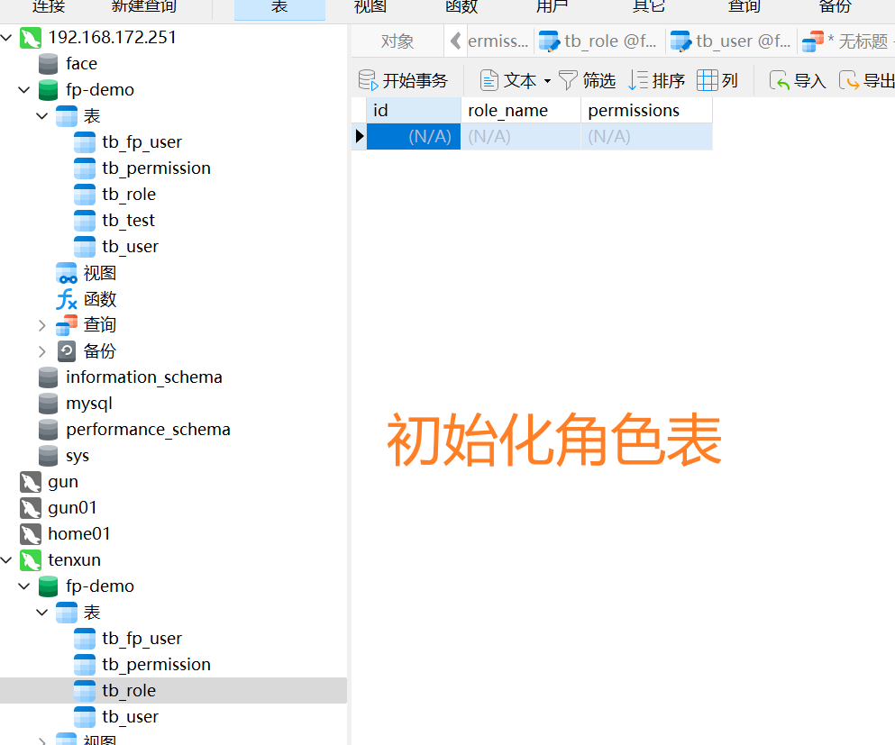

# 小程序授权设计与实现

- 发票管理系统的权限模型如下。




表示用户有这个角色。


## 权限模型


## 查询用户权限sql的思路


## 角色对应的权限


## 表结构

- 角色表

```sql
CREATE TABLE `tb_role` (
  `id` int(10) unsigned NOT NULL AUTO_INCREMENT COMMENT '主键',
  `role_name` varchar(200) NOT NULL COMMENT '角色名称',
  `permissions` json NOT NULL COMMENT '权限集合',
  PRIMARY KEY (`id`) USING BTREE,
  UNIQUE KEY `unq_role_name` (`role_name`) USING BTREE
) ENGINE=InnoDB AUTO_INCREMENT=4 DEFAULT CHARSET=utf8 ROW_FORMAT=DYNAMIC COMMENT='角色表';
```


- 权限表

```sql
CREATE TABLE `tb_permission` (
	`id` INT ( 10 ) UNSIGNED NOT NULL AUTO_INCREMENT COMMENT '主键',
	`permission_name` VARCHAR ( 200 ) NOT NULL COMMENT '权限',
	`module_id` INT ( 10 ) UNSIGNED NOT NULL COMMENT '模块ID',
	`action_id` INT ( 10 ) UNSIGNED NOT NULL COMMENT '行为ID',
	PRIMARY KEY ( `id` ) USING BTREE,
	UNIQUE KEY `unq_permission` ( `permission_name` ) USING BTREE,
UNIQUE KEY `unq_complex` ( `module_id`, `action_id` ) USING BTREE 
) ENGINE = INNODB AUTO_INCREMENT = 18 DEFAULT CHARSET = utf8 ROW_FORMAT = DYNAMIC;
```


- 权限下的模块表

```sql
CREATE TABLE `tb_module` (
  `id` int(10) unsigned NOT NULL AUTO_INCREMENT COMMENT '主键',
  `module_code` varchar(200) NOT NULL COMMENT '模块编号',
  `module_name` varchar(200) NOT NULL COMMENT '模块名称',
  PRIMARY KEY (`id`) USING BTREE,
  UNIQUE KEY `unq_module_id` (`module_code`) USING BTREE
) ENGINE=InnoDB AUTO_INCREMENT=6 DEFAULT CHARSET=utf8 ROW_FORMAT=DYNAMIC COMMENT='模块资源表';
```


- 权限下的模块下的行为表

```sql
CREATE TABLE `tb_action` (
  `id` int(11) unsigned NOT NULL AUTO_INCREMENT COMMENT '主键',
  `action_code` varchar(200) NOT NULL COMMENT '行为编号',
  `action_name` varchar(200) NOT NULL COMMENT '行为名称',
  PRIMARY KEY (`id`) USING BTREE,
  UNIQUE KEY `unq_action_name` (`action_name`) USING BTREE
) ENGINE=InnoDB AUTO_INCREMENT=8 DEFAULT CHARSET=utf8 ROW_FORMAT=DYNAMIC COMMENT='行为表';
```


## 表数据

- 权限表

```sql
INSERT INTO `tb_permission` VALUES (0, 'ROOT', 0, 0);
```

- 角色表

```sql
INSERT INTO `tb_role` VALUES (0, '超级管理员', '[0]');
```



