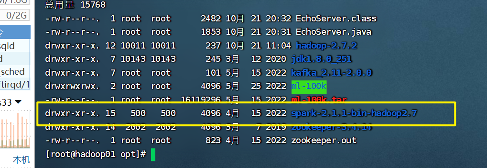
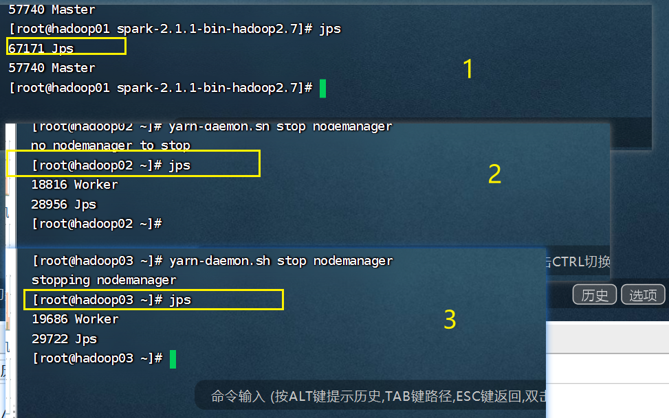
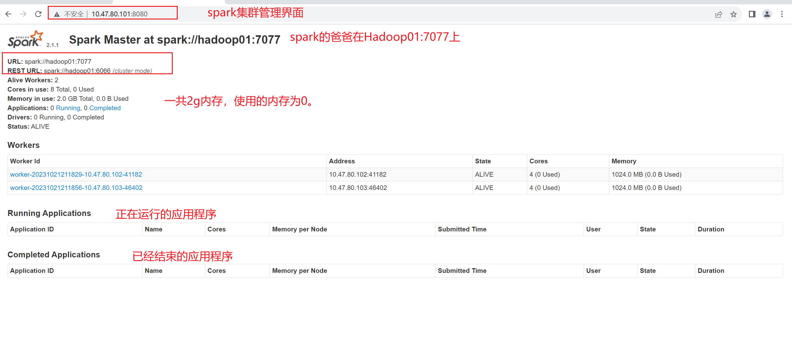

# Spark集群安装与部署

不是高可用的集群

## 1)下载spark安装包



## 2)解压Spark安装包

```cmd
tar -zxvf 包名
```

为了日后操作方便

```cmd
mv  Spark包名  spark
```


## 03)修改Spark配置文件

### 第一步

1. 进入spark/conf目录下

2. 将spark-env.sh.template配置模板文件复制一份重新命名

```cmd
cp spark-env.sh.template sarpk-env.sh
```

配置模板文件是什么？


### 第二步:配置爸爸

修改复制的配置模板文件sarpk-env.sh

```properties
#配置java环境变量
#配置Master的主机ip
export SPARK_MASTER_HOST=hadoop01
#配置Master的主机端口
export SPARK_MASTER_PORT=7077
```

::: tip

这里的配置文件就是：告诉每一台机子，爸爸在哪里，ip:端口号，就是找爸爸都地址。每一台机子都要配置这个文件。

- 老大在Hadoop01这个机子上。

:::

这个配置文件的描述英文

```properties
#!/usr/bin/env bash

#
# Licensed to the Apache Software Foundation (ASF) under one or more
# contributor license agreements.  See the NOTICE file distributed with
# this work for additional information regarding copyright ownership.
# The ASF licenses this file to You under the Apache License, Version 2.0
# (the "License"); you may not use this file except in compliance with
# the License.  You may obtain a copy of the License at
#
#    http://www.apache.org/licenses/LICENSE-2.0
#
# Unless required by applicable law or agreed to in writing, software
# distributed under the License is distributed on an "AS IS" BASIS,
# WITHOUT WARRANTIES OR CONDITIONS OF ANY KIND, either express or implied.
# See the License for the specific language governing permissions and
# limitations under the License.
#

# This file is sourced when running various Spark programs.
# Copy it as spark-env.sh and edit that to configure Spark for your site.

# Options read when launching programs locally with
# ./bin/run-example or ./bin/spark-submit
# - HADOOP_CONF_DIR, to point Spark towards Hadoop configuration files
# - SPARK_LOCAL_IP, to set the IP address Spark binds to on this node
# - SPARK_PUBLIC_DNS, to set the public dns name of the driver program
# - SPARK_CLASSPATH, default classpath entries to append

# Options read by executors and drivers running inside the cluster
# - SPARK_LOCAL_IP, to set the IP address Spark binds to on this node
# - SPARK_PUBLIC_DNS, to set the public DNS name of the driver program
# - SPARK_CLASSPATH, default classpath entries to append
# - SPARK_LOCAL_DIRS, storage directories to use on this node for shuffle and RDD data
# - MESOS_NATIVE_JAVA_LIBRARY, to point to your libmesos.so if you use Mesos

# Options read in YARN client mode
# - HADOOP_CONF_DIR, to point Spark towards Hadoop configuration files
# - SPARK_EXECUTOR_INSTANCES, Number of executors to start (Default: 2)
# - SPARK_EXECUTOR_CORES, Number of cores for the executors (Default: 1).
# - SPARK_EXECUTOR_MEMORY, Memory per Executor (e.g. 1000M, 2G) (Default: 1G)
# - SPARK_DRIVER_MEMORY, Memory for Driver (e.g. 1000M, 2G) (Default: 1G)

# Options for the daemons used in the standalone deploy mode
# - SPARK_MASTER_HOST, to bind the master to a different IP address or hostname
# - SPARK_MASTER_PORT / SPARK_MASTER_WEBUI_PORT, to use non-default ports for the master
# - SPARK_MASTER_OPTS, to set config properties only for the master (e.g. "-Dx=y")
# - SPARK_WORKER_CORES, to set the number of cores to use on this machine
# - SPARK_WORKER_MEMORY, to set how much total memory workers have to give executors (e.g. 1000m, 2g)
# - SPARK_WORKER_PORT / SPARK_WORKER_WEBUI_PORT, to use non-default ports for the worker
# - SPARK_WORKER_INSTANCES, to set the number of worker processes per node
# - SPARK_WORKER_DIR, to set the working directory of worker processes
# - SPARK_WORKER_OPTS, to set config properties only for the worker (e.g. "-Dx=y")
# - SPARK_DAEMON_MEMORY, to allocate to the master, worker and history server themselves (default: 1g).
# - SPARK_HISTORY_OPTS, to set config properties only for the history server (e.g. "-Dx=y")
# - SPARK_SHUFFLE_OPTS, to set config properties only for the external shuffle service (e.g. "-Dx=y")
# - SPARK_DAEMON_JAVA_OPTS, to set config properties for all daemons (e.g. "-Dx=y")
# - SPARK_PUBLIC_DNS, to set the public dns name of the master or workers

# Generic options for the daemons used in the standalone deploy mode
# - SPARK_CONF_DIR      Alternate conf dir. (Default: ${SPARK_HOME}/conf)
# - SPARK_LOG_DIR       Where log files are stored.  (Default: ${SPARK_HOME}/logs)
# - SPARK_PID_DIR       Where the pid file is stored. (Default: /tmp)
# - SPARK_IDENT_STRING  A string representing this instance of spark. (Default: $USER)
# - SPARK_NICENESS      The scheduling priority for daemons. (Default: 0)
# - SPARK_NO_DAEMONIZE  Run the proposed command in the foreground. It will not output a PID file.


###########  我们要配置的  ###################
#JAVA_HOME
export JAVA_HOME=/opt/jdk1.8.0_251
#配置Master的主机ip
export SPARK_MASTER_HOST=hadoop01
#配置Master的主机端口
export SPARK_MASTER_PORT=7077


```


## 04)配置奴隶slaves文件

1. 进入spark/conf目录下

2. 复制slaves.template文件,并且重命名为：slaves

```cmd
cp slaves.template slaves
```

3. 编辑文件

```cmd
vi slaves
```

```properties
hadoop02
hadoop03
```

这个爸爸有二个儿子。

文件里面的英文

```properties
[root@hadoop01 conf]# 
# this work for additional information regarding copyright ownership.
# The ASF licenses this file to You under the Apache License, Version 2.0
# (the "License"); you may not use this file except in compliance with
# the License.  You may obtain a copy of the License at
#
#    http://www.apache.org/licenses/LICENSE-2.0
#
# Unless required by applicable law or agreed to in writing, software
# distributed under the License is distributed on an "AS IS" BASIS,
# WITHOUT WARRANTIES OR CONDITIONS OF ANY KIND, either express or implied.
# See the License for the specific language governing permissions and
# limitations under the License.
#

# A Spark Worker will be started on each of the machines listed below.
hadoop02
hadoop03

```


## 5)分发文件

```cmd
scp -r 要分发的文件路径  主机名:/要分发的目标路径
```

分发同步单个文件

```cmd
scp 要分发的文件路径  主机名:/要分发的目标路径
```

### 第一步:分发奴隶配置文件

到：hadoop02、hadoop03

```cmd
scp -r slaves hadoop02:/opt/spark-2.1.1-bin-hadoop2.7/conf/slaves


scp -r slaves hadoop03:/opt/spark-2.1.1-bin-hadoop2.7/conf/slaves
```

### 第二步:分发spark的配置文件

```cmd
 scp -r spark-env.sh hadoop03:/opt/spark-2.1.1-bin-hadoop2.7/conf/spark-env.sh

```


## 6)启动spark集群

```cmd
sbin/start-all.sh
```

在爸爸节点这个执行上面命令启动集群

```cmd
[root@hadoop01 spark-2.1.1-bin-hadoop2.7]# sbin/start-all.sh

starting org.apache.spark.deploy.master.Master, logging to /opt/spark-2.1.1-bin-hadoop2.7/logs/spark-root-org.apache.spark.deploy.master.Master-1-hadoop01.out

hadoop03: starting org.apache.spark.deploy.worker.Worker, logging to /opt/spark-2.1.1-bin-hadoop2.7/logs/spark-root-org.apache.spark.deploy.worker.Worker-1-hadoop03.out


hadoop02: starting org.apache.spark.deploy.worker.Worker, logging to /opt/spark-2.1.1-bin-hadoop2.7/logs/spark-root-org.apache.spark.deploy.worker.Worker-1-hadoop02.out
[root@hadoop01 spark-2.1.1-bin-hadoop2.7]# 

```


在书上41页有哦。官方网站也有哦。

### 验证




## 7)spark管理页面访问


