# SparkHA集群部署

上一节是：spark Standalone集群是主从架构的集群模式，因此也存在单节点故障问题。

解决：

Zookeeper服务，

原理：将Standalone集群连接到同一个Zookeeper实例，并启动多个Master节点。利用Zookeeper提供的<font color='red'>选举</font>和<font color='red'>状态保存</font>功能,可以使一台Master节点被选举出来，另外一台处于Standby状态。

当活着的Master发生故障时，Standby状态的Master要被激活。然后恢复集群调度，这个过程要1~2分钟的时间。


## 01)配置zoo.cfg文件

这个是安装好的第一步要配置的文件。

```properties
# The number of milliseconds of each tick
# 设置通信心跳数
tickTime=2000
# The number of ticks that the initial
# synchronization phase can take
initLimit=10
# The number of ticks that can pass between
# sending a request and getting an acknowledgement
syncLimit=5
# the directory where the snapshot is stored.
# do not use /tmp for storage, /tmp here is just
# example sakes.

# 设置数据文件目录+数据持久化路径
#dataDir=/tmp/zookeeper
dataDir=/export/data/zookeeper/zkdata

# the port at which the clients will connect
# 设置客户端连接的端口号
clientPort=2181
# the maximum number of client connections.
# increase this if you need to handle more clients
#maxClientCnxns=60
#
# Be sure to read the maintenance section of the
# administrator guide before turning on autopurge.
#
# http://zookeeper.apache.org/doc/current/zookeeperAdmin.html#sc_maintenance
#
# The number of snapshots to retain in dataDir
#autopurge.snapRetainCount=3
# Purge task interval in hours
# Set to "0" to disable auto purge feature
#autopurge.purgeInterval=1

# 配置Zookeeper集群的服务器编号以及对应的主机名、通信端口号(心跳端口号)和# # 选举端口号。
server.1=hadoop01.2888.3888
server.2=hadoop02.2888.3888
server.3=hadoop03.2888.3888
```


## 02修改spark的spark-env.sh文件

之前没有配置HA的配置。

```properties
#JAVA_HOME
export JAVA_HOME=/opt/jdk1.8.0_251


#配置Master的主机ip
export SPARK_MASTER_HOST=hadoop01
#配置Master的主机端口
export SPARK_MASTER_PORT=7077

```

HA高可用要配置的.

添加 SPARK_DAEMO_ JAVA_OPTS 配置参

注释export SPARK_MASTER_HOST=hadoop01【配置文件告诉spark那台启动主节点】

```properties
#JAVA_HOME
export JAVA_HOME=/opt/jdk1.8.0_251


#配置Master的主机ip
#export SPARK_MASTER_HOST=hadoop01
#配置Master的主机端口
export SPARK_MASTER_PORT=7077
export SPARK_DAEMON_JAVA_OPTS="-Dspark.deploy.recoveryMode=ZOOKEEPER -Dspark.deploy.zookeeper.url=hadoop01:2181,hadoop02:2181,hadoop03:2181 -Dspark.deploy.zookeeper.dir=/spark"

```

关于上述参数的具体说明如下所示:

- spark.deploy.recoveryMode:设置 Zookeeper 去启动备用 Master 模式

- spark.deploy.zookeeper.url: 指定 ZooKeeper 的 Server 地址。

- spark.deploy.zookeeper.dir:保存集群元数据信息的文件和目录

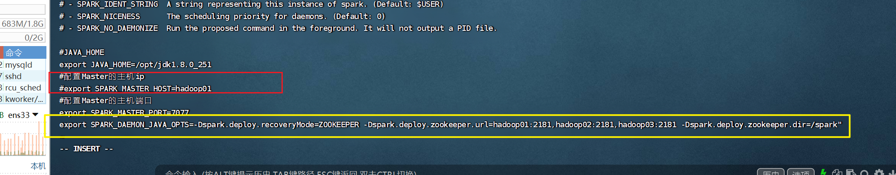

::: tip 总结

- spark的配置要添加这行

  ```properties
  export SPARK_DAEMON_JAVA_OPTS=-Dspark.deploy.recoveryMode=ZOOKEEPER -Dspark.deploy.zookeeper.url=hadoop01:2181,hadoop02:2181,hadoop03:2181 -Dspark.deploy.zookeeper.dir=/spark"
  ```

  

- 去掉：

  ```properties
  #配置Master的主机ip
  #export SPARK_MASTER_HOST=hadoop01
  ```

  这个spark文件修改要注意

:::

## 03)分发文件

到hadoop02、hadoop03

```cmd
scp spark-env.sh hadoop02:/opt/spark-2.1.1-bin-hadoop2.7/conf/

```

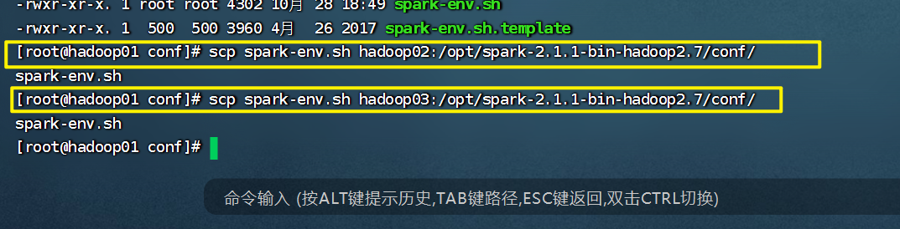


## 04)启动高可用集群

在普通模式下启动 Spark 集群，只需要通过/spark/sbin/start-all.sh 一键启动脚本即可。然而,在高可用模式下启动 Spark 集群首先需要启动 Zookeeper 集群，然后在任意一台主节点上执行 start-all. sh 命令启动 Spark 集群,最后在另外一台主节点上单独启动Master 服务。具体步骤如下。


### 启动Zookeeper服务

1. 依次在3台节点上启动 Zookeeper,命令如下。

```cmd
zkServer.sh start
```


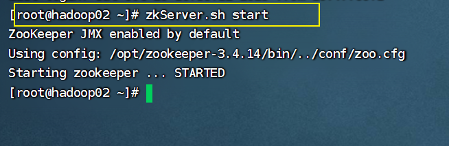


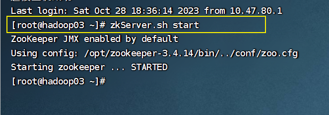


### 启动Spark集群

2. 启动 Spark 集群

在 hadoop01主节点使用一键启动脚本启动，命令如下

```
xxx/spark/sbin/start-all.sh
```

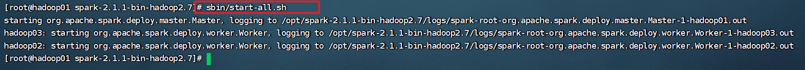

### 单独启动Master节点

3. 单独启动 Master 节点。

在 hadoop02节点上再次启动 Master 服务，命令如下

```
xxx/spark/sbin/start-master.sh
```

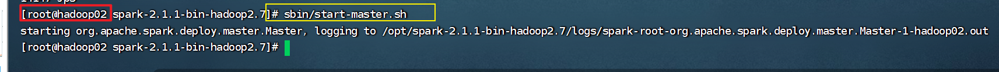

启动成功后,通过浏览器访问 https://hadoop02;8080,查看备用 Master 节点的状态如图 2-9 所示。

hadoop02 节点的状态为 STANDBY,说明 Spark HA 配置完毕

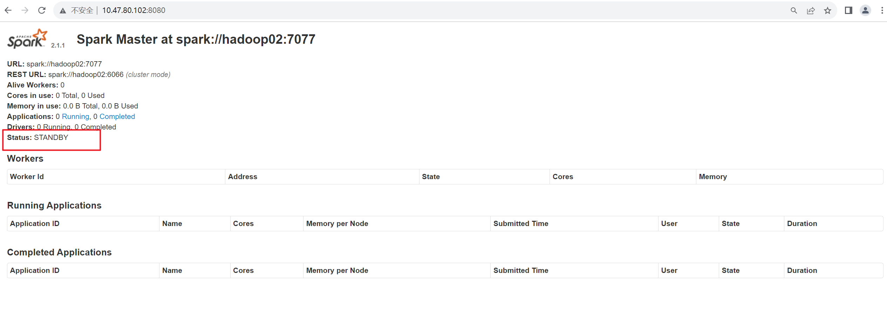

成功部署


## 05)测试Spark HA集群

把hadoop01关机

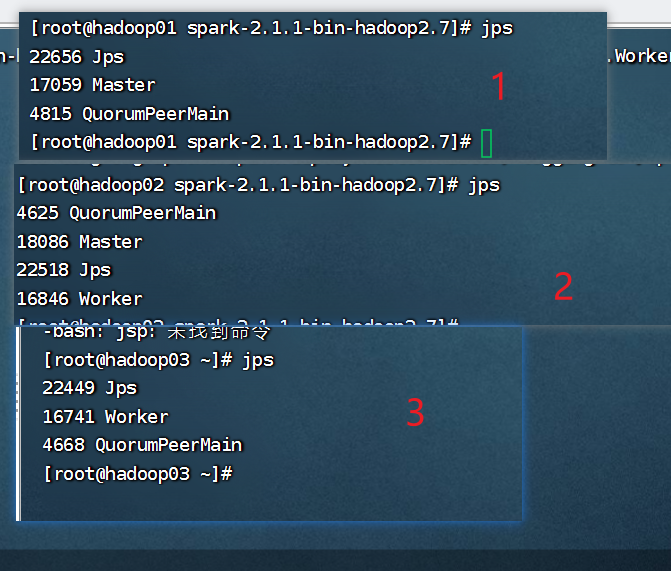

当前时间是：


关机后，看看被用机hadoop启动了maste没。


## 写脚本群起zookeeper集群

在集群中启动 Zookeeper 服务时，需要依次在3台服务器上执行启动命令，然而在实工作应用中，集群数量并非3台,当遇到数十台甚至更多的服务器时，就不得不编写脚本来启动服务了，编写脚本的语言有多种，这里采用 Shell 语言开发一键启动 Zookeeper 服务别本，使用vi创建 start_zk.sh 文件，如下:

```

```

在book page 42

## 扩展实验

上面的HA集群展示了一个节点挂了，有候补上，集群调度没有受到影响。实现了高可用集群。

### 实验一

- spark故障后怎么回复集群呢？


**实验遇到的问题**

spark怎么单独启动work集群？


**实验操作步骤**

第一步：查看hadoop02集群的spark节点

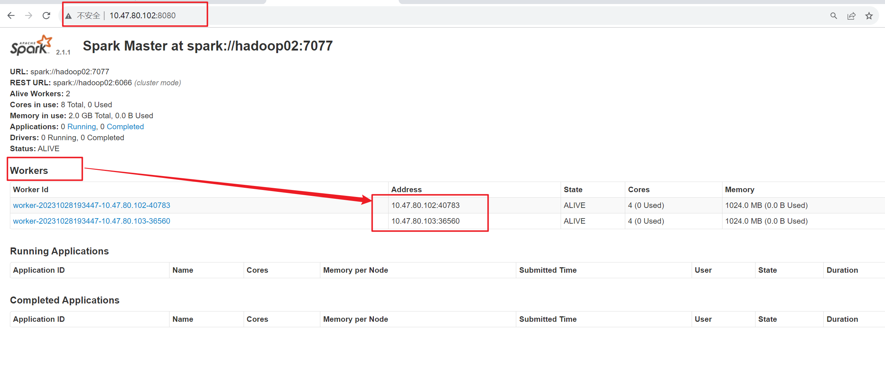

```
./start-slave.sh spark://hadoop02:7077
```

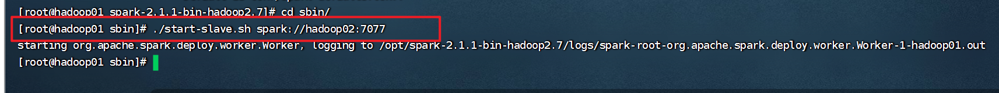


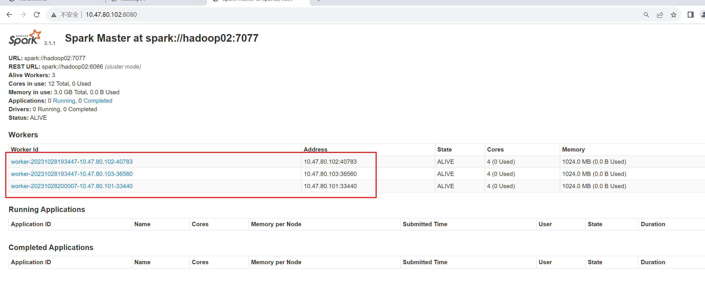


单独启动hadoop01的master

```cmd
/sbin/start-master.sh
```

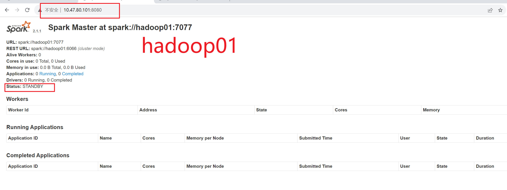

hadoop02关机


实验结论：


启动master: 日志和web ui，观察master url
./start-master.sh
启动worker: 观察web ui，是否有新加入的worker节点，以及对应的信息
./start-slave.sh spark://spark-project-1:7077
单独关闭master和worker，顺序得反过来，先关worker，再关master
./stop-slave.sh
./stop-master.sh
再次单独启动master和worker，给worker限定--memory参数，就使用500m内存，再到web ui，跟之前看到的worker信息比对一下内存最大使用量
./start-master.sh
./start-slave.sh spark://spark-project-1:7077 --memory 500m
集体关闭集群，再启动集群，保证后面可以正常使用
./stop-all.sh
./start-all.sh

## 报错

### 问题一

在hadoop单独启动集群时报错

```cmd
[root@hadoop02 spark-2.1.1-bin-hadoop2.7]# sbin/start-master.sh
starting org.apache.spark.deploy.master.Master, logging to /opt/spark-2.1.1-bin-hadoop2.7/logs/spark-root-org.apache.spark.deploy.master.Master-1-hadoop02.out
failed to launch: nice -n 0 /opt/spark-2.1.1-bin-hadoop2.7/bin/spark-class org.apache.spark.deploy.master.Master --host hadoop02 --port 7077 --webui-port 8080
  Error: Could not create the Java Virtual Machine.
  Error: A fatal exception has occurred. Program will exit.
full log in /opt/spark-2.1.1-bin-hadoop2.7/logs/spark-root-org.apache.spark.deploy.master.Master-1-hadoop02.ou
```

分析：

- 配置文件错误。本人遇到的。


