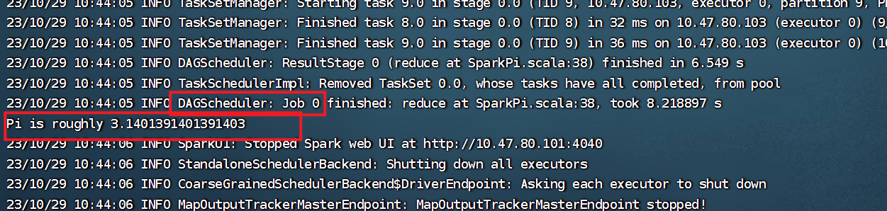
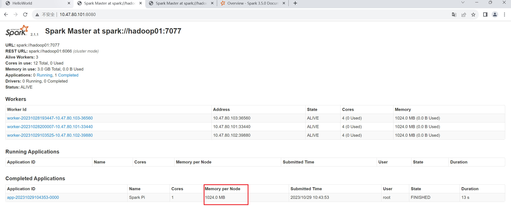

# 体验第一个Spark程序

## 进入spark目录

```cmd
[root@hadoop01 spark-2.1.1-bin-hadoop2.7]# bin/spark-submit --class org.apache.spark.examples.SparkPi --master spark://hadoop01:7077 --executor-memory 1G --total-executor-cores 1 examples/jars/spark-examples_2.11-2.1.1.jar 10
```

参数讲解

```cmd
bin/spark-submit \
--class org.apache.spark.examples.SparkPi \
--master spark://hadoop01:7077 \
--executor-memory 1G \
--total-executor-cores 1 \
examples/jars/spark-examples_2.11-2.1.1.jar \
10
```

- --master spark://hadoop01:7077 ：指定master的地址是 hadoop01 节点
- --executor-memory 1G  ：指定每个 executor 的可用内存为1GB;
- --total-executor-cores 1：指定每个 executor 使用的 CPU 核心数为1个

## 输出结果

```cmd
[root@hadoop01 spark-2.1.1-bin-hadoop2.7]# bin/spark-submit --class org.apache.spark.examples.SparkPi --master spark://hadoop01:7077 --executor-memory 1G --total-executor-cores 1 examples/jars/spark-examples_2.11-2.1.1.jar 10


Using Spark's default log4j profile: org/apache/spark/log4j-defaults.properties
23/10/29 10:43:51 INFO SparkContext: Running Spark version 2.1.1
23/10/29 10:43:51 WARN NativeCodeLoader: Unable to load native-hadoop library for your platform... using builtin-java classes where applicable
23/10/29 10:43:51 INFO SecurityManager: Changing view acls to: root
23/10/29 10:43:51 INFO SecurityManager: Changing modify acls to: root
23/10/29 10:43:51 INFO SecurityManager: Changing view acls groups to: 
23/10/29 10:43:51 INFO SecurityManager: Changing modify acls groups to: 
23/10/29 10:43:51 INFO SecurityManager: SecurityManager: authentication disabled; ui acls disabled; users  with view permissions: Set(root); groups with view permissions: Set(); users  with modify permissions: Set(root); groups with modify permissions: Set()
23/10/29 10:43:52 INFO Utils: Successfully started service 'sparkDriver' on port 46188.
23/10/29 10:43:52 INFO SparkEnv: Registering MapOutputTracker
23/10/29 10:43:52 INFO SparkEnv: Registering BlockManagerMaster
23/10/29 10:43:52 INFO BlockManagerMasterEndpoint: Using org.apache.spark.storage.DefaultTopologyMapper for getting topology information
23/10/29 10:43:52 INFO BlockManagerMasterEndpoint: BlockManagerMasterEndpoint up
23/10/29 10:43:52 INFO DiskBlockManager: Created local directory at /tmp/blockmgr-95296fcf-5ec5-498a-b1bc-32f272e498bb
23/10/29 10:43:52 INFO MemoryStore: MemoryStore started with capacity 366.3 MB
23/10/29 10:43:52 INFO SparkEnv: Registering OutputCommitCoordinator
23/10/29 10:43:53 INFO Utils: Successfully started service 'SparkUI' on port 4040.
23/10/29 10:43:53 INFO SparkUI: Bound SparkUI to 0.0.0.0, and started at http://10.47.80.101:4040
23/10/29 10:43:53 INFO SparkContext: Added JAR file:/opt/spark-2.1.1-bin-hadoop2.7/examples/jars/spark-examples_2.11-2.1.1.jar at spark://10.47.80.101:46188/jars/spark-examples_2.11-2.1.1.jar with timestamp 1698547433070
23/10/29 10:43:53 INFO StandaloneAppClient$ClientEndpoint: Connecting to master spark://hadoop01:7077...
23/10/29 10:43:53 INFO TransportClientFactory: Successfully created connection to hadoop01/10.47.80.101:7077 after 46 ms (0 ms spent in bootstraps)
23/10/29 10:43:53 INFO StandaloneSchedulerBackend: Connected to Spark cluster with app ID app-20231029104353-0000
23/10/29 10:43:53 INFO Utils: Successfully started service 'org.apache.spark.network.netty.NettyBlockTransferService' on port 37766.
23/10/29 10:43:53 INFO NettyBlockTransferService: Server created on 10.47.80.101:37766
23/10/29 10:43:53 INFO BlockManager: Using org.apache.spark.storage.RandomBlockReplicationPolicy for block replication policy
23/10/29 10:43:53 INFO BlockManagerMaster: Registering BlockManager BlockManagerId(driver, 10.47.80.101, 37766, None)
23/10/29 10:43:53 INFO StandaloneAppClient$ClientEndpoint: Executor added: app-20231029104353-0000/0 on worker-20231028193447-10.47.80.103-36560 (10.47.80.103:36560) with 1 cores
23/10/29 10:43:53 INFO BlockManagerMasterEndpoint: Registering block manager 10.47.80.101:37766 with 366.3 MB RAM, BlockManagerId(driver, 10.47.80.101, 37766, None)
23/10/29 10:43:53 INFO StandaloneSchedulerBackend: Granted executor ID app-20231029104353-0000/0 on hostPort 10.47.80.103:36560 with 1 cores, 1024.0 MB RAM
23/10/29 10:43:53 INFO BlockManagerMaster: Registered BlockManager BlockManagerId(driver, 10.47.80.101, 37766, None)
23/10/29 10:43:53 INFO BlockManager: Initialized BlockManager: BlockManagerId(driver, 10.47.80.101, 37766, None)
23/10/29 10:43:53 INFO StandaloneAppClient$ClientEndpoint: Executor updated: app-20231029104353-0000/0 is now RUNNING
23/10/29 10:43:54 INFO StandaloneSchedulerBackend: SchedulerBackend is ready for scheduling beginning after reached minRegisteredResourcesRatio: 0.0
23/10/29 10:43:55 INFO SharedState: Warehouse path is 'file:/opt/spark-2.1.1-bin-hadoop2.7/spark-warehouse'.
23/10/29 10:43:57 INFO SparkContext: Starting job: reduce at SparkPi.scala:38
23/10/29 10:43:57 INFO DAGScheduler: Got job 0 (reduce at SparkPi.scala:38) with 10 output partitions
23/10/29 10:43:57 INFO DAGScheduler: Final stage: ResultStage 0 (reduce at SparkPi.scala:38)
23/10/29 10:43:57 INFO DAGScheduler: Parents of final stage: List()
23/10/29 10:43:57 INFO DAGScheduler: Missing parents: List()
23/10/29 10:43:57 INFO DAGScheduler: Submitting ResultStage 0 (MapPartitionsRDD[1] at map at SparkPi.scala:34), which has no missing parents
23/10/29 10:43:59 INFO MemoryStore: Block broadcast_0 stored as values in memory (estimated size 1832.0 B, free 366.3 MB)
23/10/29 10:43:59 INFO MemoryStore: Block broadcast_0_piece0 stored as bytes in memory (estimated size 1167.0 B, free 366.3 MB)
23/10/29 10:43:59 INFO BlockManagerInfo: Added broadcast_0_piece0 in memory on 10.47.80.101:37766 (size: 1167.0 B, free: 366.3 MB)
23/10/29 10:43:59 INFO SparkContext: Created broadcast 0 from broadcast at DAGScheduler.scala:996
23/10/29 10:43:59 INFO DAGScheduler: Submitting 10 missing tasks from ResultStage 0 (MapPartitionsRDD[1] at map at SparkPi.scala:34)
23/10/29 10:43:59 INFO TaskSchedulerImpl: Adding task set 0.0 with 10 tasks
23/10/29 10:44:00 INFO CoarseGrainedSchedulerBackend$DriverEndpoint: Registered executor NettyRpcEndpointRef(null) (10.47.80.103:34104) with ID 0
23/10/29 10:44:00 INFO TaskSetManager: Starting task 0.0 in stage 0.0 (TID 0, 10.47.80.103, executor 0, partition 0, PROCESS_LOCAL, 6028 bytes)
23/10/29 10:44:00 INFO BlockManagerMasterEndpoint: Registering block manager 10.47.80.103:42738 with 366.3 MB RAM, BlockManagerId(0, 10.47.80.103, 42738, None)
23/10/29 10:44:04 INFO BlockManagerInfo: Added broadcast_0_piece0 in memory on 10.47.80.103:42738 (size: 1167.0 B, free: 366.3 MB)
23/10/29 10:44:05 INFO TaskSetManager: Starting task 1.0 in stage 0.0 (TID 1, 10.47.80.103, executor 0, partition 1, PROCESS_LOCAL, 6028 bytes)
23/10/29 10:44:05 INFO TaskSetManager: Starting task 2.0 in stage 0.0 (TID 2, 10.47.80.103, executor 0, partition 2, PROCESS_LOCAL, 6028 bytes)
23/10/29 10:44:05 INFO TaskSetManager: Finished task 1.0 in stage 0.0 (TID 1) in 81 ms on 10.47.80.103 (executor 0) (1/10)
23/10/29 10:44:05 INFO TaskSetManager: Finished task 0.0 in stage 0.0 (TID 0) in 5174 ms on 10.47.80.103 (executor 0) (2/10)
23/10/29 10:44:05 INFO TaskSetManager: Starting task 3.0 in stage 0.0 (TID 3, 10.47.80.103, executor 0, partition 3, PROCESS_LOCAL, 6028 bytes)
23/10/29 10:44:05 INFO TaskSetManager: Finished task 2.0 in stage 0.0 (TID 2) in 49 ms on 10.47.80.103 (executor 0) (3/10)
23/10/29 10:44:05 INFO TaskSetManager: Starting task 4.0 in stage 0.0 (TID 4, 10.47.80.103, executor 0, partition 4, PROCESS_LOCAL, 6028 bytes)
23/10/29 10:44:05 INFO TaskSetManager: Finished task 3.0 in stage 0.0 (TID 3) in 47 ms on 10.47.80.103 (executor 0) (4/10)
23/10/29 10:44:05 INFO TaskSetManager: Starting task 5.0 in stage 0.0 (TID 5, 10.47.80.103, executor 0, partition 5, PROCESS_LOCAL, 6028 bytes)
23/10/29 10:44:05 INFO TaskSetManager: Finished task 4.0 in stage 0.0 (TID 4) in 36 ms on 10.47.80.103 (executor 0) (5/10)
23/10/29 10:44:05 INFO TaskSetManager: Starting task 6.0 in stage 0.0 (TID 6, 10.47.80.103, executor 0, partition 6, PROCESS_LOCAL, 6028 bytes)
23/10/29 10:44:05 INFO TaskSetManager: Finished task 5.0 in stage 0.0 (TID 5) in 30 ms on 10.47.80.103 (executor 0) (6/10)
23/10/29 10:44:05 INFO TaskSetManager: Starting task 7.0 in stage 0.0 (TID 7, 10.47.80.103, executor 0, partition 7, PROCESS_LOCAL, 6028 bytes)
23/10/29 10:44:05 INFO TaskSetManager: Finished task 6.0 in stage 0.0 (TID 6) in 34 ms on 10.47.80.103 (executor 0) (7/10)
23/10/29 10:44:05 INFO TaskSetManager: Starting task 8.0 in stage 0.0 (TID 8, 10.47.80.103, executor 0, partition 8, PROCESS_LOCAL, 6028 bytes)
23/10/29 10:44:05 INFO TaskSetManager: Finished task 7.0 in stage 0.0 (TID 7) in 26 ms on 10.47.80.103 (executor 0) (8/10)
23/10/29 10:44:05 INFO TaskSetManager: Starting task 9.0 in stage 0.0 (TID 9, 10.47.80.103, executor 0, partition 9, PROCESS_LOCAL, 6028 bytes)
23/10/29 10:44:05 INFO TaskSetManager: Finished task 8.0 in stage 0.0 (TID 8) in 32 ms on 10.47.80.103 (executor 0) (9/10)
23/10/29 10:44:05 INFO TaskSetManager: Finished task 9.0 in stage 0.0 (TID 9) in 36 ms on 10.47.80.103 (executor 0) (10/10)
23/10/29 10:44:05 INFO DAGScheduler: ResultStage 0 (reduce at SparkPi.scala:38) finished in 6.549 s
23/10/29 10:44:05 INFO TaskSchedulerImpl: Removed TaskSet 0.0, whose tasks have all completed, from pool 
23/10/29 10:44:05 INFO DAGScheduler: Job 0 finished: reduce at SparkPi.scala:38, took 8.218897 s
Pi is roughly 3.1401391401391403
23/10/29 10:44:06 INFO SparkUI: Stopped Spark web UI at http://10.47.80.101:4040
23/10/29 10:44:06 INFO StandaloneSchedulerBackend: Shutting down all executors
23/10/29 10:44:06 INFO CoarseGrainedSchedulerBackend$DriverEndpoint: Asking each executor to shut down
23/10/29 10:44:06 INFO MapOutputTrackerMasterEndpoint: MapOutputTrackerMasterEndpoint stopped!
23/10/29 10:44:06 INFO MemoryStore: MemoryStore cleared
23/10/29 10:44:06 INFO BlockManager: BlockManager stopped
23/10/29 10:44:06 INFO BlockManagerMaster: BlockManagerMaster stopped
23/10/29 10:44:06 INFO OutputCommitCoordinator$OutputCommitCoordinatorEndpoint: OutputCommitCoordinator stopped!
23/10/29 10:44:06 INFO SparkContext: Successfully stopped SparkContext
23/10/29 10:44:06 INFO ShutdownHookManager: Shutdown hook called
23/10/29 10:44:06 INFO ShutdownHookManager: Deleting directory /tmp/spark-79d6a61a-5661-49e4-8989-a3edaa92e1e0
[root@hadoop01 spark-2.1.1-bin-hadoop2.7]# 
```




## 管理界面

