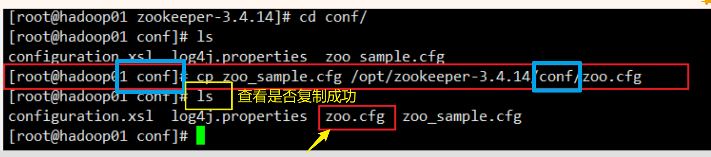
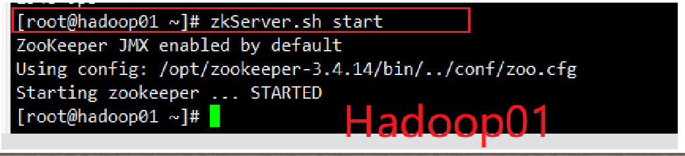
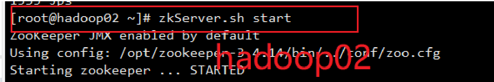
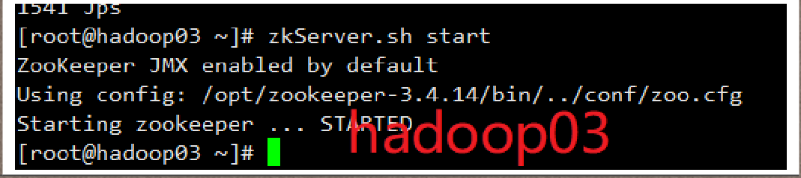
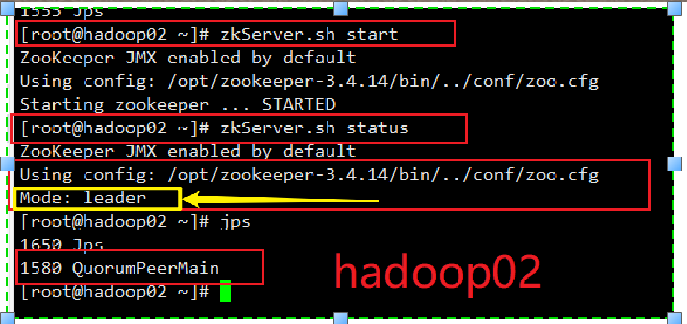

# Zookeeper分布式hadoop集群部署

## 1)下载安装包

1. 下载Zookeeper安装包
2. 上传zookeeper安装包到linux指定的目录下


## 2)配置环境变量

配置环境变量

打开文件

```
vi  /etc/profile
```

配置zookeeper环境变量

```
export ZK_HOME=/opt/zookeeper-3.4.14
export PATH=$PATH:$ZK_HOME/bin
```

刷新配置文件

```
source /etc/profile
```

## 3)解压Zookeeper安装包

```
 tar -zxvf zookeeper-3.4.14.tar.gz
```


## 4)Zookeeper相关配置

### **第一步：**

cd进入zookeeper目录下的conf目录里，将zoo_sample.cfg复制一份，并且重命名为zoo.cfg


```cmd
cp zoo_sample.cfg  /opt/zookeeper-3.4.14/conf/zoo.cfg
```




### **第二步：**

修改配置文件zoo.cfg,分别设置dataDir目录，配置服务器编号与主机名映射关系，设置与主机连接的心跳端口和选举端口。

心跳端口

选举端口

```properties
# The number of milliseconds of each tick
# 设置通信心跳数
tickTime=2000
# The number of ticks that the initial
# synchronization phase can take
initLimit=10
# The number of ticks that can pass between
# sending a request and getting an acknowledgement
syncLimit=5
# the directory where the snapshot is stored.
# do not use /tmp for storage, /tmp here is just
# example sakes.

# 设置数据文件目录+数据持久化路径
#dataDir=/tmp/zookeeper
dataDir=/export/data/zookeeper/zkdata

# the port at which the clients will connect
# 设置客户端连接的端口号
clientPort=2181
# the maximum number of client connections.
# increase this if you need to handle more clients
#maxClientCnxns=60
#
# Be sure to read the maintenance section of the
# administrator guide before turning on autopurge.
#
# http://zookeeper.apache.org/doc/current/zookeeperAdmin.html#sc_maintenance
#
# The number of snapshots to retain in dataDir
#autopurge.snapRetainCount=3
# Purge task interval in hours
# Set to "0" to disable auto purge feature
#autopurge.purgeInterval=1

# 配置Zookeeper集群的服务器编号以及对应的主机名、通信端口号(心跳端口号)和# # 选举端口号。
server.1=hadoop01.2888.3888
server.2=hadoop02.2888.3888
server.3=hadoop03.2888.3888
```


::: warning  注意知识概念清楚

server.1=hadoop01.2888.3888

1:表示服务器编号

hadoop01：表示服务器地址

2888：表示**通信端口号=心跳端口号**

3888：表示Leader选举端口号

:::


### **第三步：**

**创建myid文件**

3.1：根据配置文件zoo.cfg中设置的dataDir目录，创建zkdata文件夹

```
mkdir -p /export/data/zookeeper/zkdata
```


**3.2：创建文件**

zkdata目录下创建myid文件

```cmd
touch myid
```

写入服务器对应的编号

Hadoop01 =》 1

hadoop02  =》2

......


## 5)分发Zookeeper相关配置文件到其他服务器


### 第一步：

将zookeeper-3.4.14这个目录发送同步到hadoop这台机子上的opt目录下

```cmd
scp -r /opt/zookeeper-3.4.14/  hadoop02:/opt
```


### 第二步：

其次：将myid文件分发到hadoop02，或其他主机上，依次改为主机对应的编号

```cmd
scp -r /export/  hadoop02:/
```

### 第三步：

分发环境变量文件

```cmd
scp -r /etc/profile hadoop02:/etc/profile
```


## 6)Zookeeper服务的启动

```cmd
zkServer.sh start
```

注意启动顺序 1-2-3









### 查看状态

```cmd
zkServer.sh status
```





hadoop02为Leader

所以：zookeeper的Leaders+Follower部署成功


## 7)关闭zookeeper服务

```cmd
zkServer.sh stop
```


