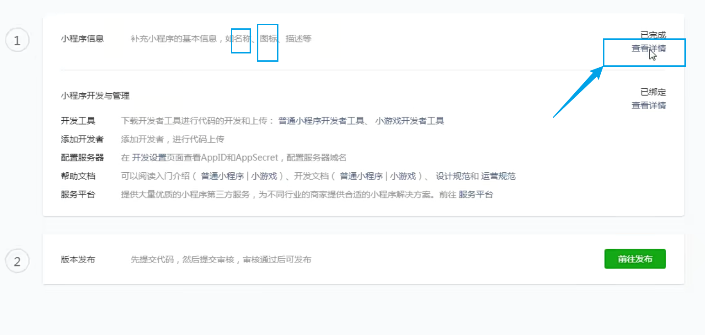

# 01什么是小程序

小程序，applet（小程序）人人都是开发者。

优点：

**注册**

登入就行了。

## 01)小程序后台

## 02)小程序的基本信息准备

点击

注意：其他任意选择，一定不要选择游戏。

## 03)Appid信息

每一个人都会有自己的appid。

为什么呢。因为每一个人的账号都不一样。

公司：给的就是这个appid，让你用这个appid去开发小程序。

appid是标识，使用发布上线使用的。不然你的小程序只能在本地去看了。

## 04)添加开发者

当前账号是管理者账号。

添加开发者者后，别人和自己都可以进行开发预览小程序效果。

微信开发工具下载

## 05)新建项目

目录：选择的文件夹不要是空的。

## 06)上传小程序代码

什么是体验版？

如：本地的上次完毕后，会生成一个在线的体验版。

如你添加的体验员，去体验、测试。【添加的体验员】

代码上传

上传后的提示

上传是传到哪里去了呢？

微信公众平台的后台。也就是微信的后台界面！

## 07)查看上传的版本

- 取消体验：表示：测试人员不可以预览了。我自己也不可以了。

重新设置体验版吧。

## 08)提交审核

再次表述你的小程序是干什么的。

## 09)审核通过与发布

- 线上版本的小程序就是人人都可以访问的。前提就是：审核版本要通过审核。