# WXapplet文件的作用

## 初始化项目文件

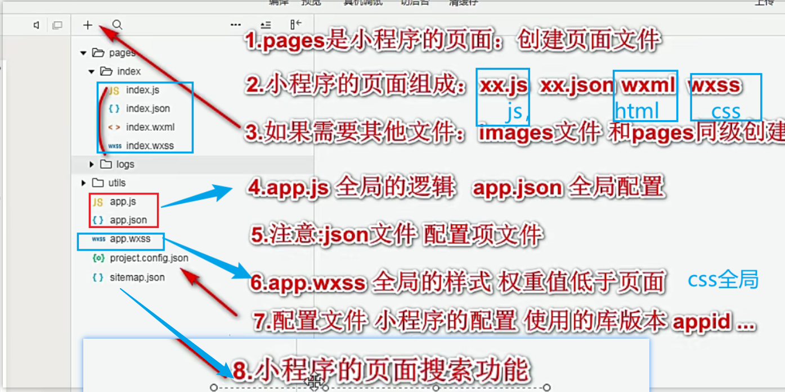

## 新建目录规则

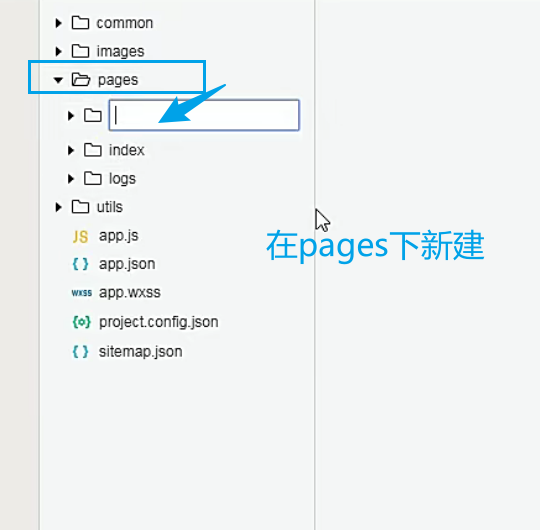

效果

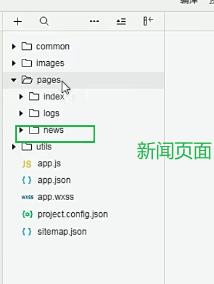

## 怎么新建page

- 选中你新建的空目录

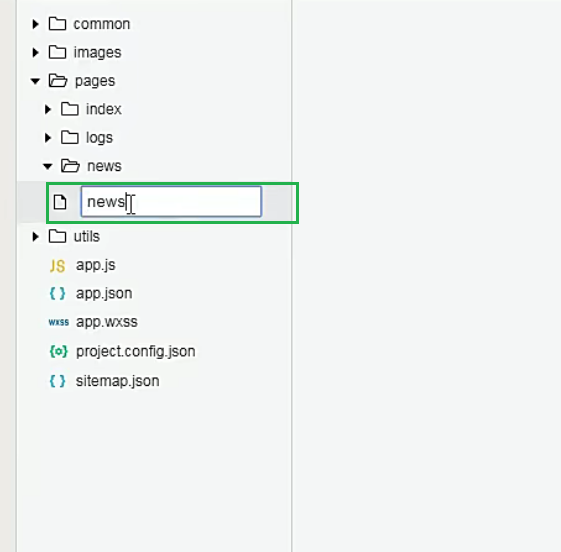

效果图：

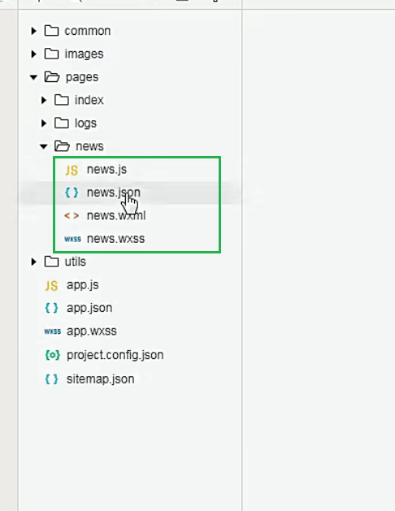

小程序页面的组成。

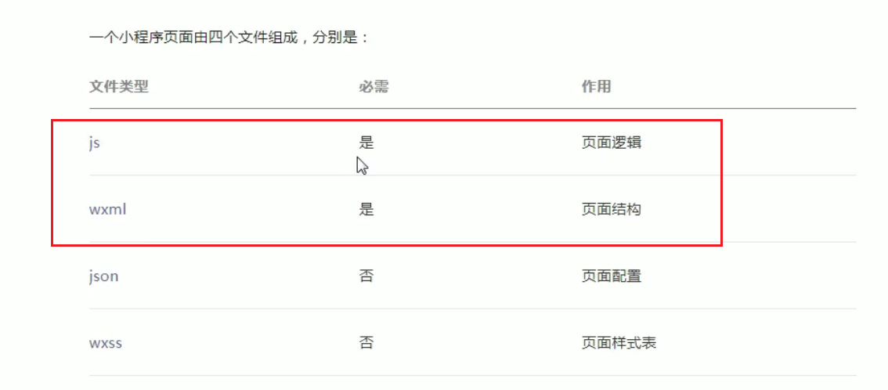

## *app.js文件

小程序的配置文件。

全局配置文件

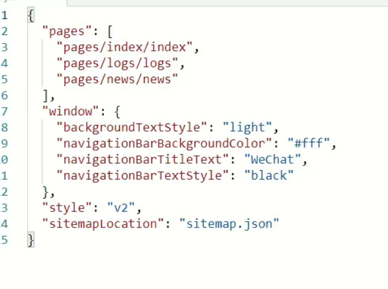

- 页属性
- 窗口属性

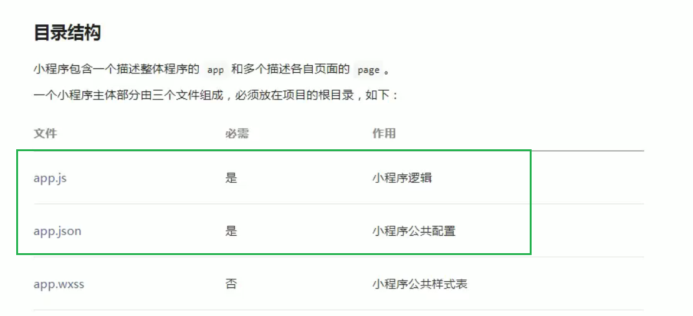

**怎么看文档**

## app.js的pages路径配置

- 谁在前就显示那个页面。

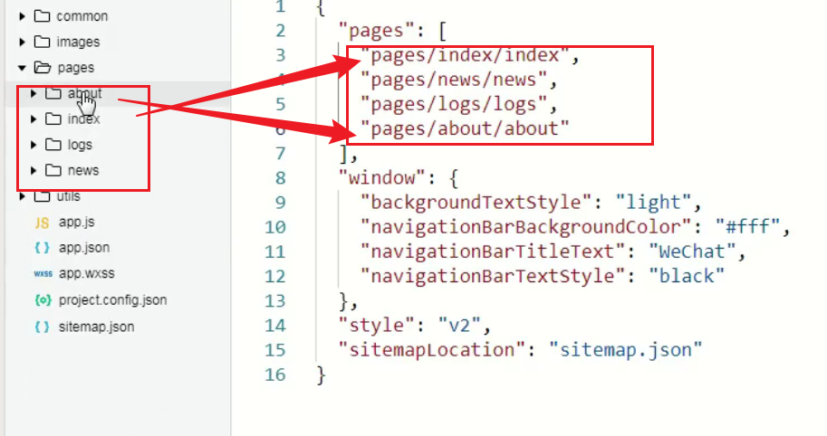

**注意点：**

- 删除两边要同时删除。页面文件夹删除了，pages也要删除
- app.js中不能有注释

## app.js的window配置

用于设置小程序

- 状态栏、
- 导航条、
- 标题、
- 窗口背景色。

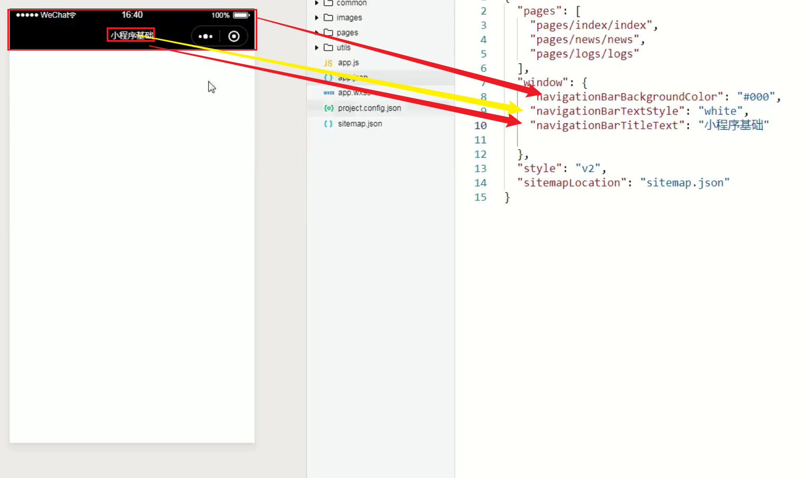

## page的json文件单独配置样式

logs这个文件夹页，进行了单独的配置。

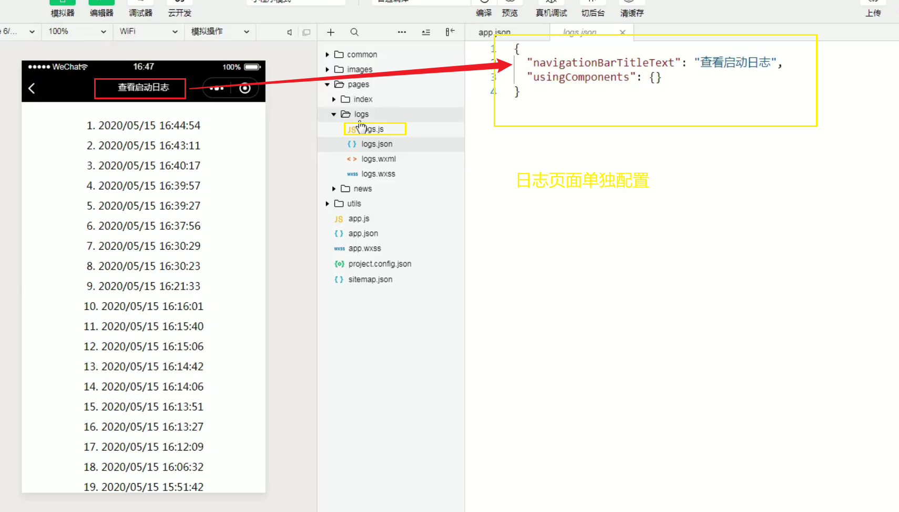

