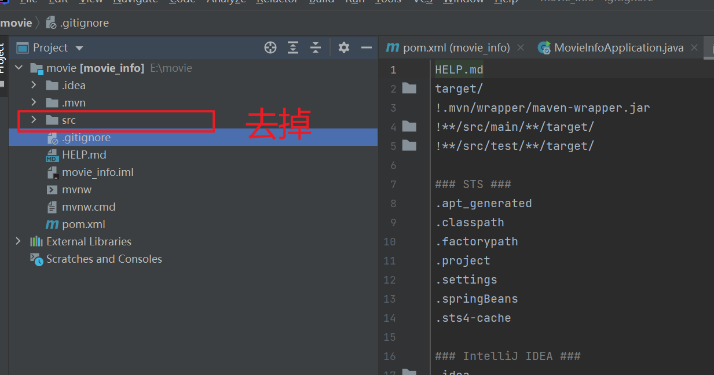
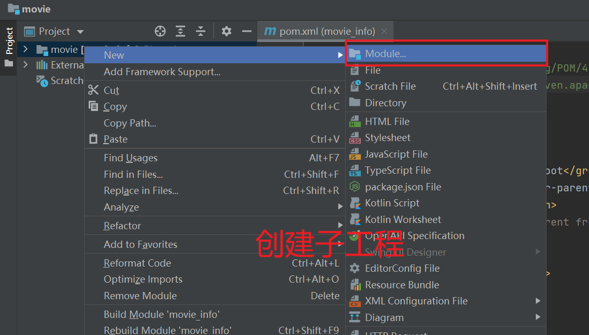
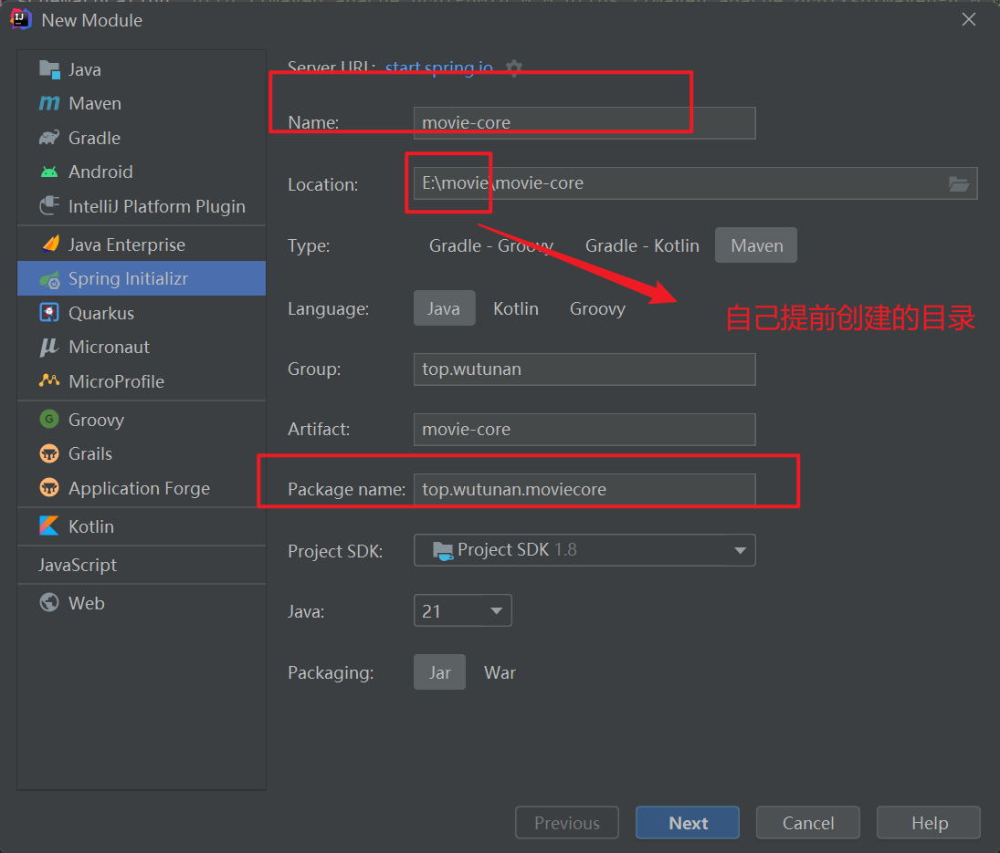
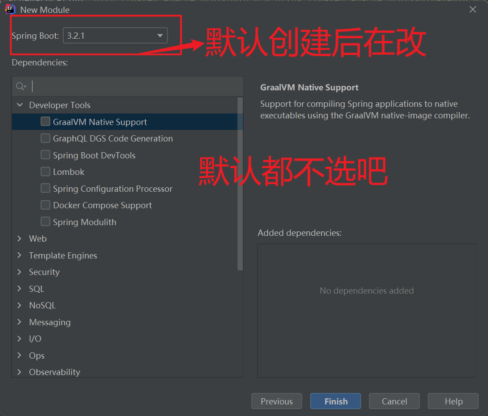
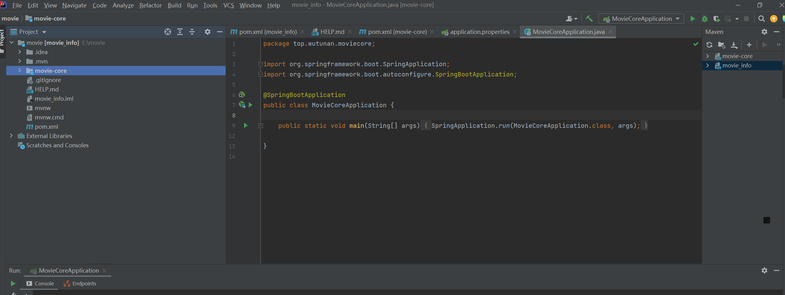
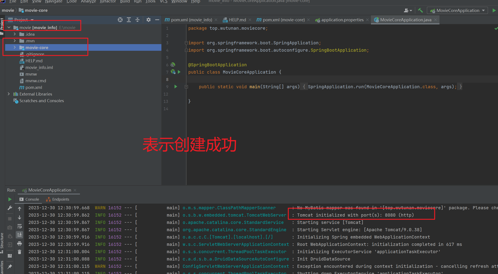

# 创建java项目

## 创建父工程




父工程的pom文件配置

```xml
<?xml version="1.0" encoding="UTF-8"?>
<project xmlns="http://maven.apache.org/POM/4.0.0" xmlns:xsi="http://www.w3.org/2001/XMLSchema-instance"
         xsi:schemaLocation="http://maven.apache.org/POM/4.0.0 https://maven.apache.org/xsd/maven-4.0.0.xsd">
    <modelVersion>4.0.0</modelVersion>

    <!--   springboot版本   -->
    <parent>
        <groupId>org.springframework.boot</groupId>
        <artifactId>spring-boot-starter-parent</artifactId>
        <version>2.3.4.RELEASE</version>
        <relativePath/> <!-- lookup parent from repository -->
    </parent>
    <groupId>top.wutunan</groupId>
    <artifactId>movie_info</artifactId>
    <!--   父工程标志  -->
    <packaging>pom</packaging>
    <version>0.0.1-SNAPSHOT</version>
    <name>movie_info</name>
    <description>Demo project for Spring Boot</description>
    <properties>
        <java.version>8</java.version>
    </properties>
    <dependencies>
        
        <dependency>
            <groupId>org.springframework.boot</groupId>
            <artifactId>spring-boot-starter</artifactId>
        </dependency>
        <!--   springmvc      -->
        <dependency>
            <groupId>org.springframework.boot</groupId>
            <artifactId>spring-boot-starter-web</artifactId>
        </dependency>

        <!--    springboot测试    -->
        <dependency>
            <groupId>org.springframework.boot</groupId>
            <artifactId>spring-boot-starter-test</artifactId>
            <scope>test</scope>
        </dependency>
        <!--   get   与  set  -->
        <dependency>
            <groupId>org.projectlombok</groupId>
            <artifactId>lombok</artifactId>
            <optional>true</optional>
        </dependency>
        <!-- ============== fastjson ============== -->
        <dependency>
            <groupId>com.alibaba</groupId>
            <artifactId>fastjson</artifactId>
            <version>1.2.47</version>
        </dependency>
        <!-- 阿里巴巴druid -->
        <dependency>
            <groupId>com.alibaba</groupId>
            <artifactId>druid-spring-boot-starter</artifactId>
            <version>1.1.21</version>
        </dependency>
        <!-- mybatis升级mybatis-plus -->
        <dependency>
            <groupId>com.baomidou</groupId>
            <artifactId>mybatis-plus-boot-starter</artifactId>
            <version>3.4.0</version>
        </dependency>
    </dependencies>

    <build>
        <plugins>
            <plugin>
                <groupId>org.springframework.boot</groupId>
                <artifactId>spring-boot-maven-plugin</artifactId>
            </plugin>
        </plugins>
    </build>

</project>

```




## 创建子工程







- 子工程重要的pom文件配置

```xml
<?xml version="1.0" encoding="UTF-8"?>
<project xmlns="http://maven.apache.org/POM/4.0.0" xmlns:xsi="http://www.w3.org/2001/XMLSchema-instance"
         xsi:schemaLocation="http://maven.apache.org/POM/4.0.0 https://maven.apache.org/xsd/maven-4.0.0.xsd">
    <modelVersion>4.0.0</modelVersion>


    <!--  指定自己的依赖是谁  -->
    <parent>
        <groupId>top.wutunan</groupId>
        <artifactId>movie_info</artifactId>
        <version>0.0.1-SNAPSHOT</version>
    </parent>

    <groupId>top.wutunan</groupId>
    <artifactId>movie-core</artifactId>

    <!--  子工程的标志  -->
    <packaging>jar</packaging>
    <version>0.0.1-SNAPSHOT</version>
    <name>movie-core</name>
    <description>Demo project for Spring Boot</description>

    <properties>
        <java.version>8</java.version>
    </properties>

    <dependencies>
        
    </dependencies>

    <build>
        <plugins>
            <plugin>
                <groupId>org.springframework.boot</groupId>
                <artifactId>spring-boot-maven-plugin</artifactId>
            </plugin>
        </plugins>
    </build>

</project>

```


## 验证

- 启动项目




- 默认tomact端口是8080

