# mybatis工具使用


## 连接数据库

点击database =》Data source =》选择你要连接的数据库mysql

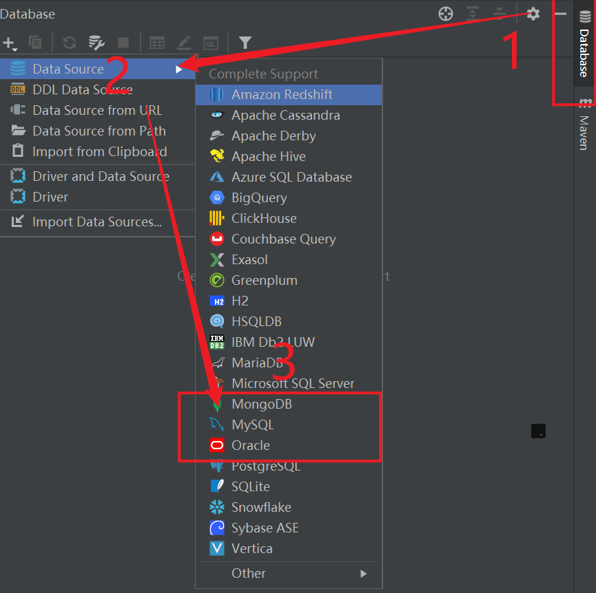

- 添加连接数据库的jar包驱动。

新版的idea直接下载就行。下载失败直接手动指定连接mysql的驱动jar包。

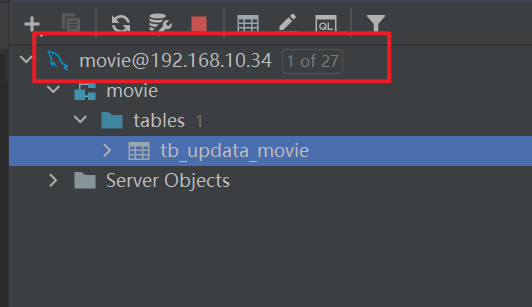


选中表进行生成相关代码。

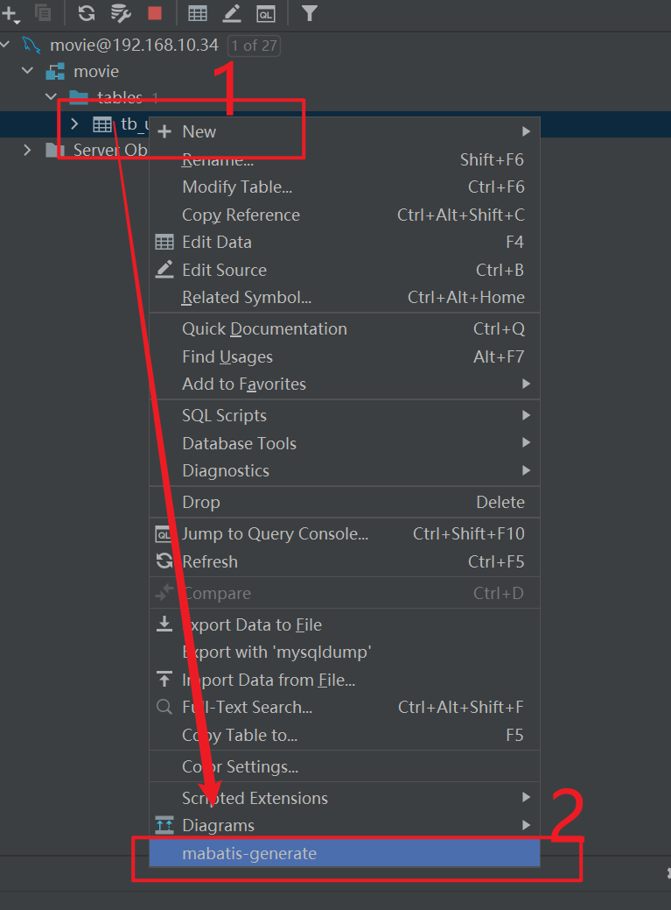


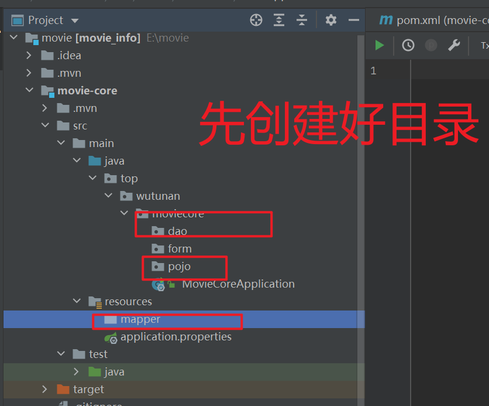


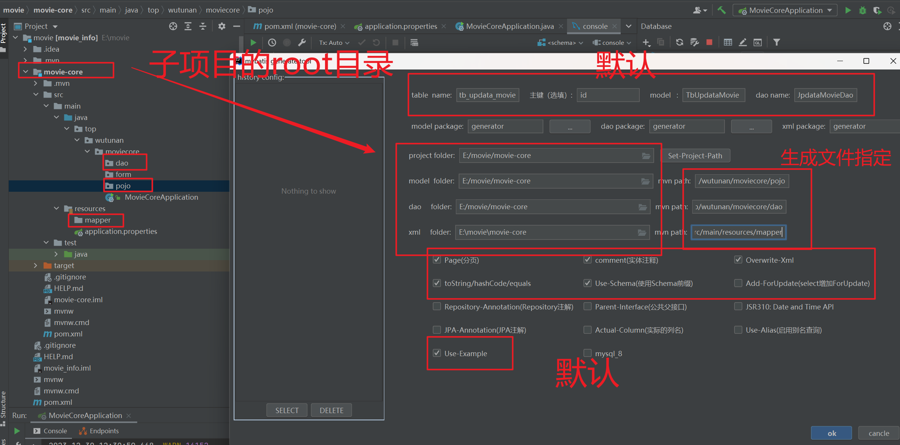

- 现在使用好像无效。总结：基本使用是这样使用。


## Free MyBatis Tool 

是一款增强idea对mybatis支持的插件。

- 默认点击生成的文件

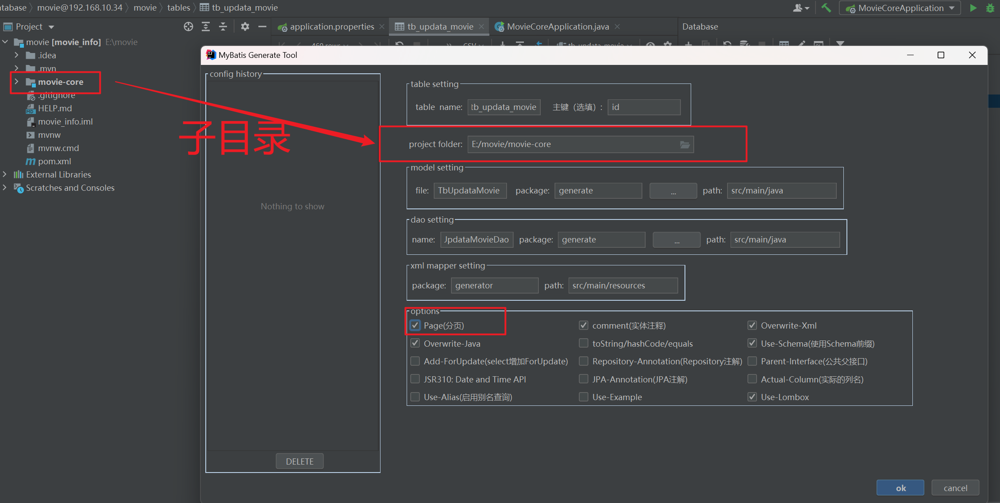


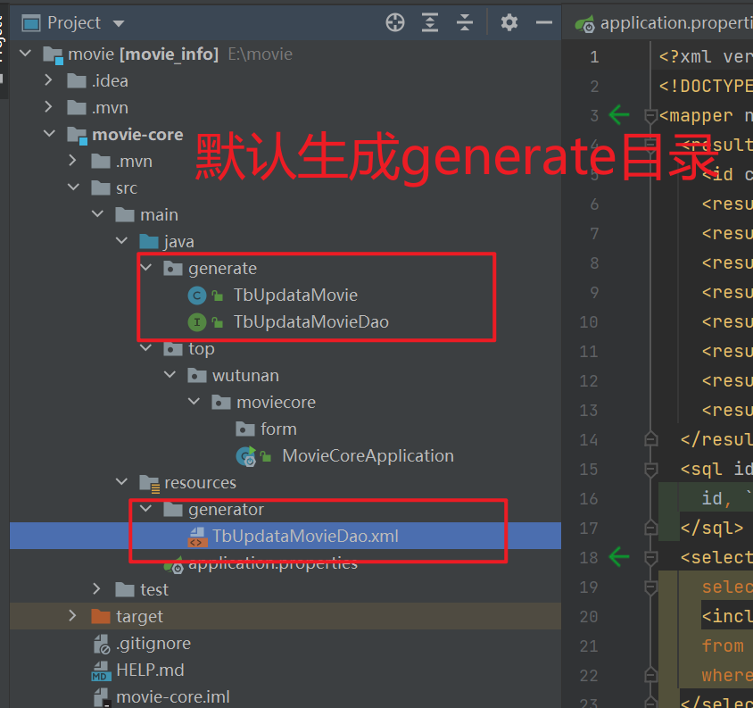


- 需求：指定相应的目录。配置。

当前目录情况：

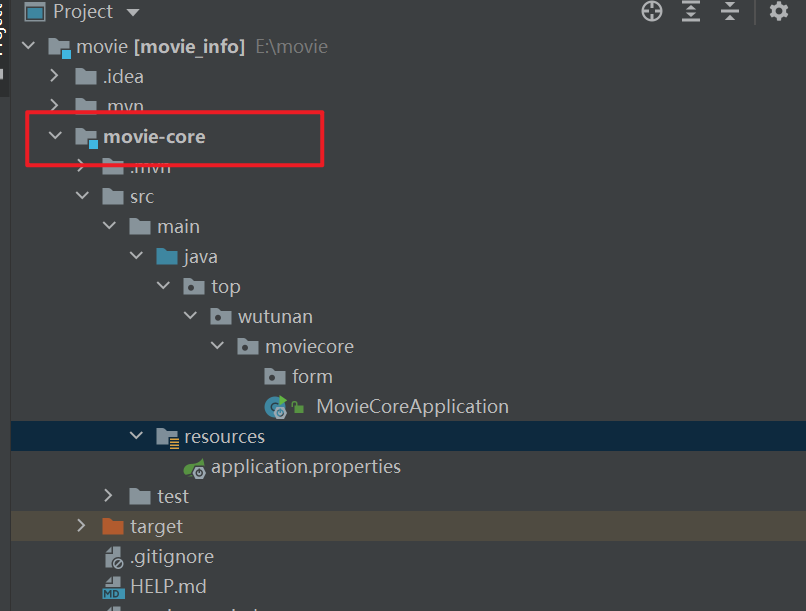


- 注意：不存在的目录自己生成。

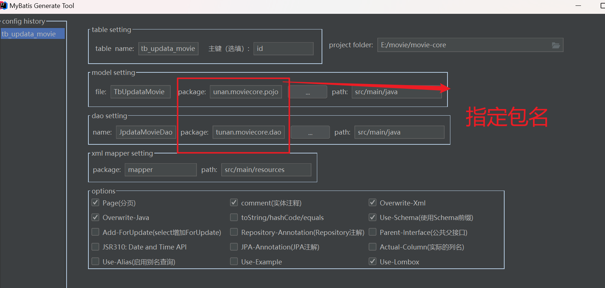


结果

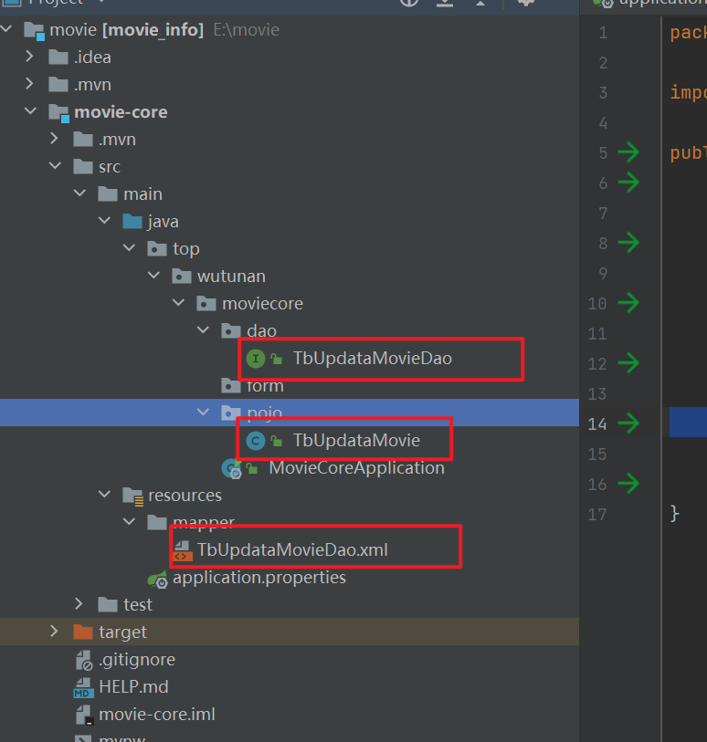


- Free MyBatis Tool 测试

springboot数据连接配置

```yaml
spring:
  datasource:
    driver-class-name: com.mysql.cj.jdbc.Driver
    url: jdbc:mysql://192.168.10.34:3306/movie?useUnicode=true&characterEncoding=UTF-8&useSSL=false&useTimezone=true&serverTimezone=GMT%2B8&autoReconnect=true
    username: root
    password: root
    hikari:
      maximum-pool-size: 100
      minimum-idle: 5
      idle-timeout: 20000
      connection-timeout: 5000
      max-lifetime: 360000
######################################   mybatis-plus集成  #####################################
mybatis-plus:
  mapper-locations: classpath*:mapper/*.xml
  type-aliases-package:
    - cn.gun.pojo
  global-config:
    db-config:
      #主键类型  AUTO:"数据库ID自增", INPUT:"用户输入ID",ID_WORKER:"全局唯一ID (数字类型唯一ID)", UUID:"全局唯一ID UUID";
      id-type: auto
  configuration:
    log-impl: org.apache.ibatis.logging.stdout.StdOutImpl
#########################################  日志    ####################################
logging:
  level:
    org.springfromework.web: ERROR
    org.mybatis: info

```

- 测试代码

```java
@RunWith(SpringRunner.class)
@SpringBootTest
class MovieCoreApplicationTests {

    @Autowired
    private TbUpdataMovieDao tbUpdataMovieDao;

    @Test
    void contextLoads() {
        TbUpdataMovie tbUpdataMovie = tbUpdataMovieDao.selectByPrimaryKey(23);
        System.out.println(tbUpdataMovie.toString());
    }

}
```


- 测试结果

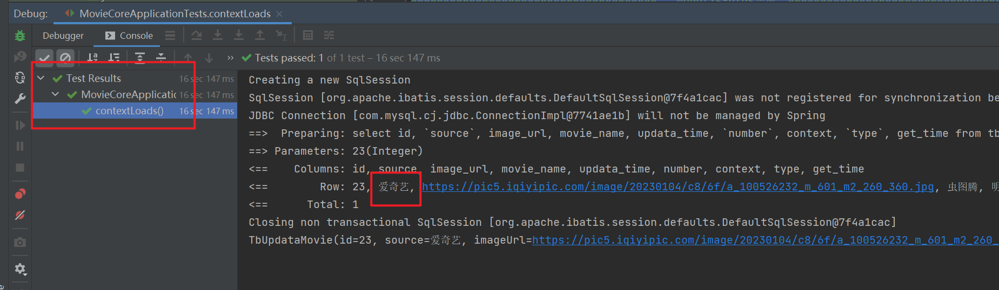


