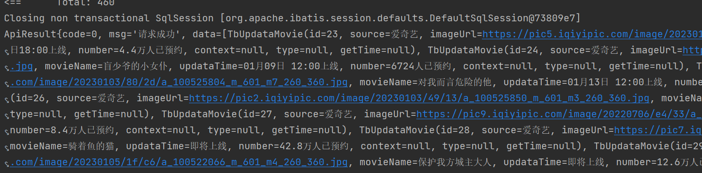

# 编写查询电视剧信息列表


## 01)编写controller层

```java
package top.wutunan.moviecore.web.controller;


import org.springframework.beans.factory.annotation.Autowired;
import org.springframework.web.bind.annotation.GetMapping;
import org.springframework.web.bind.annotation.RestController;
import top.wutunan.moviecore.Result.ApiResult;
import top.wutunan.moviecore.web.service.Impl.MovieInfoServiceImpl;

@RestController
public class MovieInfoController {

    @Autowired
    private MovieInfoServiceImpl movieInfoService;

    @GetMapping("/movie")
    public ApiResult getMovieList(){

        ApiResult movieList = movieInfoService.getMovieList();
        return movieList;
    }
}

```


## 02)编写service层

- 创建MovieInfoService.java的抽象接口

```java
package top.wutunan.moviecore.web.service;

import top.wutunan.moviecore.Result.ApiResult;

public interface MovieInfoService  {

    public ApiResult getMovieList();
}

```

- 实现MovieInfoService接口。

```java
package top.wutunan.moviecore.web.service.Impl;


import com.baomidou.mybatisplus.core.conditions.query.QueryWrapper;
import org.springframework.beans.factory.annotation.Autowired;
import org.springframework.stereotype.Service;
import top.wutunan.moviecore.Result.ApiResult;
import top.wutunan.moviecore.dao.TbUpdataMovieDao;
import top.wutunan.moviecore.pojo.TbUpdataMovie;
import top.wutunan.moviecore.web.service.MovieInfoService;

import java.util.List;

@Service
public class MovieInfoServiceImpl implements MovieInfoService {


    @Autowired
    private TbUpdataMovieDao tbUpdataMovieDao;

    @Override
    public ApiResult getMovieList() {

        QueryWrapper<TbUpdataMovie> tbUpdataMovieQueryWrapper = new QueryWrapper<>();
        List<TbUpdataMovie> tbUpdataMovies = tbUpdataMovieDao.selectList(tbUpdataMovieQueryWrapper);
        ApiResult apiResult = new ApiResult();
        apiResult.setData(tbUpdataMovies);
        return apiResult;
    }
}

```


## 03)编写dao层

```java
package top.wutunan.moviecore.dao;

import com.baomidou.mybatisplus.core.mapper.BaseMapper;
import org.apache.ibatis.annotations.Mapper;
import org.omg.CORBA.BAD_POLICY;
import top.wutunan.moviecore.pojo.TbUpdataMovie;

@Mapper
public interface TbUpdataMovieDao extends BaseMapper<TbUpdataMovie> {
    int deleteByPrimaryKey(Integer id);

    int insert(TbUpdataMovie record);

    /**
     * 根据实体类  添加
     * @param record
     * @return
     */
    int insertSelective(TbUpdataMovie record);


    /**
     * 通过主键查询
     * @param id
     * @return
     */
    TbUpdataMovie selectByPrimaryKey(Integer id);

    /**
     *
     * @param record
     * @return
     */
    int updateByPrimaryKeySelective(TbUpdataMovie record);


    int updateByPrimaryKey(TbUpdataMovie record);
}
```

::: tip 注意

1. TbUpdataMovieDao接口继承这个BaseMapper<TbUpdataMovie>类就行。

2. 接口的抽象方法是使用mybatis的工具进行生成的代码。

:::


## 测试结果

```java
@RunWith(SpringRunner.class)
@SpringBootTest
class MovieCoreApplicationTests {
    @Autowired
    private MovieInfoServiceImpl movieInfoService;
    @Test
    void contextLoads01() {
        ApiResult movieList = movieInfoService.getMovieList();
        System.out.println(movieList.toString());
    }
}

```

- 运行代码，测试service层。

