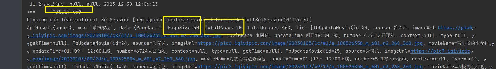

# 编写查询的分页接口


MyBatis-Plus 是 MyBatis 的增强工具，在使用 MyBatis-Plus 进行分页查询时，通常会使用 `Page` 类来封装分页相关的信息。以下是一个简单的示例，演示如何在 Spring Boot 中使用 MyBatis-Plus 编写分页接口：

首先，确保在项目中引入了 MyBatis-Plus 的依赖。可以在 Maven 或 Gradle 中添加如下依赖：

## 引入依赖

Maven:

```
<dependency>
    <groupId>com.baomidou</groupId>
    <artifactId>mybatis-plus-boot-starter</artifactId>
    <version>3.4.3.2</version> <!-- 版本号以实际版本为准 -->
</dependency>

```

Gradle:

```
implementation 'com.baomidou:mybatis-plus-boot-starter:3.4.3.2' // 版本号以实际版本为准
```


## 编写dao层

- dao接口

```java
@Mapper
public interface TbUpdataMovieDao extends BaseMapper<TbUpdataMovie> {


    /**
     * 分页查询
     * @param
     * @return
     */
    IPage<TbUpdataMovie> selectTbUpdataMoviePage(Page<TbUpdataMovie> page);

```

- xml编写

```xml
  <!-- 分页查询 -->
  <select id="selectTbUpdataMoviePage" resultMap="BaseResultMap">
    SELECT <include refid="Base_Column_List" />
    FROM tb_updata_movie
  </select>

```

## 编写service层

```java
    @Override
    public ApiResult getTbUpdataMoviePage(Integer currentPage, Integer pageSize) {
        Page<TbUpdataMovie> tbUpdataMoviePage = new Page<>(currentPage, pageSize);
        IPage<TbUpdataMovie> tbUpdataMovieIPage = tbUpdataMovieDao.selectTbUpdataMoviePage(tbUpdataMoviePage);
        // 构造一个包含分页信息和查询结果的 Map
        Map<String, Object> resultData = new HashMap<>();

        //  一共多少页
        tbUpdataMovieIPage.setPages(tbUpdataMovieIPage.getRecords().size()/pageSize+1);
        tbUpdataMovieIPage.setTotal(tbUpdataMovieIPage.getRecords().size());

        resultData.put("PageNum", tbUpdataMovieIPage.getCurrent());
        resultData.put("PageSize", tbUpdataMovieIPage.getSize());
        resultData.put("totalPages", tbUpdataMovieIPage.getPages());// 总页数
        resultData.put("totalRecord", tbUpdataMovieIPage.getTotal());
        resultData.put("list", tbUpdataMovieIPage.getRecords());


        return new ApiResult(resultData);
    }
```


## 测试

```java
    /**
     * 分页查询接口
     */
    @Test
    void contextLoads02() {
        ApiResult movieList = movieInfoService.getTbUpdataMoviePage(2,50);
        System.out.println(movieList.toString());
    }

```




