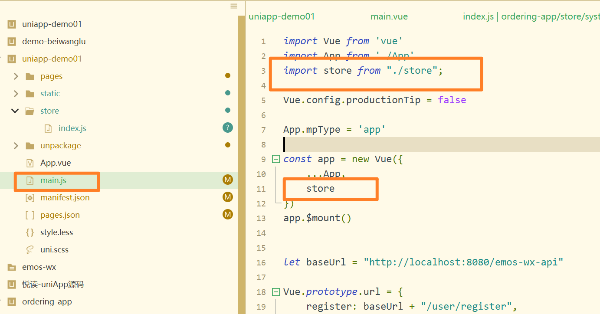
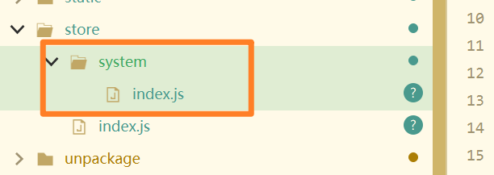
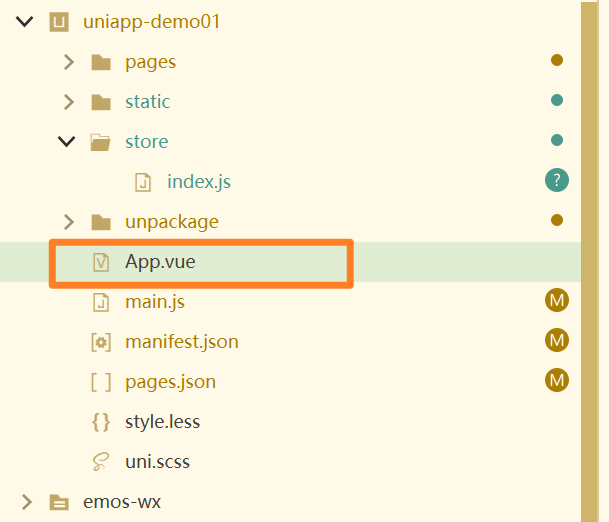
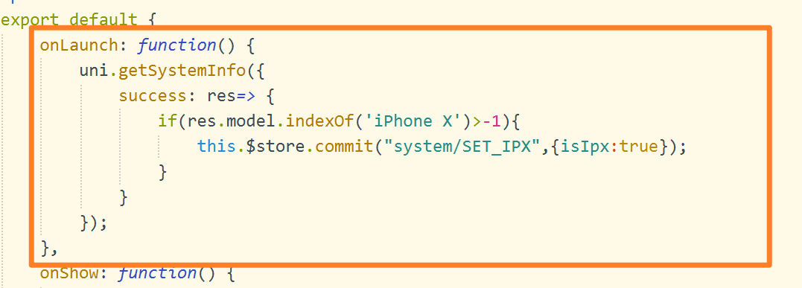
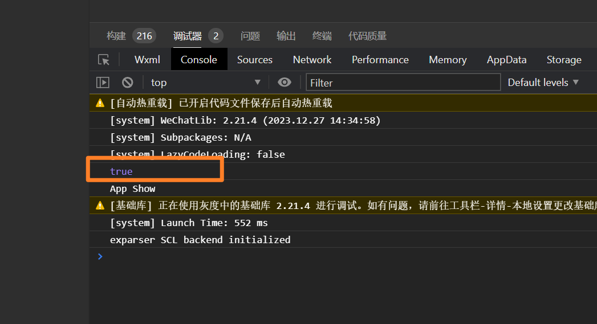
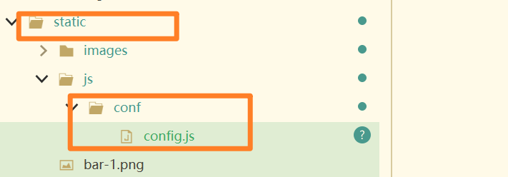
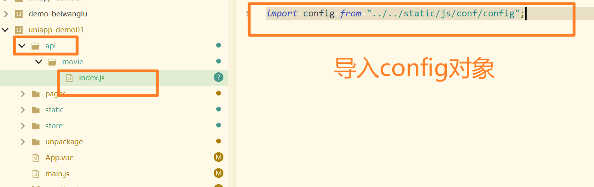

# 前端对接接口

## 创建Store目录


- 创建index.js变量。

```js
import Vue from "vue";
import Vuex from "vuex";//导入vuex
import system from "./system";
import business from "./business";

Vue.use(Vuex);

const store=new Vuex.Store({
    modules:{
        system,
        business
    }
});

// 导出这个 对象，其他主键使用。
export default store;
```


## 挂载外部文件变量

- 在main.js文件中



```js
import Vue from 'vue'
import App from './App'
//  从 那个目录下，导入 store变量
import store from "./store";

Vue.config.productionTip = false

App.mpType = 'app'

const app = new Vue({
    ...App,
	store
})
app.$mount()
```


## 创建system目录



```js

// 导出一个默认的对象到  内存
export default {
    // 命名空间
    namespaced:true,
    // 定义状态
    state:{
        isIpx:false, //是否iPhoneX
        platform:1//平台类型。值：1:微信小程序，2:微信公众号
    },
    
    // 改变 内部属性值
    mutations:{
        //设置isIpx 属性
        ["SET_IPX"](state,payload){
            state.isIpx=payload.isIpx;
        }
    }
}
```


## 做平台的判断

- 在App.vue文件中




- 添加如下代码



```js
export default {
		onLaunch: function() {
            uni.getSystemInfo({
                success: res=> {
                    if(res.model.indexOf('iPhone X')>-1){
                        // isIpx属性改变为 true。
                        this.$store.commit("system/SET_IPX",{isIpx:true});
                    }
                }
            });
		},

```


## 修改main.vue代码

- 导入变量代码

```js
	import {mapState,mapActions} from "vuex";
```

- 在vue对象中添加如下方法。

```js
		computed:{
			...mapState({
				isIpx:state=>state.system.isIpx,
			})
		},
```

这段代码是使用了 Vuex（Vue.js 的状态管理工具）中的 `mapState` 辅助函数，用于在 Vue 组件中映射 Vuex store 中的状态（state）到组件的计算属性（computed properties）中。

1. **`mapState` 辅助函数**：这是 Vuex 提供的一个辅助函数，用于在组件中映射 Vuex store 中的状态。它接受一个对象作为参数，对象的属性是组件中的计算属性，值是从 Vuex store 中获取状态的函数。
2. **`...` 扩展运算符**：在 JavaScript 中，`...` 是扩展运算符，用于展开数组或对象。在这里，`...mapState` 表示展开 `mapState` 返回的对象，将对象中的属性和值展开为当前对象的属性和值。
3. **`state => state.system.isIpx`**：这是一个箭头函数，表示从 Vuex store 中的 `system` 模块中获取 `isIpx` 状态。箭头函数的写法是 ES6 中的一种简写。

::: tip 问题

- 什么是扩展运算符？什么是箭头函数？

:::


## 测试是否为iphoneX



是。打印true。

## 设置请求地址

- 在static目录中创建js目录，如下创建。




```js
let baseApi="http://localhost";
export default {
    baseMovieApi
}
```

