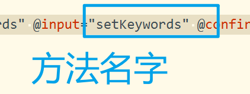

# 最近搜索的实现


## 01)封装组件

- 创建components目录


- 导入组件

```js
	import Search from "../../components/search";
```


1. **`import`关键字：** 表示引入（导入）一个外部模块或组件。
2. **`Search`：** 是导入的模块或组件的名称。在这里，`Search` 是一个从相对路径 `../../components/search` 导入的模块或组件的名称。
3. **相对路径 `../../components/search`：** 指定了被导入模块或组件的相对路径。在这个例子中，`../../components/search` 表示在当前文件的父级目录下的 `components` 目录中找到名为 `search` 的模块或组件。

这行代码的含义是，从相对路径 `../../components/search` 导入一个名为 `Search` 的模块或组件，以便在当前文件中使用它。


::: tip 模块或组件要怎么理解？举例子。

模块或组件是现代前端开发中用于组织和封装代码的概念。它们有助于将应用程序拆分成小的、独立的部分，每个部分都有自己的职责和功能。下面我将分别解释这两个概念，并给出一个简单的React组件的例子。


模块或组件是现代前端开发中用于组织和封装代码的概念。它们有助于将应用程序拆分成小的、独立的部分，每个部分都有自己的职责和功能。下面我将分别解释这两个概念，并给出一个简单的React组件的例子。

1. **模块（Module）：**
   - 在编程中，模块是一组相关的代码，被组织成一个单独的单元。这有助于将代码分离为逻辑上相关的部分，使得代码更易于维护和理解。
   - 在JavaScript中，可以使用ES6的模块系统（`import`和`export`语句）来创建模块。例如：

```javascript
// math.js
export function add(a, b) {
    return a + b;
}

// main.js
import { add } from './math';
console.log(add(2, 3)); // 输出 5

```

上述例子中，`math.js` 是一个模块，它包含了一个加法函数。`main.js` 导入了 `add` 函数，并在控制台中输出了 2 和 3 的和。

**组件（Component）：**

- 在前端框架（如React、Vue.js等）中，组件是一个可复用的UI元素，它封装了特定的功能和样式。组件可以包含自己的状态（state）和生命周期方法，使得它们可以被独立使用，并可以嵌套在其他组件中。
- 例如，在React中：

```javascript
// Button.js
import React from 'react';

function Button(props) {
    return <button onClick={props.onClick}>{props.label}</button>;
}

export default Button;
```


```javascript
// App.js
import React from 'react';
import Button from './Button';

function App() {
    const handleClick = () => {
        console.log('Button clicked');
    };

    return (
        <div>
            <h1>Hello, React!</h1>
            <Button onClick={handleClick} label="Click me" />
        </div>
    );
}

export default App;

```


上述例子中，`Button.js` 和 `App.js` 都是React组件。`Button` 组件是一个简单的按钮组件，而 `App` 组件则是包含了一个按钮的父组件。组件可以被复用，使得代码更具可维护性和可扩展性。

:::

02)


## 03)phonex的兼容性问题

- 设置在x的问题下。在components\search的index.vue文件下。


**视图层**

```html
		<!--  首页的文字 -->
        <view :class="{'search-title':true,wechat:true,ipx:false}">
            <view class="search-close"></view>
            <view class="title">搜索</view>
        </view>
```

**模型层**

```js
    import {mapState,mapMutations} from "vuex";
    export default {
        name: "search",
        computed:{
            ...mapState({
                isIpx:state=>state.system.isIpx,
            })
        },
```


## 04)点击搜索条时显示

- 第一步：设置点击事件。

```js
			<!--  点击时设置为 true -->
			<view :class="{ 'search-header': true, ipx: false }" @click="isShowSearchComponents=true">
				<view class="search-wrap">
					<view class="icon"></view>
					<view class="text">请输入影视信息</view>
				</view>
			</view>
```


- 第二步：设置属性

```js
	data() {
		return {
			isShowSearchComponents:false
		}
	},
```

父传子。

```js
		<!--  父传子   -->
		<Search :show="isShowSearchComponents" @close="isShow=false"></Search>
```


- 第三步：在components\search的index.vue文件下。设置是否要显示组件。

```js
		props:{
		    //是否显示搜索组件
		    isShowSearch:{
		        type:Boolean,
		        default:false
		    }
		},
```


错误写法

::: tip 总结

- 子组件的vue对象的porp属性是show哦。

:::

## 05)点击是否显示测试组件


效果跳转结果


## 06)点击关闭搜索组件


- 实现。子组件向父组件传值。

视图出发close方法

```js
            <view class="search-close" @click="close()"></view>
```


模型传close变量。

```js
        methods:{
            //隐藏搜索组件
            close(){
                this.$emit("close")
            },
        }
```

- 父亲组件的视图代码。@close="isShowSearchComponents=false"

```js
	<Search :show="isShowSearchComponents" @close="isShowSearchComponents=false"></Search>
```


## 07)自动获取焦点

首页点击搜索框，自动获取焦点。

- 第一步：视图的文本输入框代码

```html
		<!--  搜索的头 -->
        <view class="search-header">
            <view class="search-wrap">
                <view class="search-input"><input type="text" confirm-type="search" placeholder="请输入商家或菜品名称" :focus="false" /></view>
                <view class="search-btn"></view>
            </view>
        </view>
```

focus="false" 是不聚焦。是true聚焦。


::: tip

1. 平台兼容性问题。导致不自动聚焦。解决：300毫秒的延迟聚焦。

:::

- 第二步：编写监听函数。

1. 监听show的值变化。true是显示组件，显示时聚焦。
2. 不显示时，不聚焦。

代码实现。在search组件里面编写。

```js
        watch:{
            show(val){
                setTimeout(()=>{
                    this.isFocus=val;
                },300)
            }
        }
```

定义变量。是否要聚焦的变量。

```js
    data(){
        return {
            isFocus:false
        }
    },
```

- 第三步：测试是否有自动聚焦。


## 08)实现点击收受按钮功能

- 创建如下文件。


```js
export default {
    namespaced:true,
    // 定义状态
    state:{
        //搜索的关键词
        keywords:"",
    },
    // 改变转台
    mutations:{
        //设置搜索关键词
        ["SET_KEYWORDS"](state,payload){
            // 左边当前的属性
            // 右边用户传递过来的值。
            state.keywords=payload.keywords;
        },
    }
    
}

```


- 导出search属性。


- 导出这个存储对象

```js
import Vue from "vue";
import Vuex from "vuex";
import system from "./system";
import movie from "./movie";
import search from "./search";

Vue.use(Vuex);

const store=new Vuex.Store({
    modules:{
        system,
		movie,
		search
    }
});

// 导出这个存储对象
export default store;

```

- 在search的组件导出变量使用。


- 使用这个变量代码

```js
			// 获取状态的值。
			...mapMutations({
			    SET_KEYWORDS:"search/SET_KEYWORDS",//设置搜索关键词
			}),
```


- 获取这个变量值。

```js
        computed:{
            ...mapState({
                isIpx:state=>state.system.isIpx,
                keywords:state=>state.search.keywords,
            })
        },
```


- 设置value值。


```js
:value="keywords"
```


- 监听一个input事件



```js
 @input="setKeywords"
```


- 编写设置值的方法。

```js
		//设置搜索关键词
		setKeywords(e){
		    this.SET_KEYWORDS({keywords:e.target.value})
		},
```


## 09)实现点击搜索按钮

1. 点击搜索按钮。
2. 将搜索的关键字添加到前端的数组里面去。

- 第一步试图层编写方法。


```html
                <view class="search-btn" @click="goSearch()></view>
```

- 第二步：编写方法逻辑。

1. 搜索的值要添加到数组里面。
2. 要做页面跳转。

```js
        //跳转到搜索页面
        goSearch(){
            let keywords=this.keywords;
            if(keywords.trim()){
                // 设置到数组
                this.SET_HISTORY_KEYWORDS({keywords:keywords})
            }else {
                uni.showToast({
                    title:"请输入关键词",
                    icon:"none",
                    duration:2000
                })
            }
        },
```

- 第三步：定义历史搜索数组与添加操作代码实现。


```js
    
    state:{
        //搜索的关键词
        keywords:"",
            
            
        //历史搜索关键词
        historyKeywords:uni.getStorageSync("historyKeywords")?JSON.parse(uni.getStorageSync("historyKeywords")):[]
    },

mutations:{
        //设置历史搜索关键词
        ["SET_HISTORY_KEYWORDS"](state,payload){
            if(payload.keywords){
                // 遍历属性值去重。
                for(let i=0;i<state.historyKeywords.length;i++){
                    if(state.historyKeywords[i]==payload.keywords){
                        state.historyKeywords.splice(i--,1);
                        break;
                    }
                }
                
                state.historyKeywords.unshift(payload.keywords);
                uni.setStorageSync("historyKeywords",JSON.stringify(state.historyKeywords))
            }
        },

    }
```


- 第四步：前端导出这个状态使用。


```js
// 第一步：
SET_HISTORY_KEYWORDS:"search/SET_HISTORY_KEYWORDS",//设置历史关键词

// 第二步:
historyKeywords:state=>state.search.historyKeywords
```


- 第五步：打印历史搜索的状态值。

```

```


## 10)搜索数组渲染到视图上


```html
<view class="search-kwords">
        <view class="kwords" v-for="(item,index) in historyKeywords" :key="index">{{item}}</view>
</view>
```

- 数组有值就显示。没有值可以显示其他的吗？

实现不显示吧。

```html
<view class="search-area" v-if="historyKeywords.length>0">

   // 数组大小要大于 0
</view>
```


## 11)设置本地保存数组字符串

- 第一步：同步保存到本地。


```js
uni.setStorageSync("historyKeywords",JSON.stringify(state.historyKeywords))
```


- 第二步：取值，本地有就本地取。没有赋值为[]。是空数组。

```js
//历史搜索关键词
historyKeywords:uni.getStorageSync("historyKeywords")?JSON.parse(uni.getStorageSync("historyKeywords")):[]
```


## 12)点击垃圾图标清楚历史搜索

- 第一步：编写方法。

```js
            //清除最近搜索
            clearHistoryKeywords(){
                uni.showModal({
                    title: '',
                    content: '确认要清除最近搜索吗？',
                    success: (res)=> {
                        if (res.confirm) {
                            this.CLEAR_HISTORY_KEYWORDS();
                        }
                    }
                });
            }
```

- 第二步编写：vuex的状态值。

```
        //清除历史关键词
        ["CLEAR_HISTORY_KEYWORDS"](state){
            state.historyKeywords=[];
            uni.removeStorageSync("historyKeywords");
        }
```


在search的组件导入这个值。


```js
    CLEAR_HISTORY_KEYWORDS:"search/CLEAR_HISTORY_KEYWORDS"//清除历史关键词
```


视图层


## 重点总结点

1. input元素总结。点击手机确认按钮进行搜索的功能。


## 创建错误

- 错误一：


解决：


## bug问题

- 重复值问题。


- 去重代码

需求：

1. 数组有重复的值不能添加。


```js
                for(let i=0;i<state.historyKeywords.length;i++){
                    if(state.historyKeywords[i]==payload.keywords){
                        state.historyKeywords.splice(i--,1);
                        break;
                    }
                }
                state.historyKeywords.unshift(payload.keywords);
```


