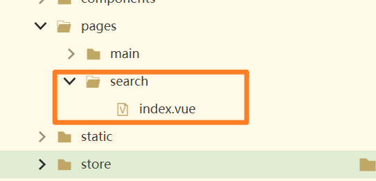
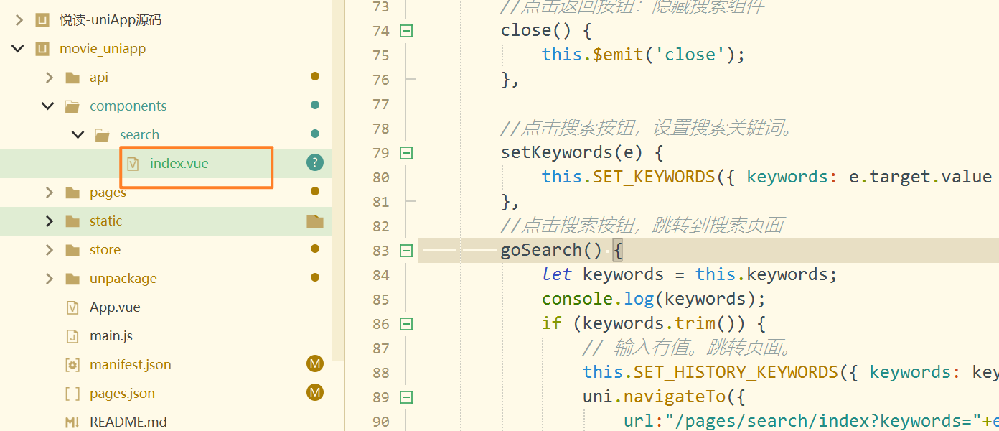
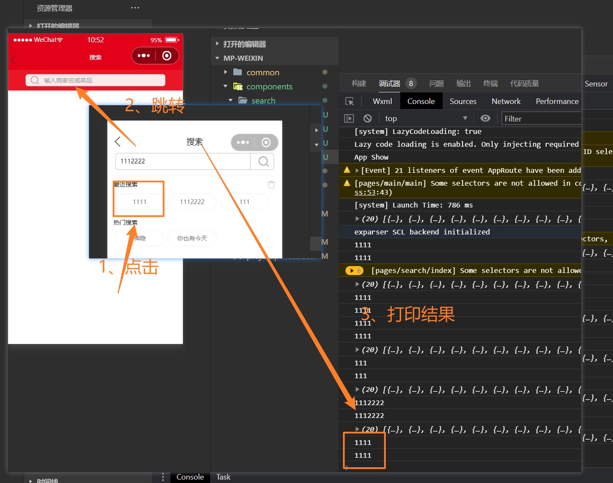
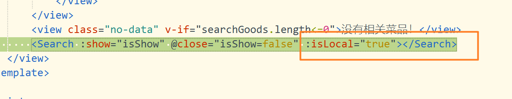
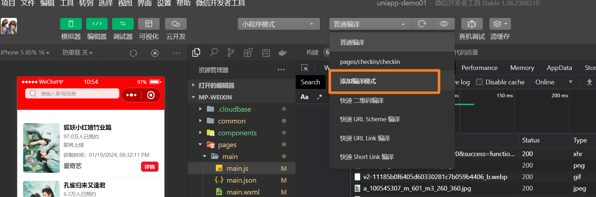
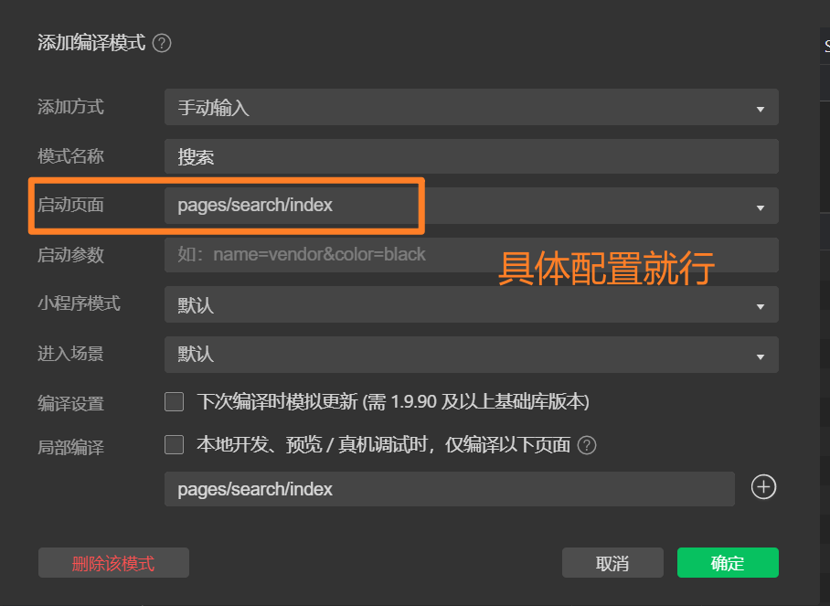

# 影视搜索的页面

效果说明


## 01)配置页面的路径

在pages.json文件中进行配置。在pages属性数组里面添加。

```json
		{
			"path": "pages/search/index",
			"style": {
				"navigationBarTitleText": "搜索",
				"navigationStyle": "custom",
				"onReachBottomDistance": 100
			}
		}
```

- "onReachBottomDistance": 100 表示上拉加载数据。


## 02)创建pages页面

创建搜索的页面，展示搜索的结果的页面。



视图代码与css代码编辑如下。


## 03)实现点击按钮跳转



```js
		//点击搜索按钮，跳转到搜索页面
		goSearch() {
			let keywords = this.keywords;
			console.log(keywords);
			if (keywords.trim()) {
				// 输入有值。跳转页面。
				this.SET_HISTORY_KEYWORDS({ keywords: keywords });
                
                // 跳转代码。
				uni.navigateTo({
				    url:"/pages/search/index?keywords="+encodeURIComponent(keywords)
				})
				
			} else {
				uni.showToast({
					title: '请输入关键词',
					icon: 'none',
					duration: 2000
				});
			}
		},
```

在搜索的组件搜索。


## 04)最近关键值字搜索


## 05)搜索结果页面接受参数

```js
        onLoad(opts){
            //接收搜索关键词
            this.keywords=opts.keywords?decodeURIComponent(opts.keywords):"";
            // this.lng=0;//经度
            // this.lat=0;//纬度
            this.maxPage=0;//总页码数
            this.curPage=1;//当前页码
        },
```

测试搜索效果




## 06)搜索页面的搜索组件

- 视图代码

```html
        <Search :show="isShow" @close="isShow=false" :isLocal="true"></Search>
```

- vue代码

```js
    import Search from "../../components/search";
```

- 加载组件

```js
        components:{
            Search
        },
```


## 07)首页被多次覆盖问题

- 在搜索组件编写。

```js
        props:{
            //是否显示搜索组件
            show:{
                type:Boolean,
                default:false
            },
            //是否在搜索页面进行搜索
            isLocal:{
                type:Boolean,
                default:false
            }
        },
```


- 搜索页面的页。组件标签添加一个属性。




- 搜索组件的方法进行添加，跳转搜索页面代码。

```js
      		//跳转到搜索页面
            goSearch(e,kwords){
                let keywords=kwords || this.keywords;
                if(keywords.trim()){
                    this.SET_HISTORY_KEYWORDS({keywords:keywords});
                    //隐藏搜索组件
                    this.close();
                    if(this.isLocal){
                        uni.redirectTo({
                            url:"/pages/search/index?keywords="+encodeURIComponent(keywords)
                        })
                    }else{
                        uni.navigateTo({
                            url:"/pages/search/index?keywords="+encodeURIComponent(keywords)
                        })
                    }
                }else {
                    uni.showToast({
                        title:"请输入关键词",
                        icon:"none",
                        duration:2000
                    })
                }
            },
```


## 08)渲染搜索影视信息展示


## wx开发工具技巧

- 添加一个编译的模式



- 配置页面的路径。





