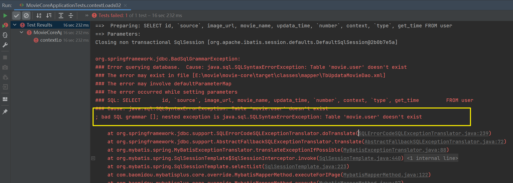

# mybatis的xml有错

```
org.springframework.jdbc.BadSqlGrammarException: 
### Error querying database.  Cause: java.sql.SQLSyntaxErrorException: Table 'movie.user' doesn't exist
### The error may exist in file [E:\movie\movie-core\target\classes\mapper\TbUpdataMovieDao.xml]
### The error may involve defaultParameterMap
### The error occurred while setting parameters
### SQL: SELECT       id, `source`, image_url, movie_name, updata_time, `number`, context, `type`, get_time         FROM user
### Cause: java.sql.SQLSyntaxErrorException: Table 'movie.user' doesn't exist
; bad SQL grammar []; nested exception is java.sql.SQLSyntaxErrorException: Table 'movie.user' doesn't exist
```



- 原因：数据库不存在。