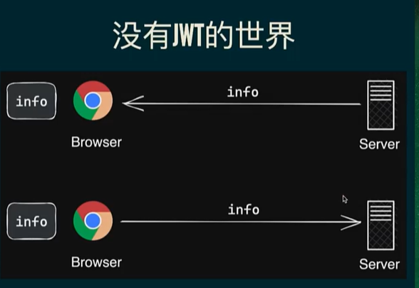
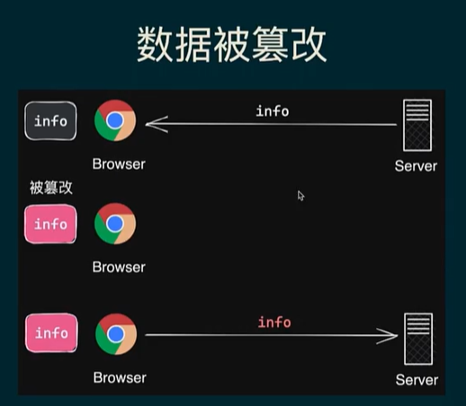
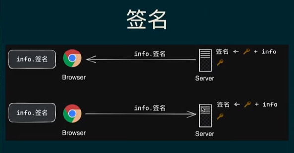

# 为什么有JWT的出现？

我们要认识清楚一个东西，首先要知道这个东西他到底解决了什么样的问题。

没有JWT的时候，到底有什么样的问题？

有些时候，服务器呢会发送一些信息给浏览器。

比方说像登录成功之后，有些身份信息会让浏览器去保存。

给了浏览器之后呢？浏览器会把这个信息保存下来，那么具体的保存位置呢可以是cookie，可以是local storage啊可以是任何东西。



那么将来有一天啊，浏览器呢要请求服务器的时候呢，他会把这个东西读出来然后呢通过http协议啊发给服务器，那么服务器就知道了，他有这个身份信息。

于是呢表明他是有登录过的，在这种简单的模式下，会有一个什么样的问题呢？

就是由于这个东西呢，它是存在浏览器端的，那浏览器要去改这个玩意。那是太容易了！

对吧一打开控制台local storage system item，这不一下就改了。包括cookie啊包括index DB啊都是可以更改

所以呢在这种模式下，你就很难防止数据被篡改。



你保存了一个身份信息到浏览器了，然后呢用户只需要打开控制台一行代码就可以改了。对吧那么下次发送的时候呢，就发送的是被更改过后的信息。那么这更改的信息服务器不知道啊！他咋知道这个信息是被更改过的呀！

所以呢，就会造成问题，那么除了被篡改之外呢？

还有一种情况呢就是被伪造。


压根就没登录，但是呢我通过这个控制台。或者是一些工具对吧，直接给他添加这么一个信息不就完事了吗？

只要我知道服务器的规则。我添加就完事了，然后发送请求的时候。就把这个信息带过去了，所以说无论是被篡改还是说被伪造，他都表明了一件事，就是服务器无法信任这个信息。没有办法信任他。

他到底是被更改过后的信息呢？还是被伪造的信息呢？还是一个正常的信息呢？估计不知道。


怎么办呢？


## 签名

就是进行签名。

什么是签名？

签名是一种算法。



你只要给他一个信息给他一个秘钥，

通过某一种算法，就可以得到一个签名结果

通常这个结果呢，我们把它转换成字符串来表示。


呃这个算法呢其实有很多哈

我们比较常见的呢是HS256啊

咱们来试一下就知道了

好我这里呢是nodeJS环境啊，我就简单的写一个签名算法啊！

```js
const crypto = require('crypto');
function sign(info,key){
    const hmac = crypto.createHmac（'sha256'，key）；
    hmac.update（info）；
    return hmac.digest（'hex'）；
}
    const KEY ='123456'
    sign（'袁大帅'，123456'）
```


首先利用这个nodeJS里边的库啊crypto，这是一个nodeJS里边的加密库啊，

我写个sign函数表示签名。你给我一个信息给我一个秘钥，然后呢我来帮你完成这个签名，来我们来试一下吧！


秘钥呢也是一个字符串啊，比方说123456吧。我们把它保存一下啊。

这个秘钥呢是保存在服务器端的，他不会发送给客户端。


好我们把这个生成的结果呢？打印一下咱们来看一下签名的结果

```
8f6b94748471bfba4docb58ca70449703b132aeab4257a2deb6a9
ed2666723a6
```

是一个字符串.


好理解到什么叫签名之后,咱们再回过头来看啊,服务器要发送这个身份信息之前呢。

他首先会对这个身份信息呢进行签名，拿到一个签名的结果。同时他会把这个签名一起发给浏览器。

那么浏览器拿到两个东西了是吧！一个是身份信息一个是签名

- 信息
- 签名

那么浏览器保存的时候呢，都一起来保存好。保存完之后。

下一次请求服务器的时候，他要把之前保存的这个身份信息+签名一起发送给服务器。那么这个时候就不一样了。

服务器通过这个信息本身，他就能验证这个信息有没有被篡改。有没有被改动过。或者伪造过。


他是怎么来验证呢？


在这个信息里面包含二个部分是吧。

- 一个是签名
- info身份信息。


客户端：发过来的签名+info到服务器端。

服务器接收客户端发过来的信息：

- 使用客户端发过来的info+同样的密钥，在来一次签名。

- 把签名结果。有客户端传递过来的这个签名进行对比。
  - 二个一样就是通过。
  - 有一点差异，那一定有问题！那就不能被信任。

可得：

1. 客户端，只要把info这个信息有改动，那么到时候这边算出来的这个签名就与之前服务器第一次传递给客户端的签名不同了。
2. 客户端改info、也改服务器端的签名。【前端用那一把密钥？】
   - 客户端获取不了服务器的钥匙。所以改不了签名。
   - 不能改签名，就不能改info。info 独立，生成一个独立的签名。

这中逻辑就是JWT的雏形。

## 什么是JWT？


本质：其实就是一个非常长的字符串。

这个字符串有三部分组成。每一个部分用这个点来分割。

- header【头】就是一个json字符串。整个JWT里边的签名算法。使用base64编码得到。

- payload【负荷】服务器想传递给客户端的信息了。比方说：身份信息。和上面一样。

  JTW的过期时间

  

- signature【签名】

  header.payload 【info】+密钥  ======》 签名算法【函数】====base64========》signature【得出的签名字符串】

base64是一种格式转换。

```js
var a = '{"alg":"HS256","typ":"JWT"}"
undefined 
btoa(a)
'eyJhbGci0iJIUzI1NiIsInR5cCI6IkpXVCJ9
atob()
```


