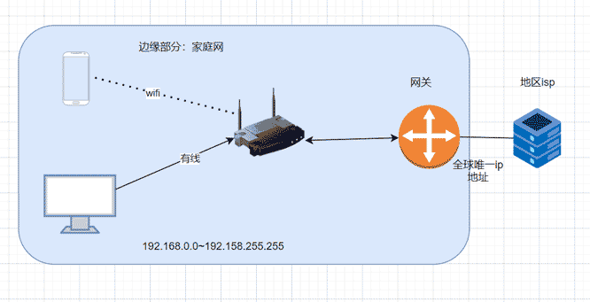

# 网络地址转换NAT技术

::: warning 学习目标
问：为什么要学习网络地址转换NAT技术？

答：这个技术是非常用的。常见频率100%。我们在家里使用手机、笔记本、电视机都是使用NAT技术进行通信的。

常见频率都100%。下面就来揭开NAT的神秘面纱。注意：下面讲述的都是基本的原理。要深入实战请阅读网络方面的书籍资料。

:::

ipv4最多只有40+亿个ip地址。

---

为什么有网络地址转换NAT技术呢？

答：在21世纪，其实ip资源不够用了。其实就是为了解决ip资源不够用问题。

## 边缘家庭网络

一般情况下，一个家庭只有一个ip地址。每一个设备在进行网络层通讯时都要有一个唯一的ip地址。

---

问：一个家庭只有一个ip地址，是怎么样将多个设备连接上互联网的呢？

答：解决如下图。

问：内网多个设备使用相同一个外网ip请求外网的服务，外部怎么知道具体哪个设备在请求呢？

答：上面的问题就要使用网络地址转换NAT技术来解决。

---

问：到底什么是网络地址转换技术？

答：NAT是Network Address Translation。网络地址转换。NAT技术用于多个主机通过一个公有ip地址访问互联网的**私有网络中**

## 边缘企业网络

## 内网地址是什么？

答：内部机构使用的。

注意：避免与外网地址重复。

## 外网地址是什么？

答：全球范围使用的。

注意：全球公网唯一的ip。

## NAT技术详解

端口（Port）：端口对应这程序的进程概念。

NAT通讯的家庭网络拓补图：

上面的电脑、手机是怎么连接到互联网的呢？只有连接到互联网就可以刷抖音、发微信，这都是连接互联网进行通信的结果。

NA（p）T表

| 方向               | 设备的ip和端口     | 出口网关           |
| ------------------ | ------------------ | ------------------ |
| 家庭网（出）互联网 | 192.168.2.11:6666  | 173.21.59.10:16666 |
| 家庭网（出）互联网 | 192.168.2.10:7777  | 173.21.59.10:17777 |
| 互联网（进）家庭网 | 73.21.59.10:16666  | 192.168.2.11:6666  |
| 互联网（进）家庭网 | 173.21.59.10:17777 | 192.168.2.10:7777  |

---

问：6666是什么？怎么理解？

答：6666是设备上运行的程序端口号的一个标识。怎么理解？这么说吧！你打开手机并也打开了快手。快手是一个app程序。这里请记住一个原则：所有的程序运行都必须开一个端口号来进行通信。6666号你就表示是一个快手的app程序。192.168.2.11的ip地址表示自己的手机。

则192.168.2.11:6666表示自己手机上的快手app程序在运行。当你在刷视频时，快手app程序通过家庭的路由器向互联网通信获取视频信息。  出口网关是负责与快手服务器进行通信的转换器。也可以理解为一个代理服务。

---

::: tip NAT技术的总结

网络地址转换技术就是发生在本地路由的。网络地址转换技术（NAT）主要功能就是把内网的ip地址转化成为外网的ip地址来进行外部的通信。并且在接收到数据之后。把外网的地址映射成为内网的ip地址转发数据包到具体的某一个设备。

优点：

- NAT减缓了ip地址的消耗。

缺点

- 添加了网络通信的复杂度。

:::

