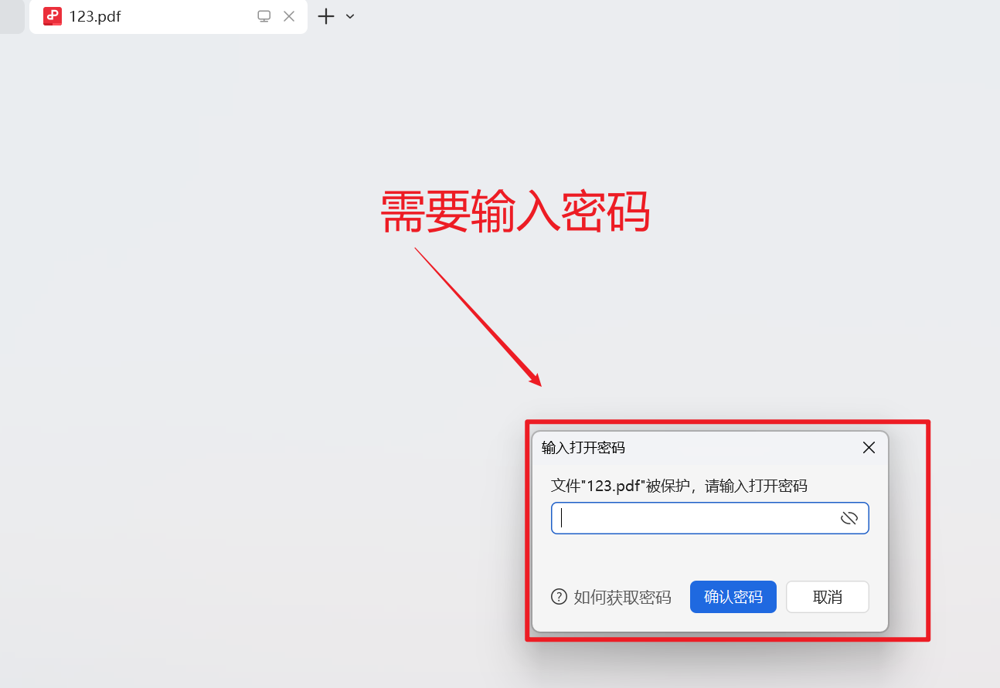

# kali破解pdf文件密码


## 遵守法律依据

破解PDF文件密码并非法外之地，其合法性完全取决于**你的目的、行为性质以及是否获得授权**。未经授权破解他人加密的PDF文件，很可能面临法律风险。

为了让你快速了解核心的法律边界，这里有一个简单的表格概括了主要情形：

| 你的行为                                                     | 法律定性                                   | 主要法律依据                       |
| :----------------------------------------------------------- | :----------------------------------------- | :--------------------------------- |
| **未经授权**破解**他人**的PDF，获取其中信息                  | **违法**，属于"窃取他人加密保护的信息"     | 《中华人民共和国密码法》第三十二条 |
| **未经授权**破解**他人**的PDF，并复制、传播内容              | **违法**，可能侵犯著作权，构成侵犯著作权罪 | 《中华人民共和国刑法》             |
| **未经授权**破解PDF，并以此牟利（如销售破解服务）            | **违法**，通常被视为严重情节，从重处罚     | 《中华人民共和国刑法》             |
| 在**合法授权**下进行安全测试，或破解**自己所有**但遗忘密码的文件 | **通常合法**                               |                                    |

⚠️违法的具体后果

如果你实施了上述违法行为，可能会承担以下法律责任：

- **行政处罚**：根据《中华人民共和国密码法》，窃取他人加密保护的信息或非法侵入他人密码保障系统的，将由有关部门依照《中华人民共和国网络安全法》等法律、行政法规追究法律责任。
- **刑事犯罪**：你的行为可能触犯《刑法》，面临更严重的后果。司法实践中，与破解密码相关的行为常涉及以下罪名：
  - **侵犯著作权罪**：通过破解PDF文件并复制、发行其内容，违法所得数额较大或有其他严重情节的，可处三年以下有期徒刑或拘役，并处罚金；情节特别严重的，处三年以上七年以下有期徒刑，并处罚金。有案例显示，销售软件的破解程序，法院会以侵犯著作权罪定罪量刑。
  - **非法获取计算机信息系统数据罪**：如果破解行为被认定为侵入计算机信息系统并获取其中存储的数据，情节严重的话，可处三年以下有期徒刑或拘役，并处罚金；情节特别严重的，处三年以上七年以下有期徒刑，并处罚金。
- **民事赔偿**：你的侵权行为给权利人（如PDF文件的创作者或所有者）造成损失的，权利人有权要求你进行经济赔偿。


## pdf文件准备

第一步：创建一个word文档。

第二步：word编辑器导出word为pdf文档。


第三步：对导出的pdf文件进行设置密码。


第四步：验证pdf文件是否设置成功。成功打开pdf文件时要输出密码才可以看到文件的内容。



## kali环境准备

第一步：创建一个文件夹。目的：为了放需要破解的pdf文件等...


第二步：pdf文件准备、破解pdf工具pdfcrack准备（pdfcrack没有就安装）。

```
apt install pdfcrack
```

验证是否验证成功或是否存在：

```shell
└─# pdfcrack -v
pdfcrack version 0.21
```


第三步：密码字典的准备。【密码可以结合用户的习惯去生成】


/usr/share/wordlists/mypassword.txt密码字典文件是自己准备的。


## 开始破解pdf文件

命令格式：

```shell
pdfcrack -w 字典文件路径 pdf加密文件路径
```

案例：

```shell
pdfcrack -w /usr/share/wordlists/mypassword.txt ./123.pdf pdfcrack -w /usr/share/wordlists/mypassword.txt ./123.pdf 
```

破解输出的结果：

```shell
└─# pdfcrack -w /usr/share/wordlists/mypassword.txt ./123.pdf 
PDF version 1.7
Security Handler: Standard
V: 2
R: 3
P: -1060
Length: 128
Encrypted Metadata: True
FileID: 3fae30afe0cb04478cf5c207edd0ab89
U: a0fcd17cb6a8bd04b4cef335f32e4bcc00000000000000000000000000000000
O: c431fab9cc5ef7b59c244b61b745f71ac5ba427b1b9102da468e77127f1e69d6
found user-password: '123456'
                                   
```


## pdfcrack命令详解

怎么看帮助信息？

答：直接pdfcrack就行。无需加-h、-help。

```
Usage: pdfcrack -f filename [OPTIONS]
OPTIONS:
-b, --bench             perform benchmark and exit
-c, --charset=STRING    Use the characters in STRING as charset
-w, --wordlist=FILE     Use FILE as source of passwords to try
-n, --minpw=INTEGER     Skip trying passwords shorter than this
-m, --maxpw=INTEGER     Stop when reaching this passwordlength
-l, --loadState=FILE    Continue from the state saved in FILENAME
-o, --owner             Work with the ownerpassword
-u, --user              Work with the userpassword (default)
-p, --password=STRING   Give userpassword to speed up breaking
                        ownerpassword (implies -o)
-q, --quiet             Run quietly
-s, --permutate         Try permutating the passwords (currently only
                        supports switching first character to uppercase)
-v, --version           Print version and exit
```

**命令用法：**

```
pdfcrack -f 文件名 [选项]
```

**选项说明：**

| 选项 | 长格式              | 说明                                               |
| :--- | :------------------ | :------------------------------------------------- |
| `-b` | `--bench`           | 执行性能测试后退出                                 |
| `-c` | `--charset=字符串`  | 使用字符串中的字符作为字符集                       |
| `-w` | `--wordlist=文件`   | 使用文件作为密码来源进行尝试                       |
| `-n` | `--minpw=数字`      | 跳过尝试比此值短的密码                             |
| `-m` | `--maxpw=数字`      | 当达到此密码长度时停止                             |
| `-l` | `--loadState=文件`  | 从文件中保存的状态继续破解                         |
| `-o` | `--owner`           | 破解所有者密码                                     |
| `-u` | `--user`            | 破解用户密码（默认选项）                           |
| `-p` | `--password=字符串` | 提供用户密码以加速破解所有者密码（隐含 `-o` 选项） |
| `-q` | `--quiet`           | 静默运行                                           |
| `-s` | `--permutate`       | 尝试排列密码（当前仅支持将首字符切换为大写）       |
| `-v` | `--version`         | 打印版本信息后退出                                 |


## pdfcrack的安装位置

问：apt install pdfcrack安装的pdfcrack一般会在kali的那个位置能找到？

在Kali Linux中通过`apt install pdfcrack`安装`pdfcrack`后，它的主要文件会分散在系统的几个特定位置。为了让你快速了解，这里用一个表格来汇总：

| 文件类型             | 常见位置                            |
| :------------------- | :---------------------------------- |
| **可执行文件**       | `/usr/bin/pdfcrack`                 |
| 手册页               | `/usr/share/man/man1/pdfcrack.1.gz` |
| 软件安装文件默认路径 | `/usr/share`                        |

**🔍 查找与管理要点**

- **直接运行**：通常，安装完成后你只需要在终端输入 `pdfcrack` 就可以直接运行它，因为 `/usr/bin/` 目录默认就在系统的**PATH环境变量**里。
- **手动安装的潜在位置**：如果你后续通过`dpkg -i`手动安装了其他版本的`.deb`包，相关文件同样会按照Debian系的规则存放到上述目录中。
- **软件源配置**：如果遇到无法通过`apt install pdfcrack`安装的情况（例如提示"Unable to locate package pdfcrack"），这可能与你的软件源配置有关。`pdfcrack`工具可能需要通过正确配置的软件源来安装。请确保你的`/etc/apt/sources.list`文件包含了正确的Kali软件源，例如 `deb http://http.kali.org/kali kali-rolling main contrib non-free`，并运行`sudo apt update`更新列表。

快速查找pdfcrack。

```shell
cd /usr/bin/
```

ls命令查找：

```shell
└─# ls -l *pdfcrack*
-rwxr-xr-x 1 root root 68136 Sep 20 13:30 pdfcrack
```

## pdfcrack开源

**🔍 主要开源仓库地址**

pdfcrack 的主要源码仓库和资源链接如下：

| 类型                  | 地址                                                 | 说明                   |
| :-------------------- | :--------------------------------------------------- | :--------------------- |
| **项目主页**          | https://pdfcrack.sourceforge.net/                    | 获取最新消息和发布版本 |
| **源码仓库 (Debian)** | https://salsa.debian.org/debian/pdfcrack             | Debian 官方维护        |
| **源码包**            | https://packages.debian.org/source/unstable/pdfcrack | 下载源码包             |

**📖 关于项目与打包**

- **原始项目**：pdfcrack 最初由 Henning Noren 开发，其核心项目托管在 **SourceForge**。
- **系统打包**：许多主流 Linux 发行版，如 **Debian**、**Gentoo** 和 **Guix**，以及 **OpenBSD** 和 **NetBSD pkgsrc-wip**，都提供了 pdfcrack 的安装包。这些发行版通常会根据自己的策略对源码进行打包，但都遵循 GPL 协议。


