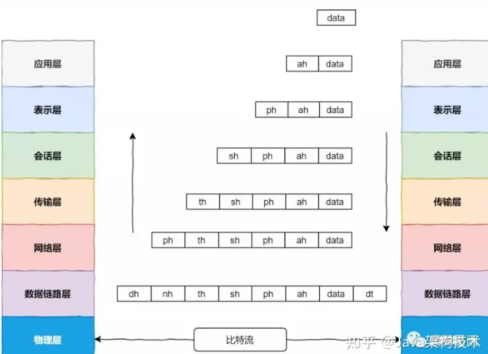
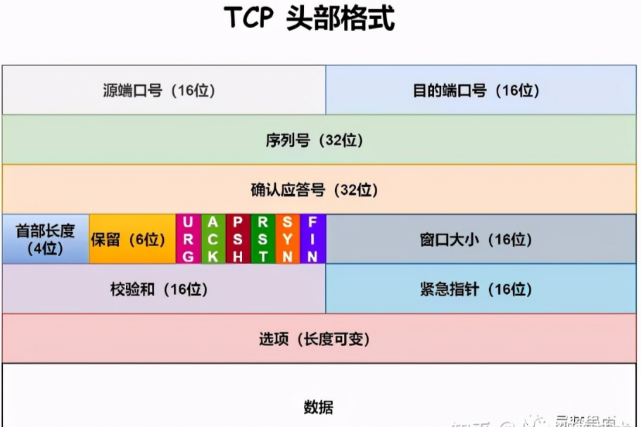

# TCP缘起

在世界上各地，各种各样的电脑，运行着各自不同的操作系统为大家服务。这些电脑，在表达同一种信息的时候，所使用的方法是千差万别。

计算机使用者意识到，计算机只是单兵作战，并不会发挥太大的作用。只有把它们联合起来，电脑才会发挥出它最大的潜力。

于是人们就想方设法的，用电线把电脑连接到了一起。但是简单的连到一起是远远不够的，就好像语言不同的两个人互相见了面，完全不能交流信息。因而他们需要定义一些共通的东西来进行交流，TCP/IP 就是为此而生。

TCP/IP 不是一个协议，而是一个协议族的统称。里面包括了 IP 协议，IMCP 协议(ping命令)，TCP 协议，以及我们更加熟悉的 http、ftp 协议等等。电脑有了这些，就好像学会了外语一样，就可以和其他的计算机终端做自由的交流了。

先看几个常见报头术语简写：

- 应用层报头：*Ppplication Header*, 简称 *AH*。
- 表示层报头：*Presentation Header*, 简称 *PH*。
- 会话层报头：*Session Header*, 简称 *SH*。
- 传输层报头：*Transport Header*, 简称 *TH*。
- 网络层报头：*Network Header*, 简称 *NH*。
- 数据链路层报头：*Data link Header*, 简称 *DH*。
- 应用层协议数据单元：*Protocol Data Unit*，简称 *PDU*。
- 数据链路层报尾：*Data link Termination*，简称 *DT*。

## 什么是TCP

TCP 协议的特点是：

面向连接

可靠交付

面向字节流

## 网络模型

国际标准化组织 ISO ，在1981 年正式推荐了一个网络系统结构（七层参考模型）。由于这个标准模型的建立，使得各种计算机网络均向它靠拢，大大推动了网络通信的发展。

这个 ISO 层网络模型各层的名字、主要功能对应的典型设备和传输单位如下图：

| 层数 | 名字       | 功能                    | 对应典型设备                                                 | 传输单位       |
| ---- | ---------- | ----------------------- | ------------------------------------------------------------ | -------------- |
| 7    | 应用层     | 提供应用程序问通信      | 计算机：应用程序，如 FTP MTP 程序级数据 HTTP                 | 程序级数据     |
| 6    | 表示层     | 处理数据格式 数据加密等 | 计算机：编码方式，如图像编解码、  URL 字段传输编码等     | 程序级数据     |
| 5    | 会话层     | 建立、维护和管理会话    | 建立、维护和管理会话 计算机 建立会话，如 sessio 认证、 断点续传 | 程序级数据     |
| 4    | 传输层     | 建立主机端到端连接      | 计算机 进程和端口                                            | 数据段（seg nt |
| 3    | 网络层     | 寻址和路由选择          | 网络：路由器、防火墙、多层交换机                             | 数据包（acke   |
| 2    | 数据链路层 | 提供介质访问 链路管理等 | 网络：网卡 、网桥、交换                                      | 帧（frame）    |
| 1    | 物理层     | 提供介质访问 链路管理等 | 网络·中继器、集线器、网线、光纤                              | bit流          |

这个七层网络模型在数据的传输过程中还会对数据进行封装，如下图：

## TCP头格式

在学习 TCP 连接之前，还要学习一下 TCP 头部格式。因为 TCP 连接建立，需要用 TCP 包来交换和管理数据，下面看一下 TCP 头部格式。

