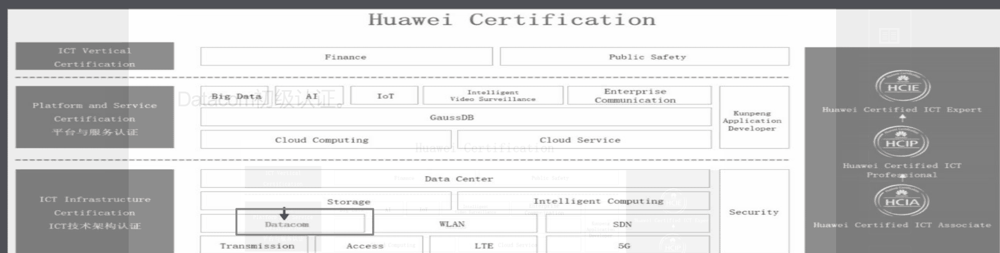

# 华为认证体系介绍

为IT(InformationTechnology，信息技术)和 CT(Communications Technology，通信技术)两大板块;

## 信息技术IT

1. 万物互联、
2. 大数据、
3. 人工智能、
4. 云计算、
5. 云服务等技术

## 通信技术CT

1. 数据通信(Datacom)、
2. 无线技术、
3. 安全、
4. 软件定义网络(Software DefinedNetwork，SDN)
5. 数据中心等内容

