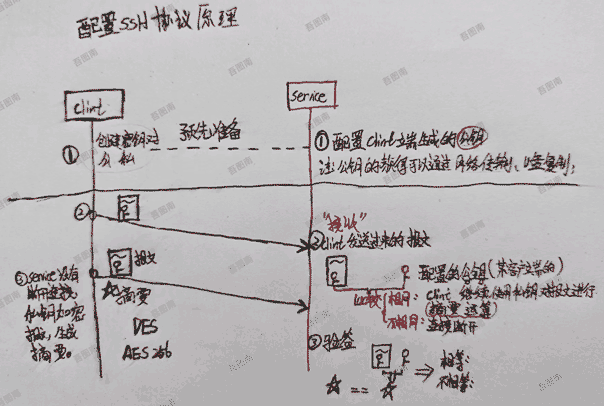
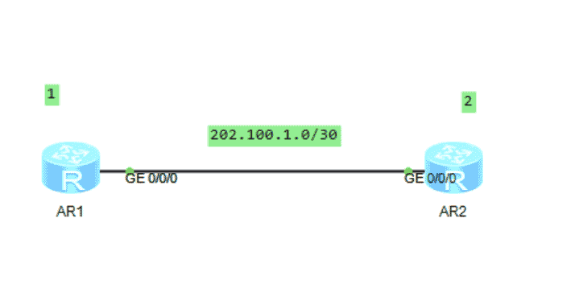
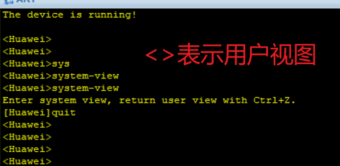
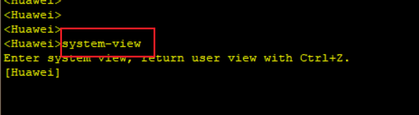
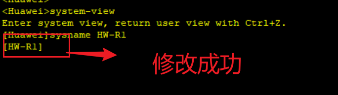
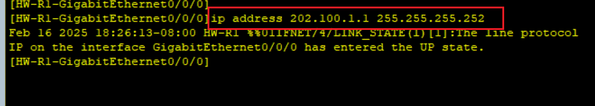
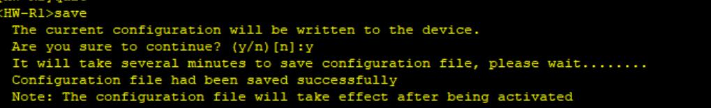

# 配置ssh协议

ssh配置原理图如下：




## 配置SSH步骤

**实验拓补图：**




**需求描述：**

R1为ssh的服务端。ip为202.100.1.1。

R2为ssh的客户端。ip为202.100.1.2。

结果：R2可以ssh连接到R1.R2通过输入密码连接登入到R1的设备上进行远程操作。


**实验实现步骤：**

启动R1与R2。

登入R1进行端口IP地址绑定配置：




第一步：进入系统视图：



```powershell
system-view
```

第二步：修改设备的名字：

```powershell
sysname HW-R1
```




第三步：配置ip地址：

进入端口配置：

```powershell
interface GigabitEthernet0/0/0 
```

配置IP地址：



```powershell
ip address 202.100.1.1 255.255.255.252
```


第四步：登入R2进行初始化配置：


```
# 第一步：进入系统视图
<Huawei>system-view
Enter system view, return user view with Ctrl+Z.

# 修改设备的名字
[Huawei]sysname HW-R2

# 端口号
[HW-R2]interface GigabitEthernet0/0/0

# 给端口号分配地址：
[HW-R2-GigabitEthernet0/0/0]ip address 202.100.1.2 255.255.255.252

Feb 16 2025 18:36:18-08:00 HW-R2 %%01IFNET/4/LINK_STATE(l)[0]:The line protocol 
IP on the interface GigabitEthernet0/0/0 has entered the UP state. 
# 配置完毕
[HW-R2-GigabitEthernet0/0/0]
```


第五步：实验二台设备是否能ping通。

R1 ping R2

```
ping 202.100.1.2
```

实验结果：

```
<HW-R1>ping 202.100.1.2
  PING 202.100.1.2: 56  data bytes, press CTRL_C to break
    Reply from 202.100.1.2: bytes=56 Sequence=1 ttl=255 time=170 ms
    Reply from 202.100.1.2: bytes=56 Sequence=2 ttl=255 time=30 ms
    Reply from 202.100.1.2: bytes=56 Sequence=3 ttl=255 time=10 ms
    Reply from 202.100.1.2: bytes=56 Sequence=4 ttl=255 time=30 ms
    Reply from 202.100.1.2: bytes=56 Sequence=5 ttl=255 time=30 ms

  --- 202.100.1.2 ping statistics ---
    5 packet(s) transmitted
    5 packet(s) received
    0.00% packet loss
    round-trip min/avg/max = 10/54/170 ms
```

说明配置是没有问题的。

第六步：登入R1设备进入aaa模式。

aaa表示：认证、授权、审计。这个模式用来创建用户与密码。

```
Enter system view, return user view with Ctrl+Z.
[HW-R1]aaa
[HW-R1-aaa]
```

执行下面命令创建用户与密码：

- `username`：用户名。
- `password`：用户密码。
- `cipher`：表示密码以加密方式存储。

```
local-user admin password cipher Admin@123
```

设置用户的级别为最高：

```
local-user admin privilege level 15
```

设置该用户用于SSH登入：

```
local-user admin service-type ssh
```

设置SSH用户admin通过密码进行认证：

```
ssh user admin authentication-type password 
```

执行结果：

```
[HW-R1-aaa]ssh user admin authentication-type password
 Authentication type setted, and will be in effect next time
```

注意：一定要开启ssh服务。

```
stelnet server  enable
```

第七步：登入R1设备上创建RSA的Key。

```
rsa local-key-pair create
```

R1设备的执行结果：

```
[HW-R1]rsa local-key-pair create
The key name will be: Host
% RSA keys defined for Host already exist.
Confirm to replace them? (y/n)[n]:y
The range of public key size is (512 ~ 2048).
NOTES: If the key modulus is greater than 512,
       It will take a few minutes.
Input the bits in the modulus[default = 512]:768
Generating keys...
........++++++++
..++++++++
....+++++++++
.+++++++++
```

第八步：登入R1设备上进入VTY通道进行配置：

VTY通道是什么？

VTY通道是用来干嘛的呢？

进入vty

```
user-interface vty 0 4
```

在vty通道中选择aaa模式

```
authentication-mode aaa
```

```
protocol inbound ?
```

vty允许ssh登录

```
protocol inbound ssh
```

上面命令在R1设备上的执行结果如下：

```
[HW-R1]user-interface vty 0 4
[HW-R1-ui-vty0-4]authentication-mode aaa
[HW-R1-ui-vty0-4]protocol inbound ?
  all     All protocols
  ssh     SSH protocol
  telnet  Telnet protocol
[HW-R1-ui-vty0-4]protocol inbound ssh
[HW-R1-ui-vty0-4]
```

第九步：测试SSH登入。

登入R2的设备上。

注意：要在系统视图进行测试。

```
stelnet 202.100.1.1
```

执行结果：

```
[HW-R2]stelnet 202.100.1.1
Please input the username:admin
Trying 202.100.1.1 ...
Press CTRL+K to abort
Connected to 202.100.1.1 ...
Error: Failed to verify the server's public key.
Please run the command "ssh client first-time enable"to enable the first-time ac
cess function and try again.
```

在R2的设备上

```
ssh client first-time enable
```

ssh登入远程R1设备成功的结果：

```
[HW-R2]stelnet 202.100.1.1
Please input the username:admin
Trying 202.100.1.1 ...
Press CTRL+K to abort
Connected to 202.100.1.1 ...
The server is not authenticated. Continue to access it? (y/n)[n]:y
Feb 16 2025 19:26:43-08:00 HW-R2 %%01SSH/4/CONTINUE_KEYEXCHANGE(l)[0]:The server
 had not been authenticated in the process of exchanging keys. When deciding whe
ther to continue, the user chose Y. 
[HW-R2]
Save the server's public key? (y/n)[n]:y
The server's public key will be saved with the name 202.100.1.1. Please wait...

Feb 16 2025 19:26:50-08:00 HW-R2 %%01SSH/4/SAVE_PUBLICKEY(l)[1]:When deciding wh
ether to save the server's public key 202.100.1.1, the user chose Y. 
[HW-R2]
Enter password:
Enter password:
<HW-R1>
```


注意事项

1. **安全性**：
   - 启用 `ssh client first-time enable` 后，客户端会自动信任目标服务器的公钥。
   - 如果目标服务器的公钥被篡改（例如中间人攻击），客户端可能无法检测到。
   - 因此，建议在首次连接成功后，禁用该功能以增强安全性：
2. **服务端公钥变化**：
   - 如果目标服务器的公钥发生变化（例如服务器重装），客户端会提示公钥不匹配。
   - 此时需要手动更新公钥或重新启用首次访问功能。

**总结**

- `ssh client first-time enable` 是 **客户端** 的配置，用于跳过首次连接时的公钥验证。
- 它适用于第一次连接目标服务器的场景。
- 为了安全性，建议在首次连接成功后禁用该功能。

## 保存配置

在用户试用执行下面的命令：

```powershell
save
```




## 查看保存的配置

配置完毕后。我们执行了save命令进行配置的保存。下面是查看这个设备的配置了哪些信息。

```powershell
display saved-configuration
```

执行查看配置信息的结果：

```
<HW-R1>display saved-configuration
[V200R003C00]
#
 sysname HW-R1
#
 snmp-agent local-engineid 800007DB03000000000000
 snmp-agent 
#
 clock timezone China-Standard-Time minus 08:00:00
#
portal local-server load portalpage.zip
#
 drop illegal-mac alarm
#
 set cpu-usage threshold 80 restore 75
#
aaa 
 authentication-scheme default
 authorization-scheme default
 accounting-scheme default
 domain default 
 domain default_admin 
 local-user admin password cipher %$%$K8m.Nt84DZ}e#<0`8bmE3Uw}%$%$
 local-user admin service-type http
#
firewall zone Local
 priority 15
#
interface GigabitEthernet0/0/0
 ip address 202.100.1.1 255.255.255.252 
#
interface GigabitEthernet0/0/1
#
interface GigabitEthernet0/0/2
#
interface NULL0
#
user-interface con 0
 authentication-mode password
user-interface vty 0 4
user-interface vty 16 20
#
wlan ac
#
return
```


