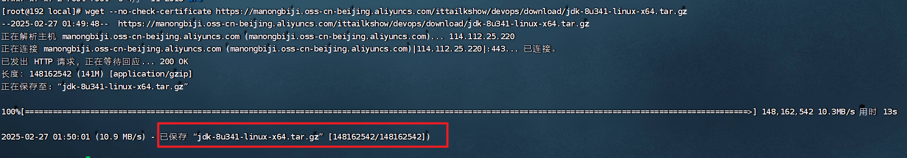
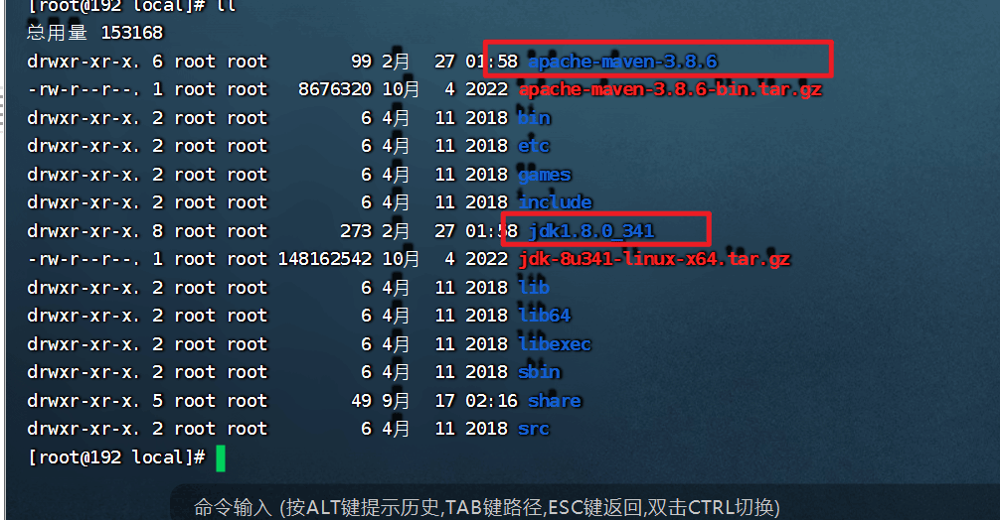
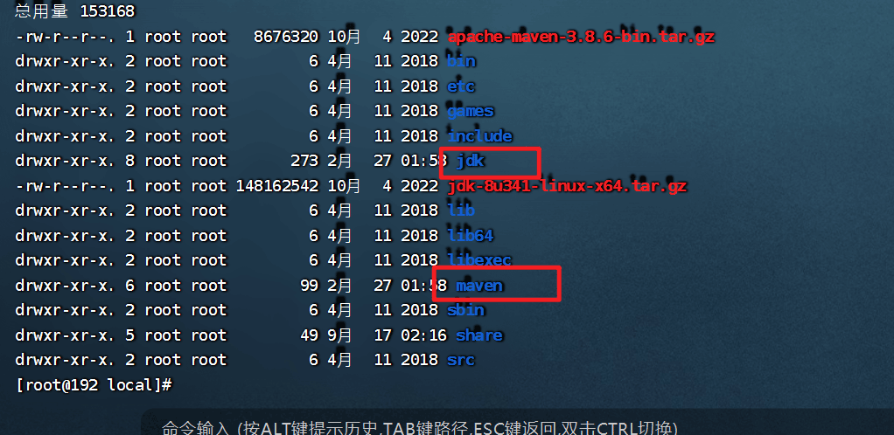
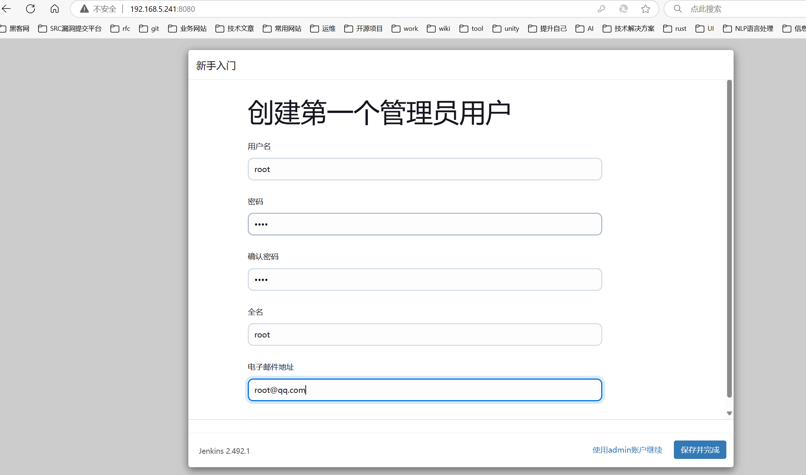
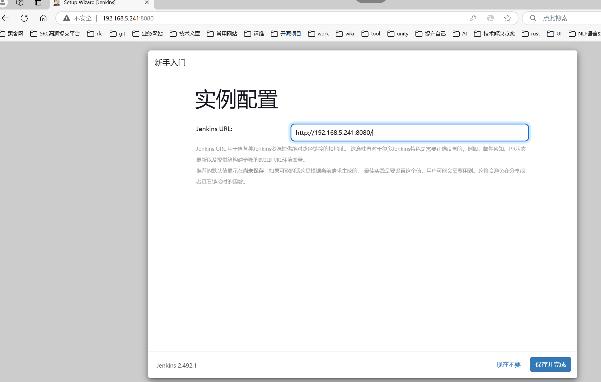
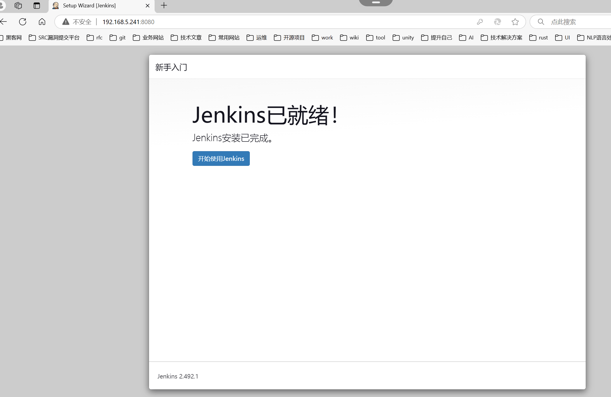
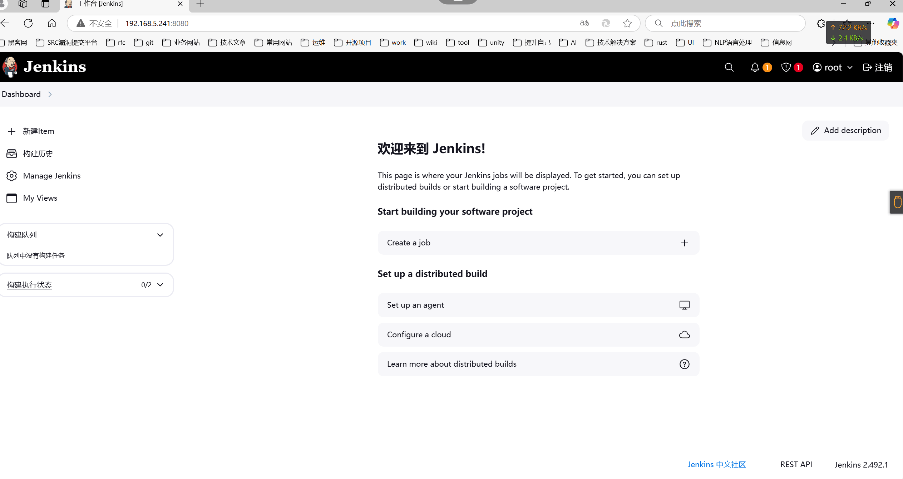
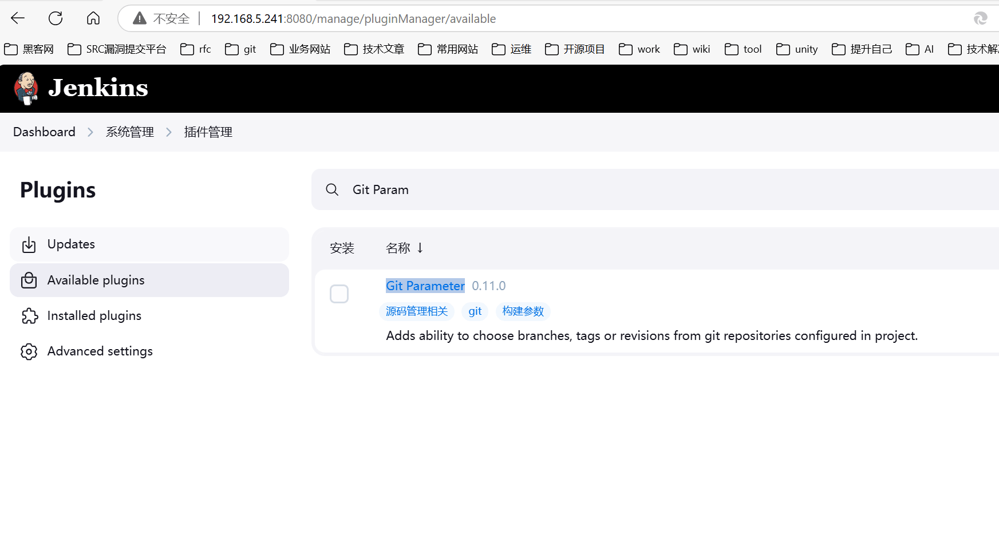

# 安装初始化Jenkins


```shell
cd /usr/local
```

## 配置JDK&Maven

下载jdk

```shell
wget --no-check-certificate https://manongbiji.oss-cn-beijing.aliyuncs.com/ittailkshow/devops/download/jdk-8u341-linux-x64.tar.gz
```




```
wget --no-check-certificate \
https://manongbiji.oss-cn-beijing.aliyuncs.com/ittailkshow/devops/download/apache-maven-3.8.6-bin.tar.gz
```


解压jdk：

```shell
tar zxvf jdk-8u341-linux-x64.tar.gz
```

解压maven：

```
tar zxvf apache-maven-3.8.6-bin.tar.gz
```




目录重新命名：

```
mv jdk1.8.0_341 jdk
mv apache-maven-3.8.6 maven
```



删除安装包：

```
rm -f jdk-8u341-linux-x64.tar.gz 
rm -f apache-maven-3.8.6-bin.tar.gz 
```


进入maven目录下conf配置目录。

```
cd /usr/local/maven/conf
```


删除settings.xml配置文件。

```
rm -f settings.xml
```


```
wget --no-check-certificate \
https://manongbiji.oss-cn-beijing.aliyuncs.com/ittailkshow/devops/download/settings.xml
```


## 部署Jenkins容器


```
rm -rf /var/jenkins/
```


```
docker rm -f jenkins
```


```
mkdir -p /var/jenkins/
```


```
chmod -R 777 /var/jenkins/
```


```
docker run --name jenkins \
--restart=always \
--network macvlan5  --ip=192.168.5.241 \
-v /var/jenkins/:/var/jenkins_home/ \
-v /usr/local/jdk:/usr/local/jdk \
-v /usr/local/maven:/usr/local/maven \
-e JENKINS_UC=https://mirrors.cloud.tencent.com/jenkins/ \
-e JENKINS_UC_DOWNLOAD=https://mirrors.cloud.tencent.com/jenkins/ \
-d jenkins/jenkins:lts
```

注意：https://mirrors.cloud.tencent.com/jenkins/是国内jenkins的仓库地址。

```
-e JENKINS_UC=https://mirrors.cloud.tencent.com/jenkins/ \
```

访问地址：

192.168.5.241:8080


```
docker logs -f jenkins
```


## 初始化jenkins


初始化的密码保存在这个文件下。

/var/jenkins/secrets/initialAdminPassword


Jenkins 2.492.1【2025_02_26】

Jenkins 2.319.1【旧的版本】


初始化⽤户名、密码都是root













## 插件的安装

Git Parameter的作用：选择那个仓库下的分支、那个tag的版本 进行相应的处理。

一句话：拉取源代码的。

[Git Parameter](https://plugins.jenkins.io/git-parameter)



Publish Over SSH作用：连接远程服务器（目标服务器）。做应用的构建、发布的工作。

一句话总结：就是将我们编译好的代码打包为jar（java）发布到目标服务器进行运行。

[Publish Over SSH](https://plugins.jenkins.io/publish-over-ssh)


## 安装插件超时问题


解决：多尝试几次。


