# Jenkins自动拉取构建代码


## GitLab创建仓库


创建一个空项目。

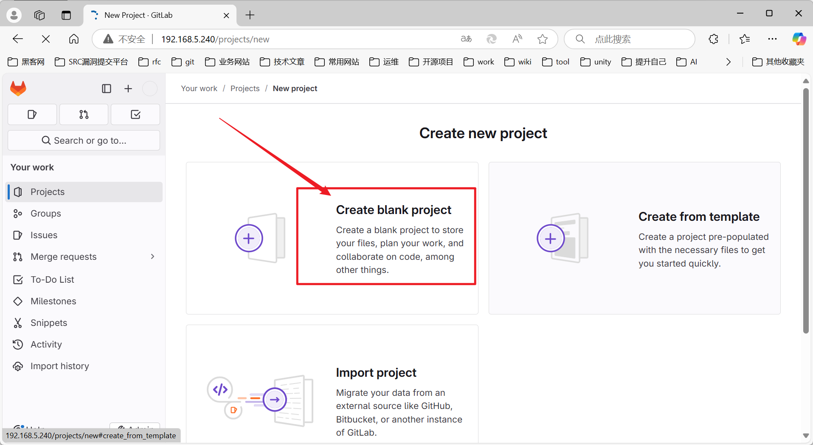


目前这个仓库是空的。什么都没有。


下面就是要开发一个自己的代码项目上传到这个仓库当中去。然后被jenkins拉取进行构建项目。


## idea创建项目

打开我们的神器。


我们这选择创建项目。


我们这边选择创建maven工程吧。spring Initializr 必须要jdk17才可以。


注意名字的填写。


初始化工程醒目


本地启动进行测试。


测试结果展示：

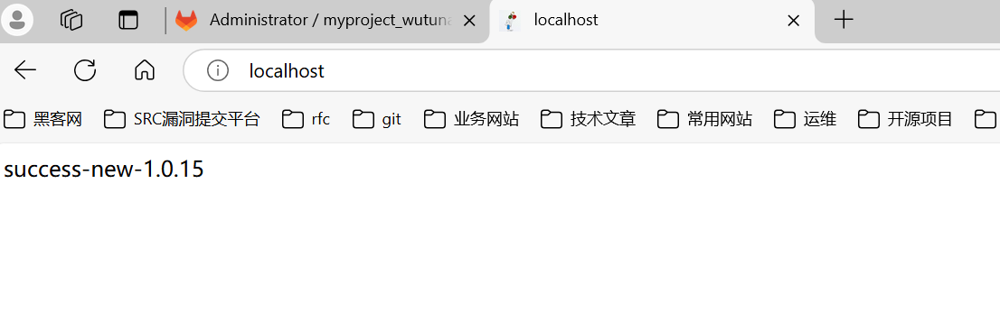

## 项目上传到gitlab中


我们选择git版本控制。


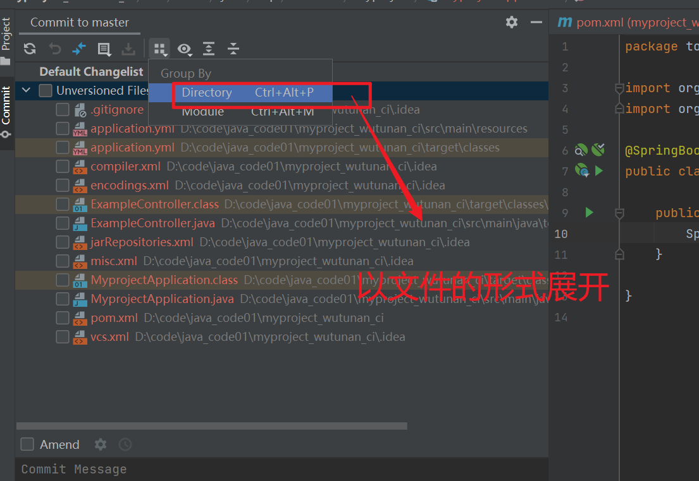


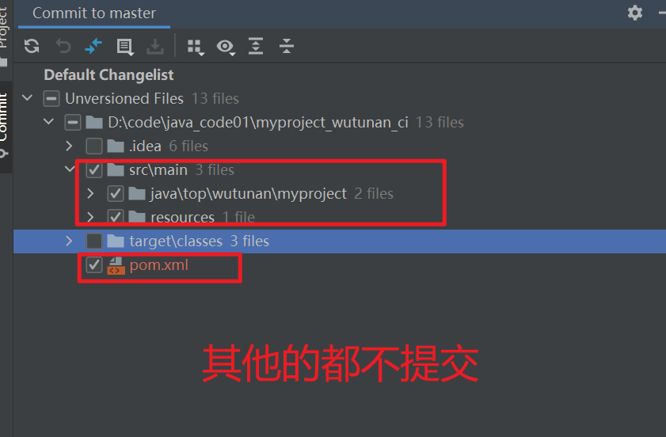


选择提交并推送代码到远程。


这个时候会弹出一个新的窗口。告诉我们要输入你像提交到那个远程仓库中去。下面操作如下：

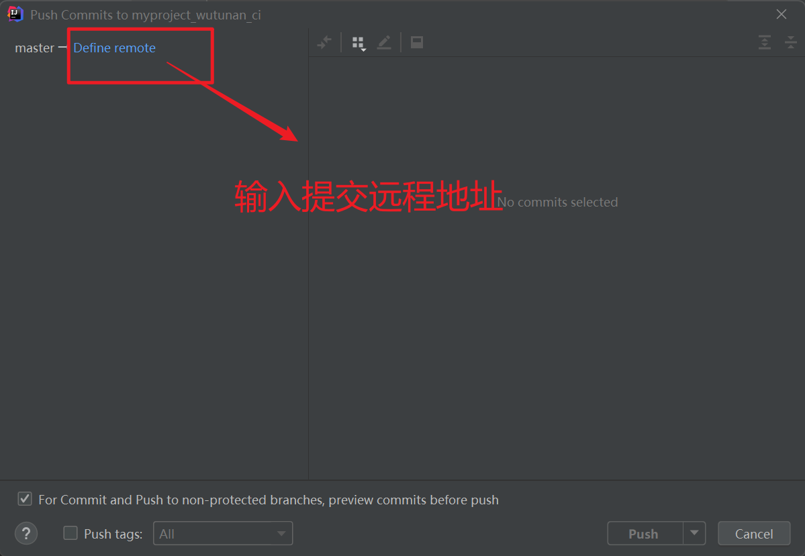


看到这个窗口，熟悉git的伙伴懂的都懂。


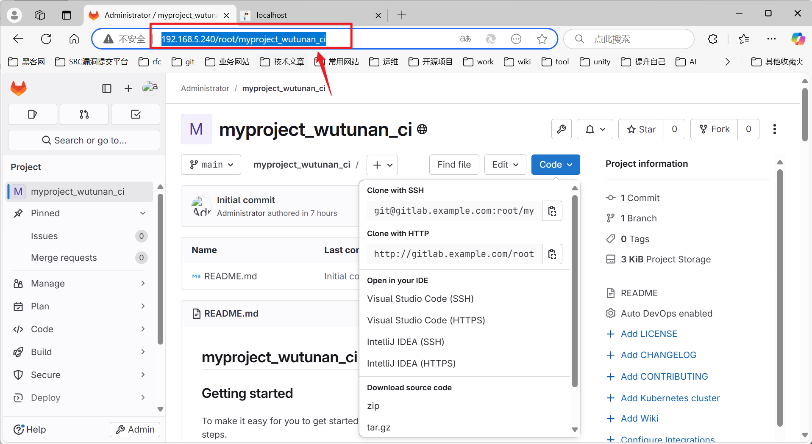


::：tip 推送代码时注意

如果用户与密码没有正确就是无法推送的。就会报如下错误。

:::


```shell
warning: ----------------- SECURITY WARNING ----------------
warning: | TLS certificate verification has been disabled! |
warning: ---------------------------------------------------
warning: HTTPS connections may not be secure. See https://aka.ms/gcm/tlsverify for more information.
warning: ----------------- SECURITY WARNING ----------------
warning: | TLS certificate verification has been disabled! |
warning: ---------------------------------------------------
warning: HTTPS connections may not be secure. See https://aka.ms/gcm/tlsverify for more information.
remote: HTTP Basic: Access denied. If a password was provided for Git authentication, the password was incorrect or you're required to use a token instead of a password. If a token was provided, it was either incorrect, expired, or improperly scoped. See http://192.168.5.240/help/topics/git/troubleshooting_git.md#error-on-git-fetch-http-basic-access-denied
fatal: Authentication failed for 'http://192.168.5.240/root/myproject_wutunan_ci.git/'
```

密码与用户正确后的日志：

```shell
Enumerating objects: 14, done.
Counting objects:   7% (1/14)
Counting objects:  14% (2/14)
Counting objects:  21% (3/14)
Counting objects:  28% (4/14)
Counting objects:  35% (5/14)
Counting objects:  42% (6/14)
Counting objects:  50% (7/14)
Counting objects:  57% (8/14)
Counting objects:  64% (9/14)
Counting objects:  71% (10/14)
Counting objects:  78% (11/14)
Counting objects:  85% (12/14)
Counting objects:  92% (13/14)
Counting objects: 100% (14/14)
Counting objects: 100% (14/14), done.
Delta compression using up to 12 threads
Compressing objects:  12% (1/8)
Compressing objects:  25% (2/8)
Compressing objects:  37% (3/8)
Compressing objects:  50% (4/8)
Compressing objects:  62% (5/8)
Compressing objects:  75% (6/8)
Compressing objects:  87% (7/8)
Compressing objects: 100% (8/8)
Compressing objects: 100% (8/8), done.
Writing objects:   7% (1/14)
Writing objects:  14% (2/14)
Writing objects:  21% (3/14)
Writing objects:  28% (4/14)
Writing objects:  35% (5/14)
Writing objects:  42% (6/14)
Writing objects:  50% (7/14)
Writing objects:  57% (8/14)
Writing objects:  64% (9/14)
Writing objects:  71% (10/14)
Writing objects:  78% (11/14)
Writing objects:  85% (12/14)
Writing objects:  92% (13/14)
Writing objects: 100% (14/14)
Writing objects: 100% (14/14), 1.70 KiB | 1.70 MiB/s, done.
Total 14 (delta 0), reused 0 (delta 0), pack-reused 0
remote: 
remote: To create a merge request for master, visit:        
remote:   http://gitlab.example.com/root/myproject_wutunan_ci/-/merge_requests/new?merge_request%5Bsource_branch%5D=master        
remote: 
To http://192.168.5.240/root/myproject_wutunan_ci
*	refs/heads/master:refs/heads/master	[new branch]
branch 'master' set up to track 'origin/master'.
Done

```


最终推送效果：

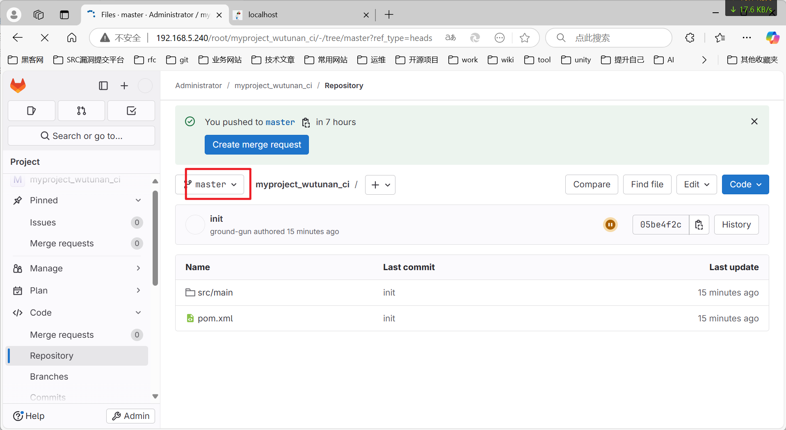


## jenkins拉取远程代码

使用jenkins代码的拉取、构建。


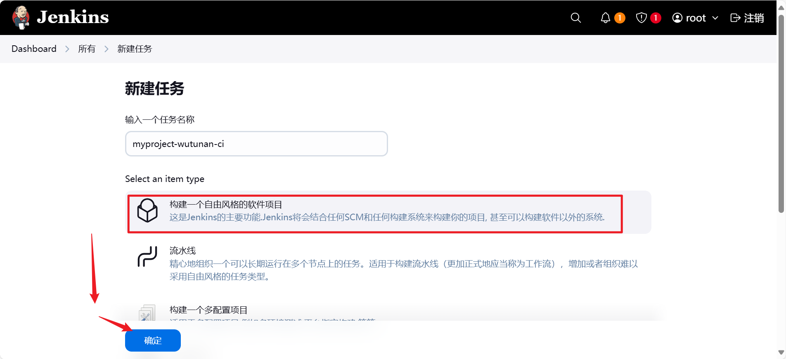


默认指定的就是master。


点击进入这个myproject-wutunan-ci这个任务。

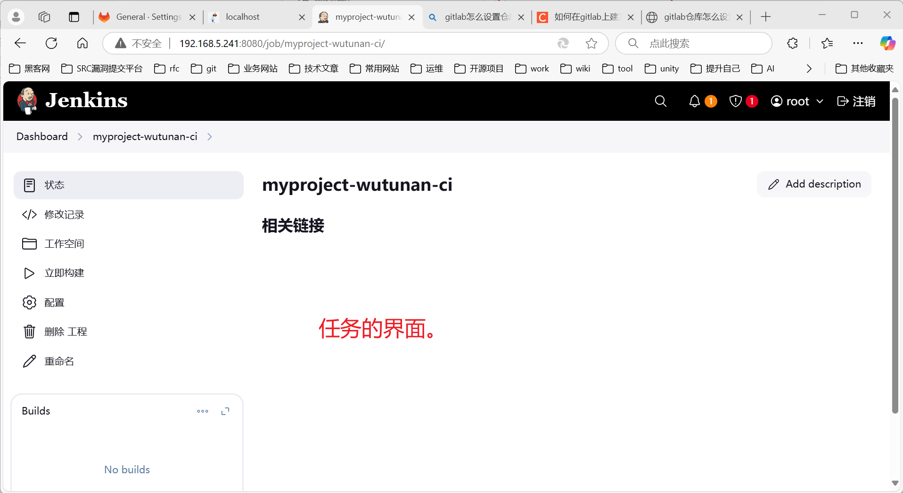

我们怎么执行这个任务呢？

答：进行如下点击立即构建。


查看执行历史记录。


执行结果：

```
Started by user root
Running as SYSTEM
Building in workspace /var/jenkins_home/workspace/myproject-wutunan-ci
The recommended git tool is: NONE
No credentials specified
Cloning the remote Git repository
Cloning repository http://192.168.5.240/root/myproject_wutunan_ci
 > git init /var/jenkins_home/workspace/myproject-wutunan-ci # timeout=10
Fetching upstream changes from http://192.168.5.240/root/myproject_wutunan_ci
 > git --version # timeout=10
 > git --version # 'git version 2.39.5'
 > git fetch --tags --force --progress -- http://192.168.5.240/root/myproject_wutunan_ci +refs/heads/*:refs/remotes/origin/* # timeout=10
 > git config remote.origin.url http://192.168.5.240/root/myproject_wutunan_ci # timeout=10
 > git config --add remote.origin.fetch +refs/heads/*:refs/remotes/origin/* # timeout=10
Avoid second fetch
 > git rev-parse refs/remotes/origin/master^{commit} # timeout=10
Checking out Revision 05be4f2cf750060cbb4a5822407a0330891a34a6 (refs/remotes/origin/master)
 > git config core.sparsecheckout # timeout=10
 > git checkout -f 05be4f2cf750060cbb4a5822407a0330891a34a6 # timeout=10
Commit message: "init"
First time build. Skipping changelog.
Finished: SUCCESS
```


怎么验证我们拉取代码成功了呢？

答：我们要到jenkins的服务器上看下有没有这个文件。

在这个目录下:

`/var/jenkins/workspace`


::: tip 对jenkins操作总结

jenkins就是我们人要手动转化为一个一个命令的工作全部交给jenkins自动去完成了。上面只是jenkins帮我们去拉取代码。

:::


## jenkins对拉取的代码进行编译


也可以使用maven目标。

```
sh /usr/local/maven/bin/mvn package
```


查看控制台日志。


我们怎么证明它构建成功了呢？同样的去jenkins的服务器上去看看是否有jar包。


证明构建成功了。


## jenkins发布jar包启动

最终学习的目标效果：

- 熟悉将jar包发布到目标服务器上启动。
- 熟悉怎么在jenkins上操作的流程。

我们上面的步骤已经产生了jar包。那么我们要进行发布jar包进行部署了。


下面的选项是插件的加持效果。


下面的配置清单可向远程服务器使用ssh进行登入、传输文件、启动服务等工作。


操作流程如下：


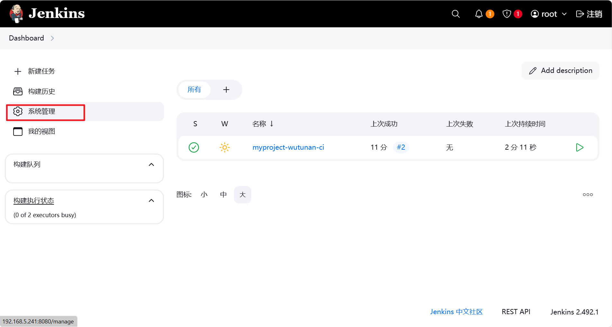


测试远程连接是否通。


传输的目标文件我们填写为

```
target/*.jar
```


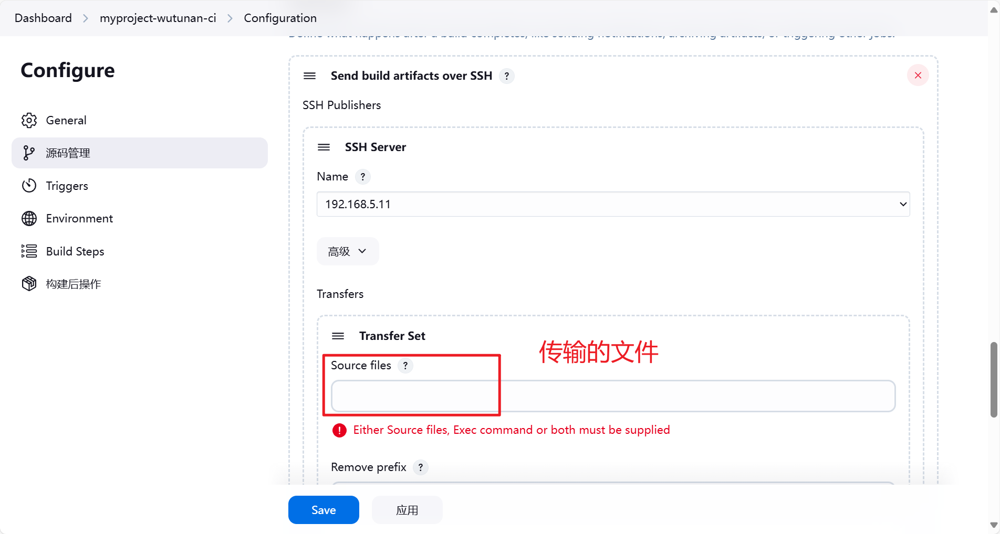


```
pkill java
nohup  java -jar /usr/local/target/myproject.jar & sleep 1
```


Exec in pty 一定要勾选。


返回到主页面。我们在从新构建任务。


配置上传jar包到目标服务器的构建的日志：

```shell
Started by user root
Running as SYSTEM
Building in workspace /var/jenkins_home/workspace/myproject-wutunan-ci
The recommended git tool is: NONE
No credentials specified
 > git rev-parse --resolve-git-dir /var/jenkins_home/workspace/myproject-wutunan-ci/.git # timeout=10
Fetching changes from the remote Git repository
 > git config remote.origin.url http://192.168.5.240/root/myproject_wutunan_ci # timeout=10
Fetching upstream changes from http://192.168.5.240/root/myproject_wutunan_ci
 > git --version # timeout=10
 > git --version # 'git version 2.39.5'
 > git fetch --tags --force --progress -- http://192.168.5.240/root/myproject_wutunan_ci +refs/heads/*:refs/remotes/origin/* # timeout=10
 > git rev-parse refs/remotes/origin/master^{commit} # timeout=10
Checking out Revision 05be4f2cf750060cbb4a5822407a0330891a34a6 (refs/remotes/origin/master)
 > git config core.sparsecheckout # timeout=10
 > git checkout -f 05be4f2cf750060cbb4a5822407a0330891a34a6 # timeout=10
Commit message: "init"
 > git rev-list --no-walk 05be4f2cf750060cbb4a5822407a0330891a34a6 # timeout=10
[myproject-wutunan-ci] $ /bin/sh -xe /tmp/jenkins4706290564308122792.sh
+ sh /usr/local/maven/bin/mvn package
[INFO] Scanning for projects...
[INFO] 
[INFO] ------------------< top.wutunan:myproject_wutunan_ci >------------------
[INFO] Building myproject_wutunan_ci 1.0-SNAPSHOT
[INFO] --------------------------------[ jar ]---------------------------------
[INFO] 
[INFO] --- maven-resources-plugin:3.2.0:resources (default-resources) @ myproject_wutunan_ci ---
[INFO] Using 'UTF-8' encoding to copy filtered resources.
[INFO] Using 'UTF-8' encoding to copy filtered properties files.
[INFO] Copying 1 resource
[INFO] Copying 0 resource
[INFO] 
[INFO] --- maven-compiler-plugin:3.10.1:compile (default-compile) @ myproject_wutunan_ci ---
[INFO] Nothing to compile - all classes are up to date
[INFO] 
[INFO] --- maven-resources-plugin:3.2.0:testResources (default-testResources) @ myproject_wutunan_ci ---
[INFO] Using 'UTF-8' encoding to copy filtered resources.
[INFO] Using 'UTF-8' encoding to copy filtered properties files.
[INFO] skip non existing resourceDirectory /var/jenkins_home/workspace/myproject-wutunan-ci/src/test/resources
[INFO] 
[INFO] --- maven-compiler-plugin:3.10.1:testCompile (default-testCompile) @ myproject_wutunan_ci ---
[INFO] No sources to compile
[INFO] 
[INFO] --- maven-surefire-plugin:2.22.2:test (default-test) @ myproject_wutunan_ci ---
[INFO] No tests to run.
[INFO] 
[INFO] --- maven-jar-plugin:3.2.2:jar (default-jar) @ myproject_wutunan_ci ---
[INFO] 
[INFO] --- spring-boot-maven-plugin:2.7.4:repackage (repackage) @ myproject_wutunan_ci ---
[INFO] Replacing main artifact with repackaged archive
[INFO] ------------------------------------------------------------------------
[INFO] BUILD SUCCESS
[INFO] ------------------------------------------------------------------------
[INFO] Total time:  4.862 s
[INFO] Finished at: 2025-02-28T11:35:53Z
[INFO] ------------------------------------------------------------------------
SSH: Connecting from host [6f4daa421264]
SSH: Connecting with configuration [192.168.5.11] ...
SSH: EXEC: completed after 1,202 ms
SSH: Disconnecting configuration [192.168.5.11] ...
SSH: Transferred 1 file(s)
Finished: SUCCESS
```


怎么验证我们将java的项目打包为jar。并传输到目标服务器上进行了运行呢？

答：我们访问目标服务器的jar程序。能访问就说明成功了。


观察目标服务器发生了什么变化？

进入我们之前配置的目录。会在这个目录下生成一个target目录。

```
/usr/local
```

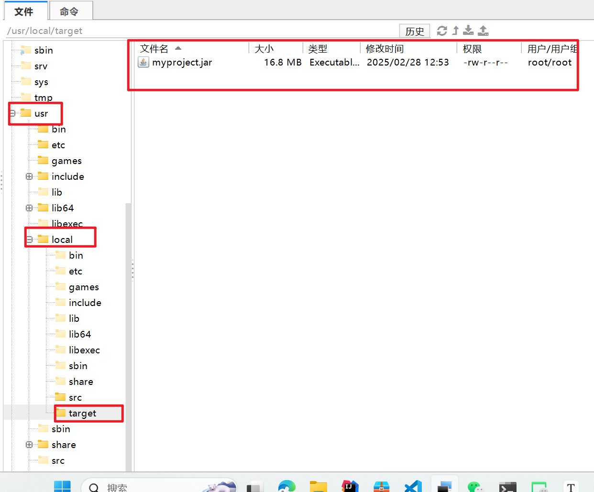


---

如何查看程序是否启动成功呢？

答：我们使用netstat命令来查看。

```
netstat -tulpn
```

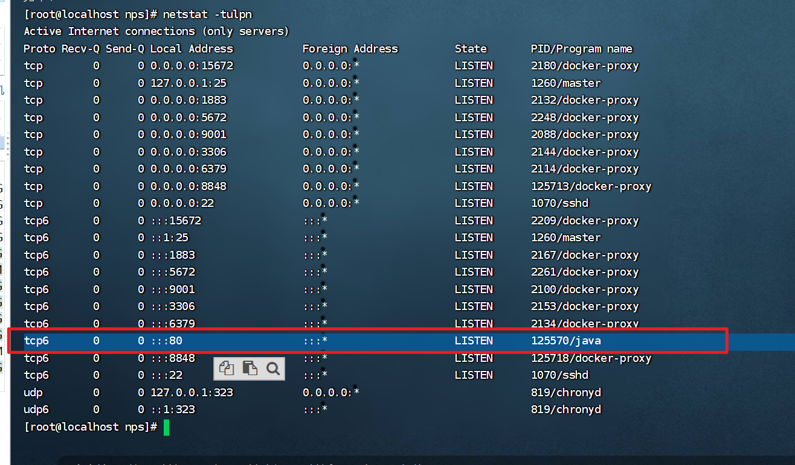

我们可以看到这个java的程序已经启动了。证明jenkins完成了构建、发布、运行工作。

---

全局搜索日志文件。

```shell
find / -name nohup.out
```

执行结果：

```
[root@localhost nps]# find / -name nohup.out
find: ‘/proc/14895’: 没有那个文件或目录
find: ‘/proc/14902’: 没有那个文件或目录
/root/nohup.out
[root@localhost nps]# 
```


---

::: tip jenkins小结

1. jenkins可以自动的完成代码的拉取。
2. jenkins可以自动的完成代码的构建。
3. jenkins可以自动的完成构建的应用发布。

::: 


