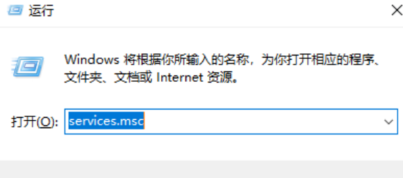

# VMware Workstation 未能启动 VMware Authorization Service

1. 按 *Win + R* 键，输入 *services.msc* 并点击确定。
2. 在服务列表中找到 **VMware Authorization Service** 并双击。
3. 将启动类型修改为 **自动** 或 **手动**，然后点击 **应用**。
4. 点击 **启动**，等待服务启动完成后，点击 **确定**。

