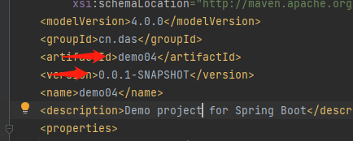
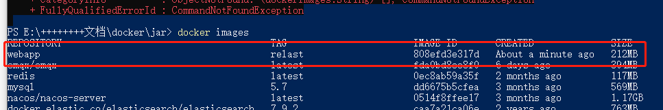

# 构建自己的镜像

准备：

java的springboot打包的jar包一个。

在github上。


## springboot程序打包

进行打包：插件配置

```xml
            <build>
                <finalName>webapp</finalName>
                <plugins>
                    <plugin>
                        <groupId>org.springframework.boot</groupId>
                        <artifactId>spring-boot-maven-plugin</artifactId>
                    </plugin>
                </plugins>
            </build>
```

或者

```xml
    <build>
        <finalName>webapp</finalName>
        <plugins>
            <plugin>
                <groupId>org.apache.maven.plugins</groupId>
                <artifactId>maven-compiler-plugin</artifactId>
                <configuration>
                    <source>1.8</source>
                    <target>1.8</target>
                </configuration>
            </plugin>
            <plugin>
                <groupId>org.springframework.boot</groupId>
                <artifactId>spring-boot-maven-plugin</artifactId>
                <version>2.0.4.RELEASE</version>
                <executions>
                    <execution>
                        <goals>
                            <goal>repackage</goal>
                        </goals>
                    </execution>
                </executions>
            </plugin>
            <plugin>
                <groupId>org.mybatis.generator</groupId>
                <artifactId>mybatis-generator-maven-plugin</artifactId>
                <version>1.3.2</version>
                <configuration>
                    <verbose>true</verbose>
                    <overwrite>true</overwrite>
                </configuration>
            </plugin>
        </plugins>
    </build>

```


注意：打包的时候，是一个工程项目，springboot这样引入，

```xml

    <parent>
        <groupId>org.springframework.boot</groupId>
        <artifactId>spring-boot-starter-parent</artifactId>
        <version>2.2.6.RELEASE</version>
        <relativePath/>
    </parent>
    
```

我之前是父工程管理的方式引入，打包没有将依赖一起打入。而且没有找到主程序类。我也不知为什么？

主要是坑啊！


执行打包命令或者点击


打包结果：




::: tip 打包的名字什么来的呢？

打包后的名子 = artifactId + version 

:::


## 启动jar程序

运行打包好的jar在cmd中。


加了：属性后打包

```xml
  <finalName>webapp</finalName>
```


## 测试


## 将jar打包为镜像


将一个Java的JAR文件打包为Docker镜像，通常需要以下几个步骤：

1. 创建Dockerfile：在项目的根目录下创建一个名为`Dockerfile`的文件。Dockerfile是一个文本文件，其中包含了构建Docker镜像所需的指令和配置。

2. 编写Dockerfile内容：以下是一个简单的Dockerfile示例，用于将Java应用程序的JAR文件打包为Docker镜像：

   若果你要用其他版本的jdk，可以如下FROM openjdk:11-jre-slim

```
# 使用一个基础的Java镜像作为基础镜像
FROM openjdk:8-jre-slim

# 将本地的JAR文件复制到镜像中
COPY your-app.jar /app/your-app.jar

# 设置工作目录
WORKDIR /app

# 暴露应用程序的端口（如果需要）
EXPOSE 8080

# 定义容器启动时运行的命令
CMD ["java", "-jar", "your-app.jar"]
```

在上面的示例中，将`your-app.jar`替换为您实际的JAR文件名称。

如下：我自己填写的。


1. 构建Docker镜像：在包含Dockerfile的目录中，打开终端并运行以下命令来构建Docker镜像。将`your-image-name:tag`替换为您想要的镜像名称和标签。

```cmd
docker build -t your-image-name:tag .
```


```cmd
docker build -t webapp:relast .
```


## 查看构建的镜像



运行Docker容器：构建完成后，您可以使用以下命令来运行Docker容器。将`your-container-name`替换为您想要的容器名称。

## 运行构建的容器

```
docker run --name your-container-name -p 8080:8080 -d your-image-name:tag
```


启动命令：

```cmd
docker run --name webapp01 -p 8080:8080 -d webapp:relast
```


这些步骤会将您的Java应用程序JAR文件打包到一个Docker镜像中，并在Docker容器中运行起来。请确保您在Dockerfile中使用适当的基础镜像和路径，以及根据您的应用程序需要进行调整。

注意：在构建Docker镜像时，确保您已经安装了Docker，并且您的JAR文件位于与Dockerfile相同的目录中，或者您可以根据需要调整COPY指令的路径。


## 浏览器访问是否成功


访问：


## 停止运行的容器

要停止正在运行的容器，您可以使用以下命令

```cmd
docker stop <容器名称或容器ID>
```


## 将自己的镜像打包

```cmd
docker save -o image.tar IMAGE_NAME:TAG
```


## 加载本地镜像

```
docker load -i image.tar
```


