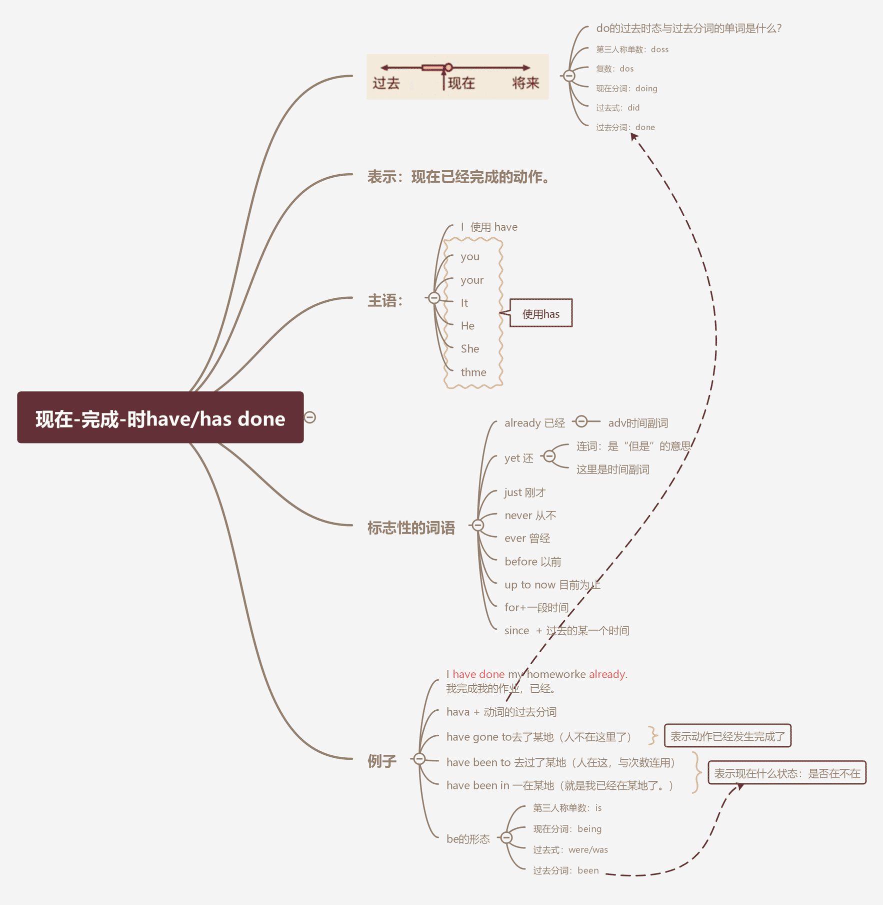

# 常见时态

## 01)现在完成时

大白话讲就是：

完成态通常表达“已经“完成了的动，往往还对现在造成影响。

英文

- 比如我已经吃掉了胡萝卜（暗示：没得吃了）。

中文

- 咱们中文是用“过“了“这些词来表示完成，比如：我吃过胡萝卜。而现在有些人甚至会说：我有吃过胡梦卜你有吃过胡萝卜吗？

软，你知道吗，胡卜超好吃软，你有吃过吗？没吃过啊？真的假的，我有吃过很多种胡萝卜哦！

你看，这里的有“其实也是在表示动作完成的状态。搞不好就是从英语那里过来的。

- have

  | 主格形式      | 形式 |
  | ------------- | ---- |
  | l/you/we/they | have |
  | She/he/it     | has  |

  1.实义动词
  2.助动词，构成时态    

  助动词have的变位+动词的过去分词  

  - 过去分词

    1. 通常：+ed
    2. 有些动词是“不规则变化”，如：
       eat >eaten
       bring  >brought 带来
       feel> felt 感受到
    3. 【不规则变化】不规则变化不是在词尾ted那么简单。

    keep, sleep，le**ave**> 

    kept, slept,    le**ft**

