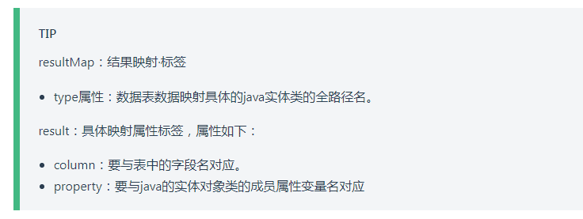

# vuepress常用语法

## 01）提示块

这个叫：自定义容器。



语法：

```markdown
:::tip

:::
```

怎么写：

```markdown
:::tip
resultMap：结果映射·标签

- type属性：数据表数据映射具体的java实体类的全路径名。

result：具体映射属性标签，属性如下：

- column：要与表中的字段名对应。
 - property：要与java的实体对象类的成员属性变量名对应
:::
```


## 02）提示块自定义标题

```md
::: tip
这是一个提示
:::

::: warning
这是一个警告
:::

::: danger
这是一个危险警告
:::

::: details
这是一个详情块，在 IE / Edge 中不生效
:::
```

你也可以自定义块中的标题：

~~~md
::: danger STOP
危险区域，禁止通行
:::

::: details 点击查看代码【自定义的标题名字】
```js
console.log('你好，VuePress！')
```
:::
~~~

结果就不放图片了。和上面哪一张同理。

## 03)字标粗&字标颜色

- <b>字标粗：</b>使用b标签，不要用二个*表示。

  ```html
  <b>xxx</b>
  **xxx**   [vuepress不支持]
  ```

- <b>字标颜色：</b>标记颜色用font标签。

  ```html
  <font color="red">xxxxxxx</font>
  ```

  


