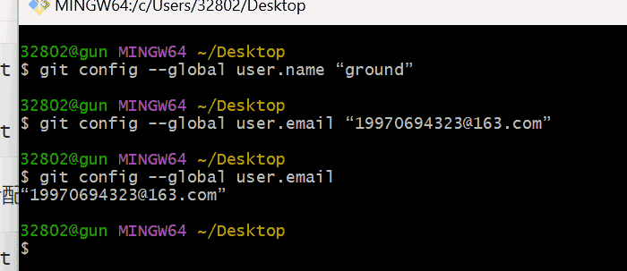
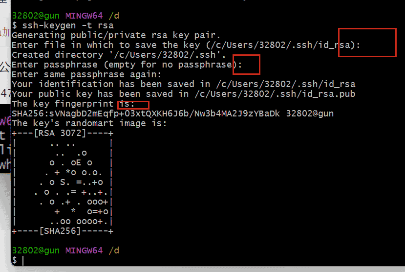
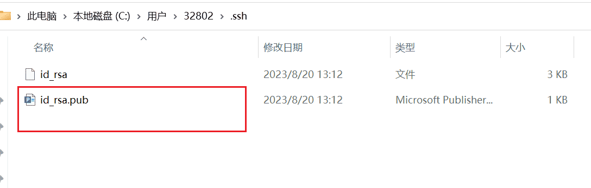
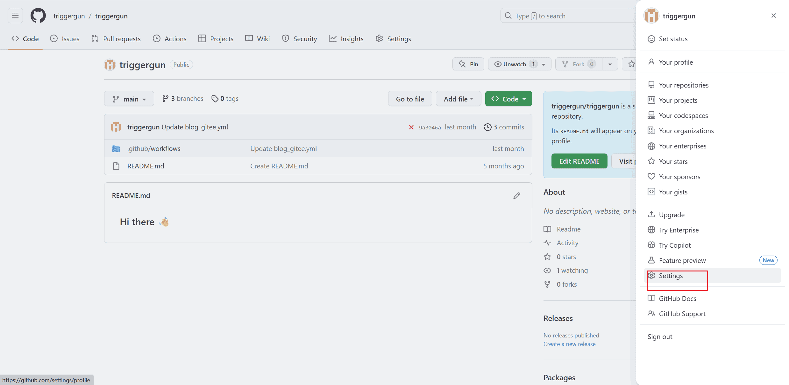
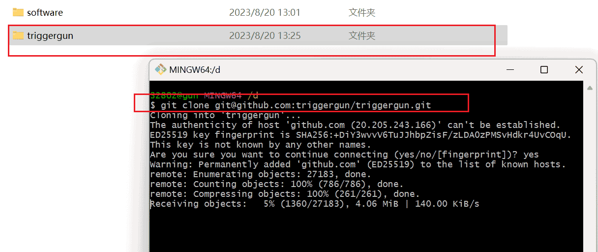
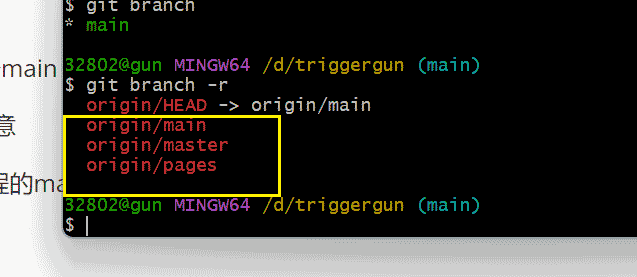
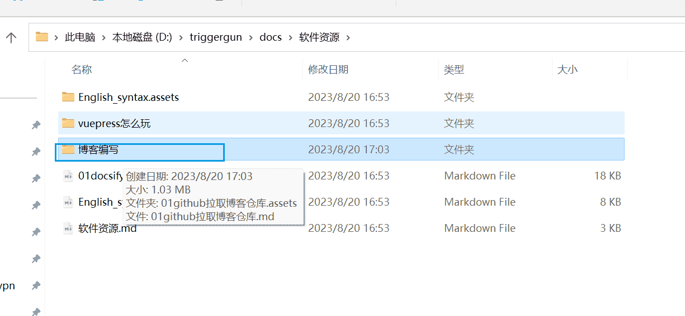
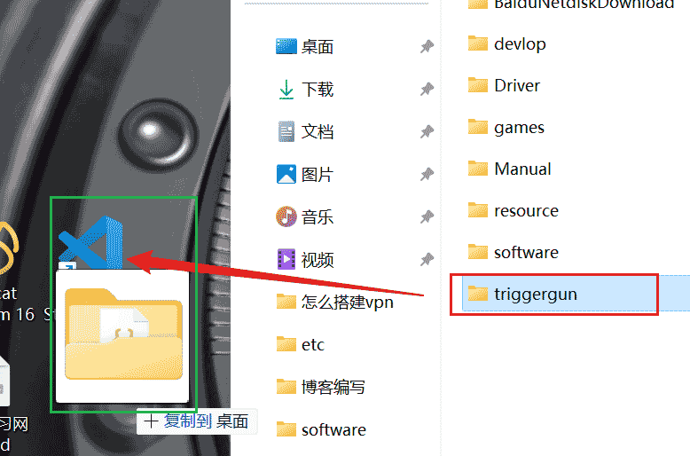

# github拉取博客仓库

- 安装git。


- 某个文件夹下打开git bash这个小黑窗口。


## 1）初始化git

```
git config --global user.name “ground” 

git config --global user.email “19970694323@xx” 
```

查看配置信息

```
git config --global user.name 

git config --global user.email
```

如下操作：




## 2）电脑&github配置shh

使用 ssh安全连接，可以让我们在操作远程仓库时跳过用户信息的验证。

获取公钥的操作我们可以进入 c盘，找到自己对应的用户目录；在该目录下寻找 .ssh 文件夹，在该文 件夹下打开 Git Bash


输入 ssh-keygen 命令可以创建 ssh公钥文件，为了安全起见 我们需要追加 -t 选项，将该公钥进行加密

```cmd
ssh-keygen -t rsa # rsa加密算法是 git官方推荐的加密算法
```

使用该命令后会让你输入一些公钥信息，不知道怎么填可以全部按回车使用默认的信息





三次回车

命令执行完毕会在 .ssh 文件夹下生成两个文件，我们需要用到的是以 pub 为后缀的文件，即公钥文件。




### 打开github

登入上github账号




创建一个shh的key


把公钥信息粘贴过来就行。


### clone代码仓库到本地


执行clone命令会自动生成一个文件夹。




## 3)切换分支

分支说明：

- main
- master
- pages


拉取下来的仓库默认在main分支上。要切换到pages分支上创造。

进入triggergun这个文件夹打开git bash窗口。


### 查看本地分支


本地只有一个main

::: danger 注意

main是与远程的main分支进行了关联的。

:::

要查看所有远程分支的名称。

```
git branch -r 
```



可以看到当前分支一共有三个分支。

- 我们要在origin/pages分支上更新我们的博客内容。
- 然后推上去。

最后：github的action帮我们自动构建打包部署。

### 远程分支的切换

```cmd
$ git checkout -b pages origin/pages


Updating files: 100% (24969/24969), done.
Switched to a new branch 'pages'

# 分支 pages  关联了  远程的  origin/pages分支。
branch 'pages' set up to track 'origin/pages'.

```


## 总结：

拉取下来后可以共同一起维护了。

- 但是要遵守一个编写博客的规则。下一篇出。




打开拉取下来的创库进行编写跟新博客。


