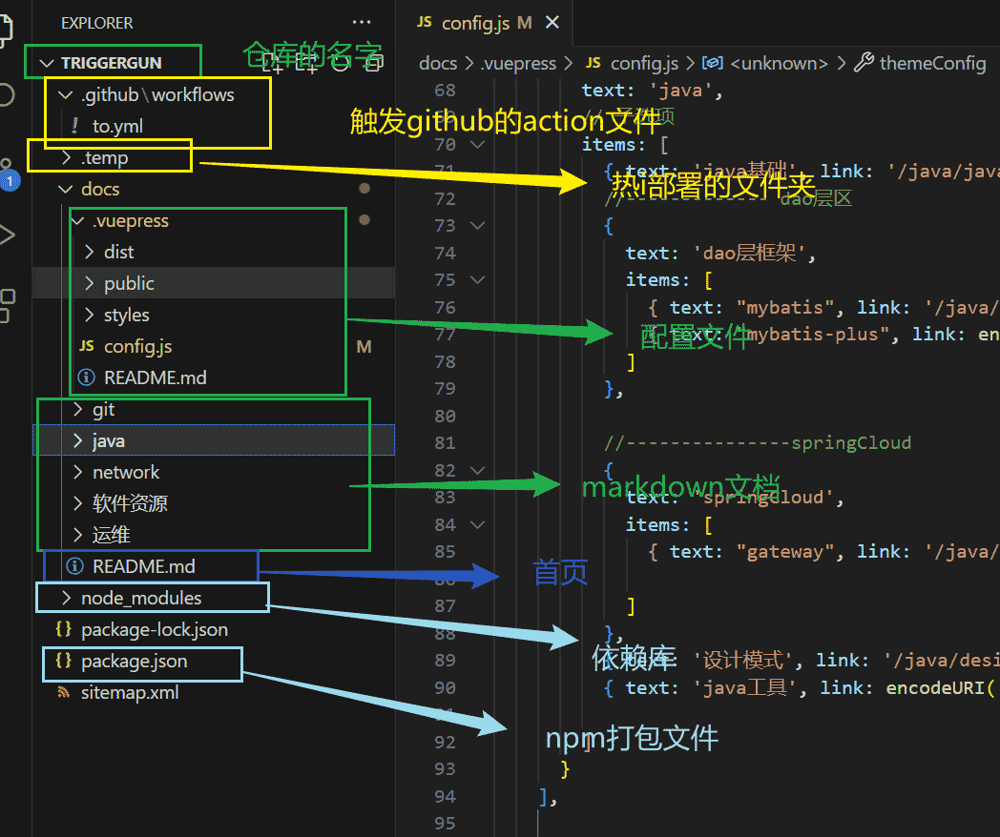

# 代码怎么运行




## 打开package文件

```json
{
  "name": "hongblog",
  "version": "1.0.0",
  "description": "",
  "main": "index.js",
  "scripts": {
    "dev": "vuepress dev docs --temp .temp",
    "build": "vuepress build docs"
  },
  "keywords": [],
  "author": "",
  "license": "ISC",
  "devDependencies": {
    "vuepress": "^1.9.9",
    "vuepress-plugin-medium-zoom": "^1.1.9"
  },
  "dependencies": {
    "markdown-it-disable-url-encode": "^1.0.1"
  }
}

```

::: tip  怎么运行程序呢？

- "dev": "vuepress dev docs --temp .temp",运行代码，浏览器访问。
- "build": "vuepress build docs"，打包构建出网页的html、css、js源码。

:::

**注意：**还要安装node，版本要在14以上。

....略。。。
