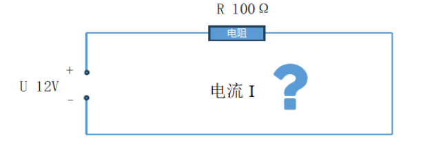

# 常用定律

## 欧姆定律

电阻不变的情况下，电压和电流成正比。具体公式如下所示:
$$
I = U/R
$$

I 电流   单位： 安培A

U电压 单位：伏特V

R电阻 单位：欧姆Ω

例如:电路中一个电阻R的阳值为100Ω，电源的电压为U=12V，那么通过这个电阻的电流I是多少?

电流  I=  U / R  =     12  /  100   =   0.12 A(安培)

## 电功率

指电流在单位时间内做的功，是用来表示消耗电能的快慢的物理量

电路中元器件的工作功率计算公式如下：

U ： 伏特 V

I ： 安培 A

P ： 瓦特W 、KW
$$
P = U * I
$$

## 焦耳定律

电流通过导体产生的热量跟电流的二次方成正比，跟导体的电阻成正比，跟通电时间成正比。
公式如下:
$$
Q = I^2 * R * t
$$
I: 安培(A)
R: 欧姆(2)
t: 时间(s)
Q: 能量 （J）
$$
p=F^2*R:功率(W)Q:能量(J)
$$

电路通过导体时，如果电能全部转化为内能，而没有同时转化为其他形式的能量，那么电流产生的热量O就等于消耗的电能W，即O-W=UIt
例如，一根60Q的电阻丝接在36V的电源两端，在5min内共产生多少热量。
$$
I = U/R = 36V/60Ω = 0.6A
$$

$$
P=I*I*R*t  =0.6A * 0.6A * 60Ω * 5 * 60s  =  6480J
$$

