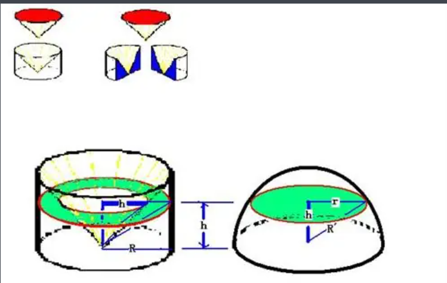
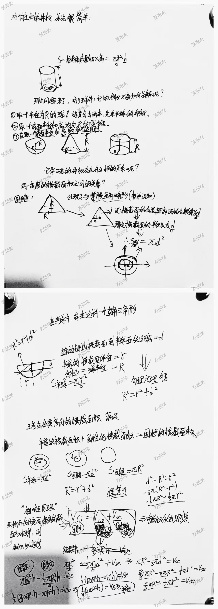

# 球体体积公式推过程

## 祖暅原理推导

[祖暅原理_百度百科 (baidu.com)](https://baike.baidu.com/item/祖暅原理/5165170)

在国内：称为祖暅原理

在国外：卡瓦列利原理

应用：求球体的体积。

使用一个原理：“幂势既同，则积不容异”。“幂”是截面积，“势”是立体的高。意思是两个同高的立体，如在等高处的截面积相等，则体积相等。更详细点说就是，界于两个平行平面之间的两个立体，被任一平行于这两个平面的平面所截，如果两个截面的面积相等，则这两个立体的体积相等。

- 推到过程如下图

