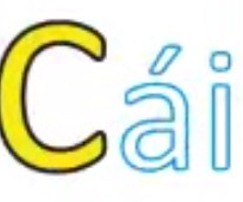
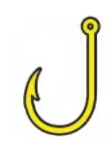
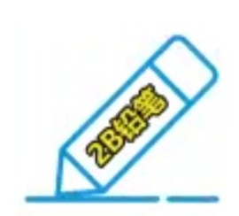
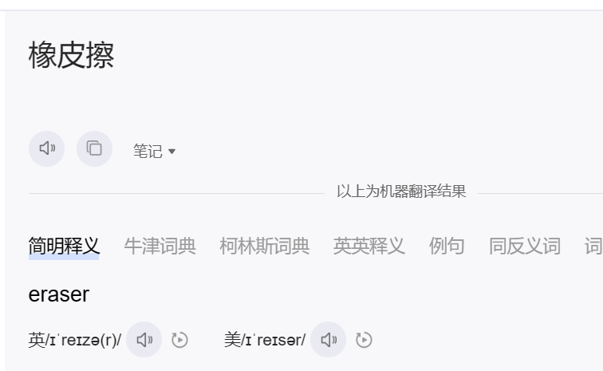
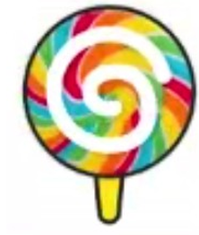
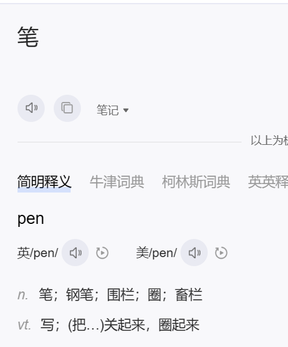
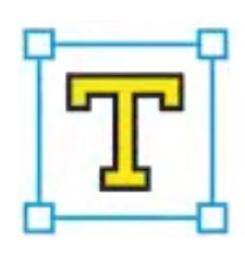

# 巧记ps快捷键

正所谓大江东去浪涛尽，ps在我的心中有烙印！

- 为有快捷键呢？

​		答：大风起兮云飞扬，从早到晚都在忙！

## 常用快捷键

|       操作        | 描述         |
| :---------------: | ------------ |
|     Ctrl + j      | 复制图层     |
| [    ] 左右中括号 | 调整画笔大小 |
|                   |              |

## 工具快捷键

可视化记忆

## 移动工具【V】

巧记：V倒过来向 移动的鼠标

## 套索工具【L】

巧记：L很像是套索的一根绳子的形状

## 快速选择工具【W】

巧记：w 像两个闪电叠在一起 很快

## 裁剪工具【C】

巧记：裁剪的裁，拼音C开头。

## 吸管工具【i】

巧记：因为吸管的形状和 I 很像

## 修补工具【J】

巧记：J 和外科医生修补皮肤的时候用的弯钩很像！

## 画笔工具【B】

巧记：2B铅笔是用来画画的

## 橡皮擦工具【E】

巧记：因为英文单词是：Eraser

## 渐变工具【G】

巧记：G 和 渐变的彩虹棒棒糖的形状很像

## 钢笔工具【P】

巧记：钢笔的英文 是pen

## 文字工具【T】

巧记：在99% 的软件里面文字工具都是T

## 形状工具【U】

巧记：形状就和我的下巴一样U字形

## 总结

拳不离手，曲不离口！多用是最好好的记忆方式。

