# ps白底证件照变蓝底

需求描述：当前只有一张白底证件照。我要一张蓝底的证件照片。在照相馆要加20元才给你做。生活虐我千百遍，我待生活初恋。作为一个21世纪青年。ps总是要会的。下面就是ps实战。

## ps打开白底证件照

下图准备好的证件照。

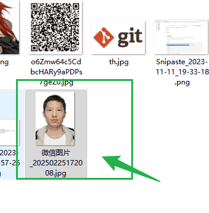

我们使用ps打开这张图片。

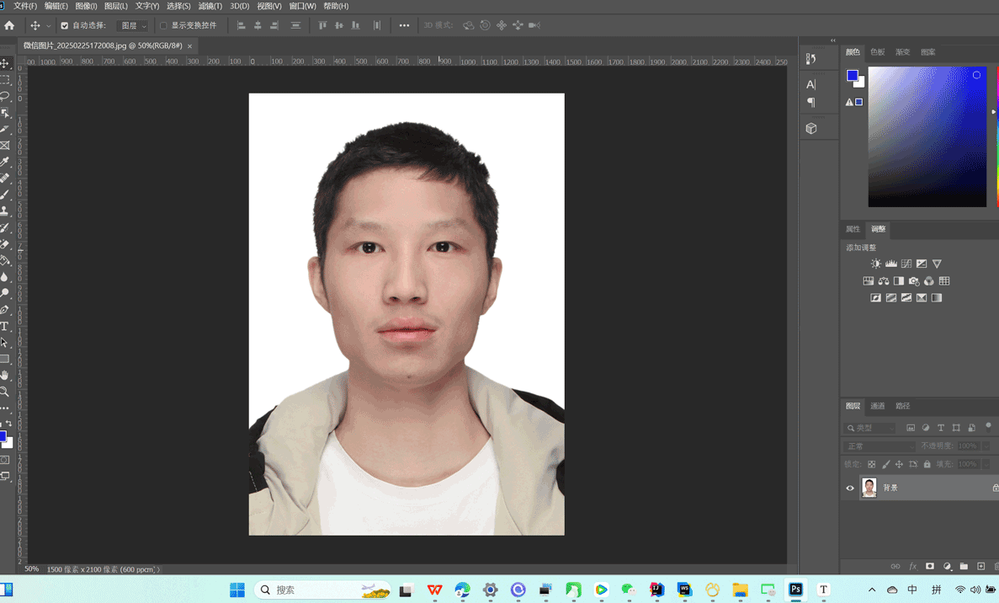

打开了，我们要怎么操作呢？答：人类最伟大的发明就是创造了“工具”。那当然是用 魔棒工具了。那么问题来了。对于ps小白来说什么是魔棒工具呢？

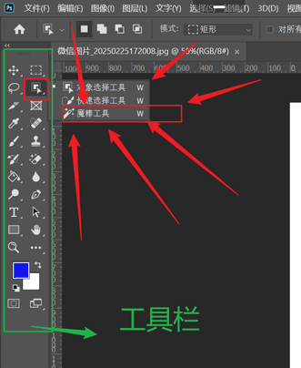

魔棒工具是长这个样子的。我们点击它。

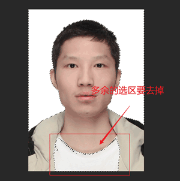

使用魔棒工具后，我们怎么去掉多余的选区呢？（问deepseek）

解决上面的问题其实非常简单？魔棒有个一熟悉可以勾选“连续”。

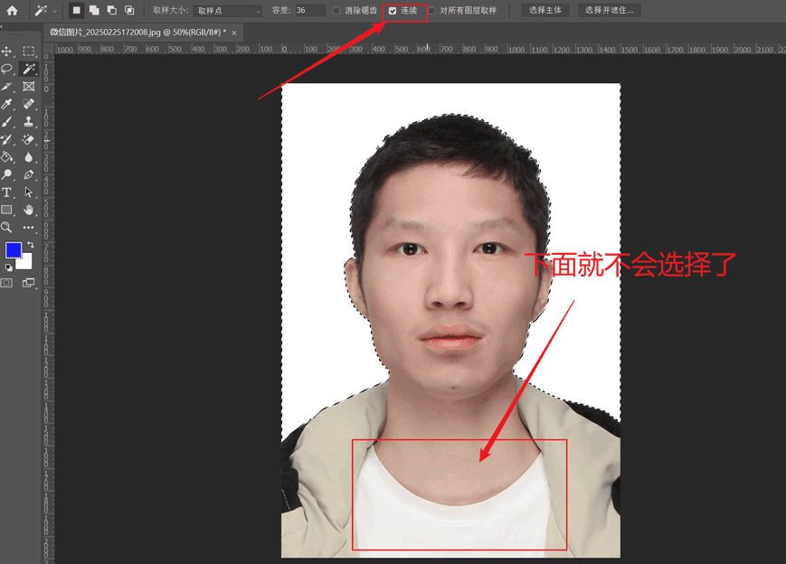

然后操作又来了。点击 --> 选择 --> 反向 /反选（不同ps版本名字不一样）

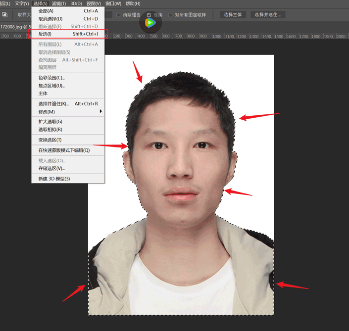

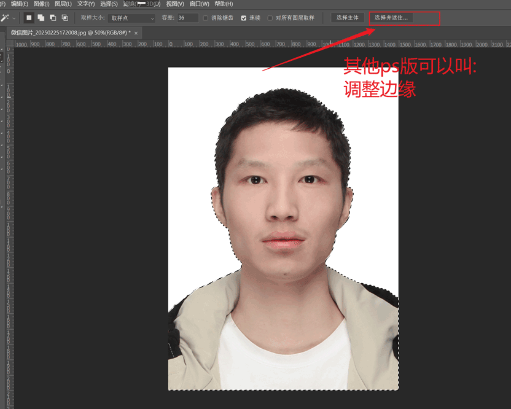

ALT +  鼠标滚轮  = 放大

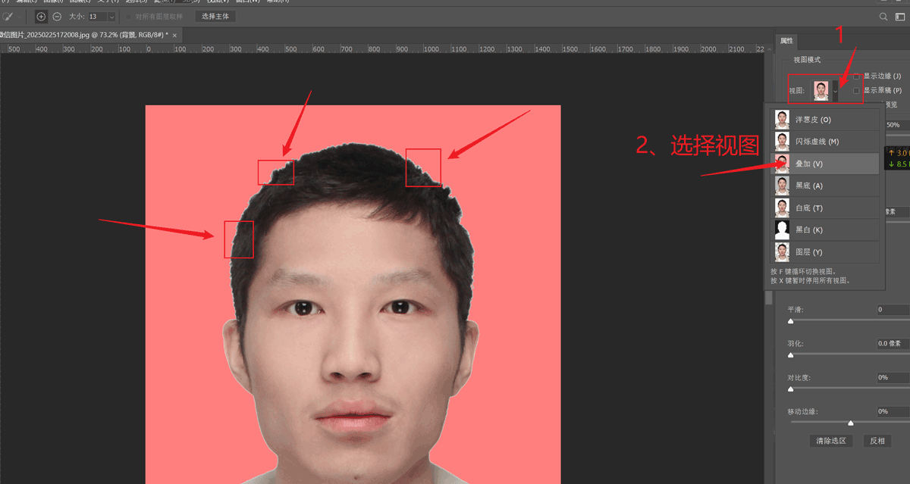

选着边缘检查画笔工具。画笔方法的方法 ATL + ] = 放大笔芯涂抹。

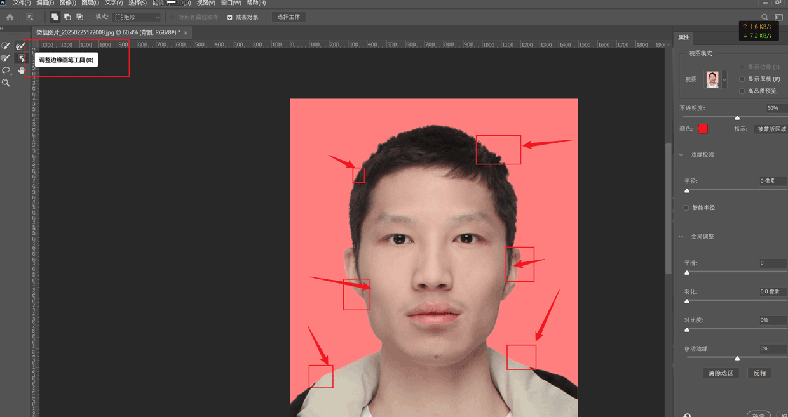

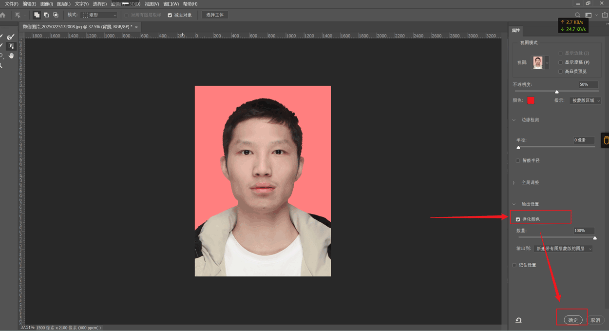

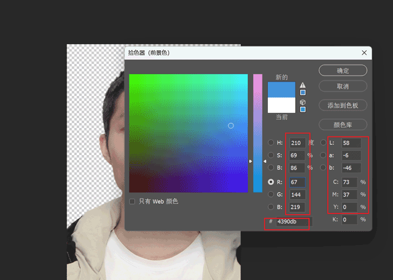

选中背景。进行填充颜色。

怎么填充颜色呢？(问deepseek)

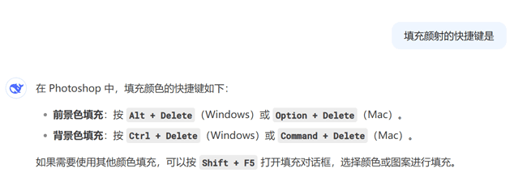

下图是图层面板。如果你操作到这没有这二个图层。说明你前面的操作有问题。建议重新来过。

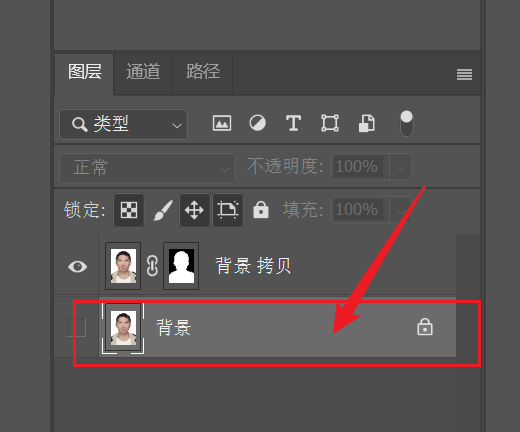

填充的效果如下：

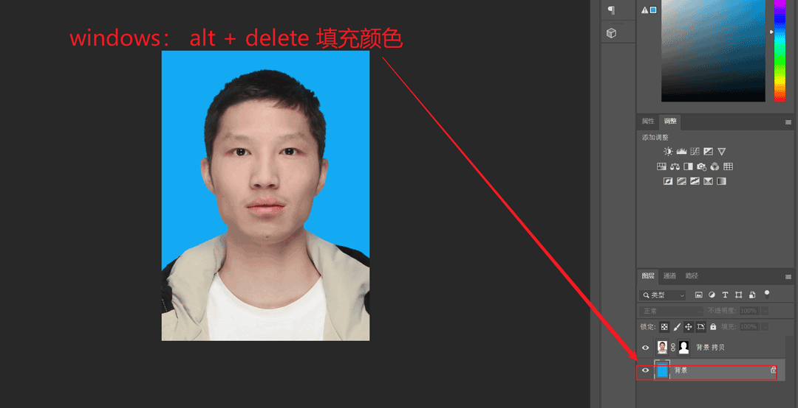

我们新建图层。

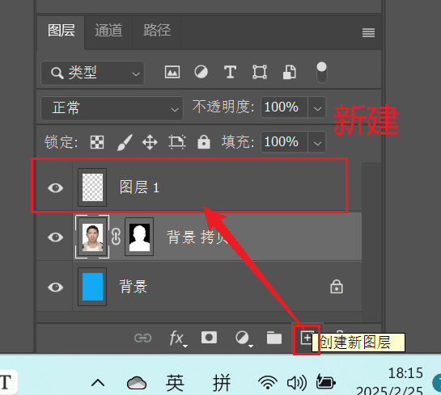

图层样式我们改为 “强光”。

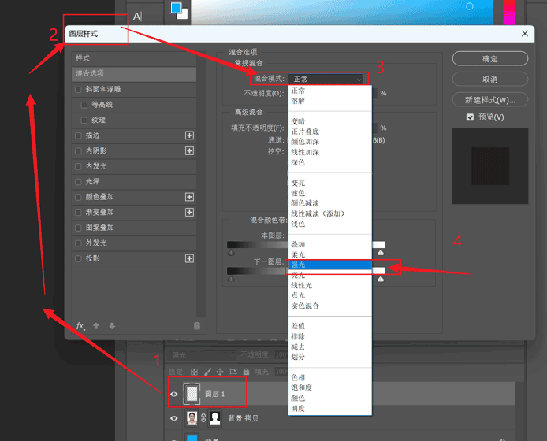

注意：我们现在是在自己创建的图层上进行操作的。

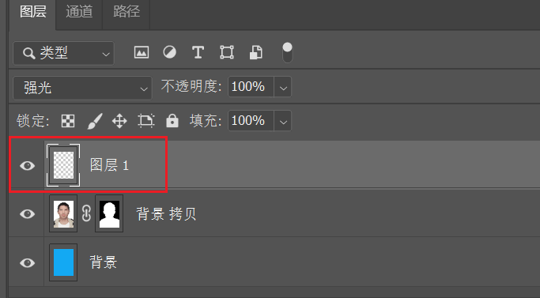

::: warning 剪贴蒙版
我们为下一层的图层创建剪贴蒙版。换一句话说：下层依赖于上层的图层蒙版。
:::

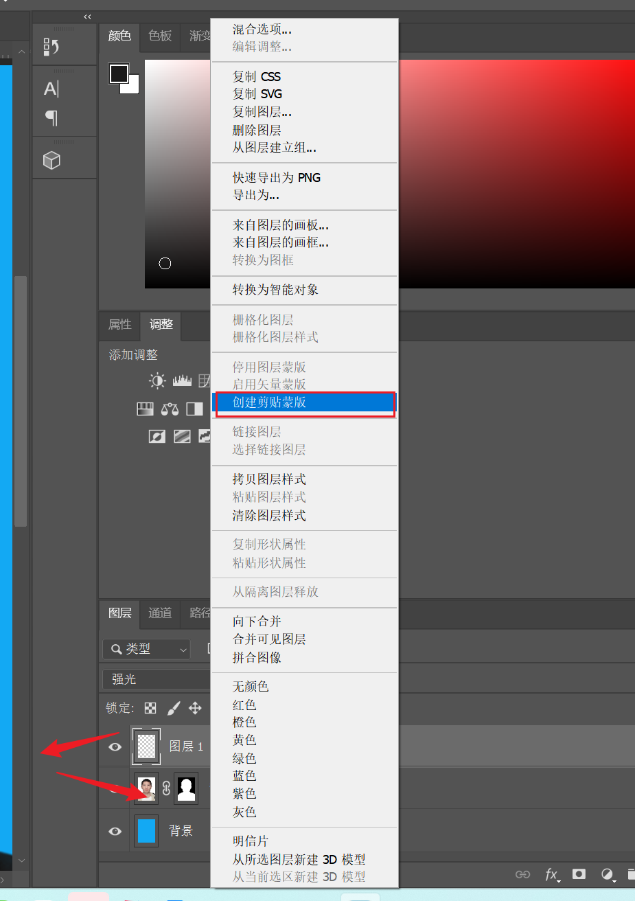

我们选着吸管工具。用于吸取头发的颜色。

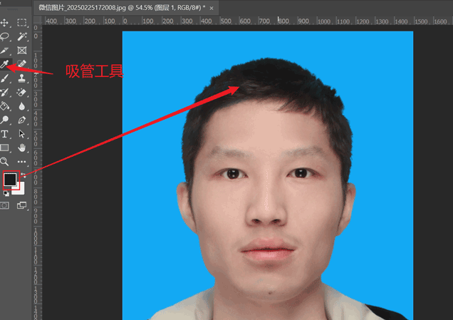

在然后就是使用画笔工具了。

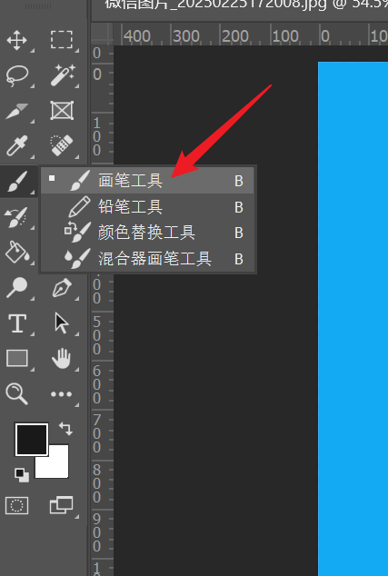

最终效果：

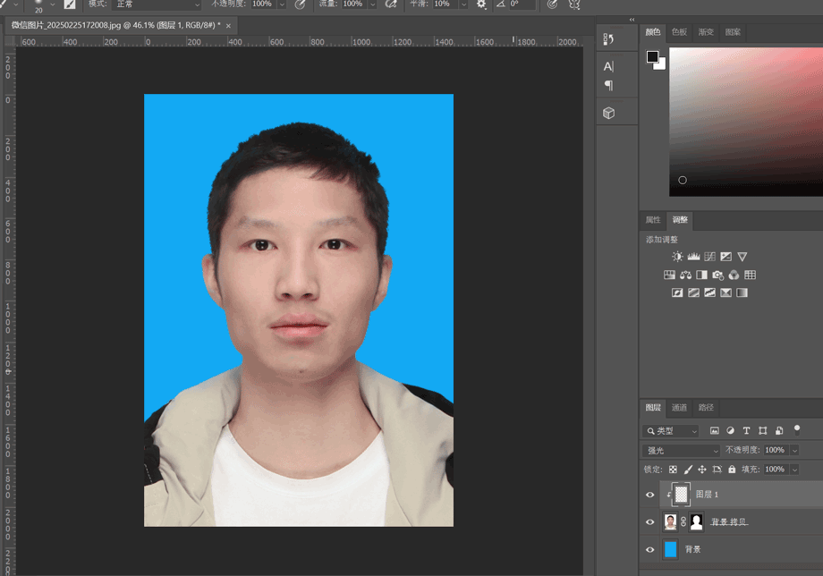

导出jpg文件格式保存。

## 效果展示

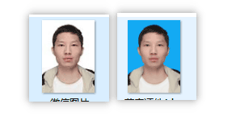

