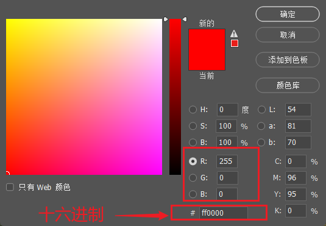
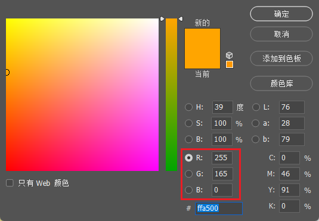
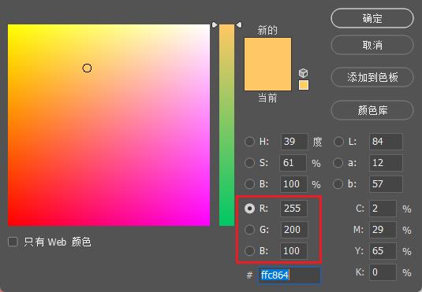
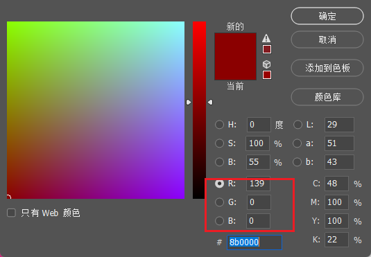

# 暖色十进制转十六进制表示


## 相关问题

前端暖色的10进制转十六进制来表示有什么对应的关系吗？

答：暖色十进制转十六进制的核心规律可以归结为一句话：

**R的高位字节（FF）固定或接近FF，G、B按暖度递减，十六进制表现为“FF XX YY”且 XX ≥ YY。**

### 1)十进制 → 十六进制的固定映射

十进制的 `0-255` 直接对应十六进制的 `00-FF`，每个RGB分量用两位十六进制表示：

| 十进制 | 十六进制 |
| ------ | -------- |
| 0      | 00       |
| 255    | FF       |
| 128    | 80       |
| 165    | A5       |

**例子：**

- 橙色 `RGB(255, 165, 0)` → `#FFA500`
  拆分：
  - 255 → `FF`
  - 165 → `A5`
  - 0 → `00`

### 2)暖色的十六进制模式

暖色十六进制通常为 `#FF XX YY`，其中：

- **FF**（红色通道）始终最高，固定或接近 `FF`。
- **XX**（绿色通道）从 `FF`（黄色）到 `00`（红色）递减。
- **YY**（蓝色通道）通常 `00` 或较低值（如 `33`、`66`）。

| 颜色 | 十进制 (R,G,B)  | 十六进制  | 模式说明                   |
| ---- | --------------- | --------- | -------------------------- |
| 纯红 | (255, 0, 0)     | `#FF0000` | R=FF, G=00, B=00           |
| 橙色 | (255, 165, 0)   | `#FFA500` | R=FF, G=A5, B=00           |
| 暖黄 | (255, 200, 100) | `#FFC864` | R=FF, G≥B                  |
| 深红 | (139, 0, 0)     | `#8B0000` | R\<FF，但仍为暖色（R>G>B） |

纯红



橙色



暖黄



深红




### 3)快速判断口诀

**“十六进制看前三位：FF开头是暖色，00开头是冷色。”**

- `#FFxxxx`：一定是暖色（红色主导）。
- `#00xxxx`：一定是冷色（蓝色或绿色主导）。
- `#xxxxFF`：一定是冷色（蓝色主导）

### 4)工具验证


```js
// 将十进制RGB转十六进制
function toHex(r, g, b) {
  return `#${r.toString(16).padStart(2, '0')}${g.toString(16).padStart(2, '0')}${b.toString(16).padStart(2, '0')}`.toUpperCase();
}

console.log(toHex(255, 165, 0)); // "#FFA500"（暖橙色）
```

### 总结

**暖色十六进制的对应关系是：**
十进制的 `R高值（255→FF）`、`G中值（如165→A5）`、`B低值（0→00）` 直接映射为 `#FFXXYY`，且数值上 `FF ≥ XX ≥ YY`。